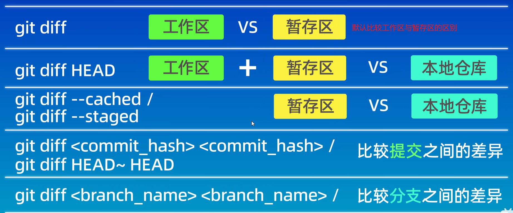

[TOC]

### 1、概述

#### 1.1、版本控制器的方式

>a、集中式版本控制工具（如：SVN、CVS）
>
>​	集中式版本控制工具，版本库是集中存放在中央服务器的，团队里的每个人工作时从中央服务器中下载代码，个人修改后然后提交到中央服务器中。（必须联网才能工作，局域网或者互联网）。
>
>
>
>b、分布式版本控制工具（如：git）
>
>​	分布式版本控制系统没有“中央服务器”，每个人的电脑上都是一个完整的版本库，这样工作的时候，无需要联网了，因为版本库就在你自己的电脑上。多人协作只需要各自的修改推送给对方，就能互相看到对方的修改了。  
>
>

#### 1.2、git创建

>a、Git是Linus Torvalds(开发linux的核心人员之一) 为了帮助管理 Linux 内核开发而开发的一个开放源码的版本控制软件  
>
>b、特点：
>
>​	速度、简单的设计、对非线性开发模式的强力支持（允许成千上万个并行开发的分支）、完全分布式、有能力高效管理类似 Linux 内核一样的超大规模项目（速度和数据量）  

#### 1.3、git工作流程


> 解释：
>
> 1. clone（克隆）: 从远程仓库中克隆代码到本地仓库  。
> 2. checkout （检出）:从本地仓库中检出一个仓库分支然后进行修订  。
> 3. add（添加）: 在提交前先将代码提交到暂存区  。
> 4. commit（提交）: 提交到本地仓库。本地仓库中保存修改的各个历史版本  。
> 5. fetch (抓取) ： 从远程库，抓取到本地仓库，不进行任何的合并动作，一般操作比较少  。、
> 6. pull (拉取) ： 从远程库拉到本地库，自动进行合并(merge)，然后放到到工作区，相当于
> 	fetch+merge  
> 7. push（推送） : 修改完成后，需要和团队成员共享代码时，将代码推送到远程仓库  

### 2、常用命令

#### 2.1、linux的相关指令

>- ls/ll 查看当前目录  
>- cat 查看文件内容  
>- touch 创建文件  
>- vi vi编辑器（使用vi编辑器是为了方便展示效果，学员可以记事本、editPlus、notPad++等其它编
>	辑器）  
>- mkdir 创建目录
>- alias 起别名命令 类似c中#define
>- rm 删除文件/目录
>- clear 清屏

#### 2.2、git相关指令

>1. [git add](####3.5.1、提交到仓库) 提交到暂存区
>2. [git commit ](####3.5.1、提交到仓库) 提交到本地仓库
>3. [git log ](3.5.3、查看提交日志) 查看日志
>4. [git reset  ](####3.5.4、版本回退) 版本回退
>5. [git reflog ](####3.5.5、查看所有操作记录（包括已经被删除的操作记录）)  查看所有操作记录（包括已经被删除的操作记录）
>6. [git ls-files](####3.5.6、查看仓库文件) 查看仓库文件
>7. [ .gitignore ](####3.5.7 、忽略文件) 忽略文件
>8. [git diff ](#####3.5.8、查看差异) 查看差异
>9. [git rm ](####3.5.9、删除文件) 删除文件
>10. [git branch](#####3.6.1、查看本地分支) 查看本地分支
>11. [git branch 分支名](#####3.6.2、创建本地分支)  创建本地分支
>12. [git switch](#####3.6.3、切换分支) 切换分支
>13. [git merge](#####3.6.4、合并分支(merge)) 合并分支(merge)
>14. [git branch -d](#####3.6.5、删除分支) 删除分支
>15. [git checkout 文件名](#####3.6.7、恢复文件) 恢复文件
>16. [git remote add](######3.7.3.1、添加远程仓库)  添加远程仓库
>17. [git remote](######3.7.3.2、查看远程仓库)  查看远程仓库
>18. [git push](######3.7.3.3、文件推送到远程仓库)  文件推送到远程仓库
>19. [git branch -vv](######3.7.3.4、查看本地分支与远程分支的关联关系)  查看本地分支与远程分支的关联关系
>20. [git clone](######3.7.3.5、从远程仓库克隆)  从远程仓库克隆
>21. [git fetch](######3.7.3.6、从远程仓库中抓取和拉取)  从远程仓库中抓取
>22. [git pull](######3.7.3.6、从远程仓库中抓取和拉取)  从远程仓库中拉取
>23. [git gc](#####3.5.10、清除和优化git仓库) 清除和优化git仓库
>
>

### 3、git指令与操作

#### 3.1、基本配置

>Git GUI：Git提供的图形界面工具
>Git Bash：Git提供的命令行工具
>当安装Git后首先要做的事情是设置用户名称和email地址。这是非常重要的，因为每次Git提交都会使用
>该用户信息  

>a、打开git bash
>
>b、设置用户信息
>
>```txt
>git config --global user.name “itcast”
>git config --global user.email “hello@itcast.cn”
>```
>
>>“itcast”:用户名
>>
>>“hello@itcast.cn”：邮箱（可以是不存在的）
>
>
>
>c、查看配置信息  
>
>```txt
>git config --global user.name
>git config --global user.email
>```

#### 3.2、为常用指令配置别名（可选）  

>Ⅰ、
>
>```txt
>1. 打开用户目录，创建 .bashrc 文件
>部分windows系统不允许用户创建点号开头的文件，可以打开gitBash,执行 touch ~/.bashrc
>2.在 .bashrc 文件中输入如下内容：
>	#用于输出git提交日志
>	alias git-log='git log --pretty=oneline --all --graph --abbrev-commit'
>	#用于输出当前目录所有文件及基本信息
>	alias ll='ls -al'
>3. 打开gitBash，执行 source ~/.bashrc
>```
>
>Ⅱ、
>
>```html
>打开gitBash，直接使用alias命令创建别名
>alias 别名='具体命令'
>```

#### 3.3、解决GitBash乱码问题  

>1. 打开GitBash执行下面命令  
>
>```txt
>git config --global core.quotepath false
>```
>
>2.${git_home}/etc/bash.bashrc 文件最后加入下面两行  
>
>```txt
>export LANG="zh_CN.UTF-8"
>export LC_ALL="zh_CN.UTF-8"
>```
>
>>新版git，没有这个问题。
>>
>>${git_home}为git的安装目录，可以通过where git 来寻找。

#### 3.4、获取本地仓库

>1）在电脑的任意位置创建一个空目录（例如test）作为我们的本地Git仓库
>2）进入这个目录(可以是已经存在的)中，点击右键打开Git bash窗口
>3）执行命令git init
>4）如果创建成功后可在文件夹下看到隐藏的.git目录  
>
>

#### 3.5、基础操作

##### 3.5.1、提交到仓库


>
>
>1. git add (工作区 --> 暂存区)
>
>	
>
>	```html
>	git add [文件/目录名/.]
>	```
>
>	>[文件名/.] 需要添加的文件或者该目录下的全部文件和目录
>
>	
>
>2. git commit (暂存区 --> 本地仓库)  
>
>
>
>```html
>1、git commit -m"提交信息"
>2、git commit -am"提交信息" 
>```
>
>>-m：message，提交信息的意思
>>
>>-am：git add与git commit合在一起的写法

##### 3.5.2、查看状态

>```html
>git status
>```
>
>>红色文件：未放入暂存区。
>>
>>绿色文件：未放入仓库（已经放入暂存区）。
>>放入仓库文件，不显示。

##### 3.5.3、查看提交日志

>```html
>1、git log [option]	
>2、git log --pretty=oneline --all --graph --abbrev-commit    <==等价于==>     git-log
>```
>
>>[option]可选：
>>
>>​	--all 显示所有分支
>>​	--pretty=oneline 将提交信息显示为一行
>>​	--abbrev-commit 使得输出的commitId更简短
>>​	--graph 以图的形式显示  
>>
>>第二个指令，前面给它起了别名叫git-log
>
>

##### 3.5.4、版本回退

>```html
>1、git reset --soft [commitID]
>2、git reset --hard [commitID]
>3、git reset --mixed [commitID]
>```
>
>>[commitID]：commitID 可以使用 git-log 或 git log 指令查看（上图中的哈希值）  
>>--soft：回退的时候，保留工作区和暂存区中的回退文件/目录
>>
>>--hard：回退的时候，删除工作区和暂存区中的回退文件/目录
>>
>>--mixed：回退的时候，保留工作区中的回退文件/目录，删除暂存区中的回退文件/目录
>
>

##### 3.5.5、查看所有操作记录（包括已经被删除的操作记录）

>```html
>git reflog
>```
>
>可以查看所有分支的所有操作记录（包括已经被删除的 commit 记录和 reset 的操作）

##### 3.5.6、查看仓库文件

>```html
>git ls-files
>```
>
>不带选项：默认情况下，git ls-files 列出所有已跟踪的文件，包括已修改但尚未暂存的文件。
>
>```html
>git ls-files -c
>```
>
>-c 或 --cached：只列出已经通过 git add 添加到暂存区的文件。
>
>```html
>git ls-files -o
>```
>
>-o 或 --others：只列出未跟踪的文件。
>
>```html
>git ls-files -s
>```
>
>-s 或 --stage：显示文件的状态信息，包括文件的模式(例如，100644 表示普通文件，100755 表示[可执行文件](https://so.csdn.net/so/search?q=可执行文件&spm=1001.2101.3001.7020))和 SHA-1 哈希值。
>
>```html
>git ls-files -t
>```
>
>-t：只列出已跟踪的文件。
>
>```html
>git ls-files -u
>```
>
>-u 或 --unmerged：只列出有合并冲突的文件。
>
>```html
>git ls-files -h
>```
>
>-h或者-help :列出其他选项

##### 3.5.7 、忽略文件

>可以在工作目录中创建一个名为 .gitignore 的文件（文件名称固定），列出要忽略的文件模式。  
>
>忽略文件模板
>
>``` .gitignore 
># no .a files 
># 忽略所有.a文件
>*.a
>
># but do track lib.a, even though you're ignoring .a files above
># 但跟踪所有的lib.a文件，即使你在前面忽略了所有.a文件
>!lib.a
>
># only ignore the TODO file in the current directory, not subdir/TODO
># 只忽略当前目录下的T0D0文件，而不忽略subdir/TODO 	
>/TODO
>
># ignore all files in the build/ directory
># 忽略任何目录下的build/ directory
>build/
>
># ignore doc/notes.txt, but not doc/server/arch.txt
># 忽略 doc/notes.txt，但是不忽略doc/server/arch.txt
>doc/*.txt
>
># ignore all .pdf files in the doc/ directory
># 忽略doc/目录及其所有子目录下的.pdf文件
>doc/**/*.pdf
>```
>
>[GitHub官方提供的 .gitignore 文件模板](https://github.com/github/gitignore?tab=readme-ov-file)
>
>忽略命令：
>
>```html
>忽略xx.x文件
>git update-index --assume-unchanged xx.x
>
>恢复跟踪该文件
>git update-index --no-assume-unchanged xx.x
>
>```
>
>>不会更改`.gitignore`文件的内容。

##### 3.5.8、查看差异

>```html
>git diff [options] [source1] [source2]
>```
>
>>source1 和 source2：
>>可以是提交哈希值、分支名、标签名等，用于指定要比较的两个版本的来源。如果不指定，则有不同的默认行为。
>>options：
>>	--staged或--cached：比较暂存区和上次提交之间的差异。
>>	--name-only：只显示发生变化的文件名，而不显示具体的差异内容。
>>	--name-status：显示发生变化的文件名以及变化的状态（A 表示添加、D 表示删除、M 表示修改）。
>>	-w或--ignore-all-space：忽略空白字符的差异。
>
>
>
>```html
>git diff  
>```
>
>这将显示自上次提交以来对所有文件所做的更改。
>
>```html
>git diff --staged
>```
>
>此命令显示已经添加到暂存区但还没有提交的更改（本地仓库）。
>
>```html
>git diff branch1 branch2
>```
>
>将显示 `branch1` 和 `branch2` 分支之间的差异。
>
>```html
>git diff --name-only
>```
>
>只显示发生变化的[文件名](https://so.csdn.net/so/search?q=文件名&spm=1001.2101.3001.7020)。
>
>```html
>git diff --name-status
>```
>
>比较特定提交之间的差异。
>
>```html
>git diff commitA commitB
>```
>
>这里 `commitA` 和 `commitB` 可以是提交哈希值、分支名或标签名等。
>
>```html
>git diff -U5 commitA commitB
>```
>
>此命令将显示 `commitA` 和 `commitB` 之间的差异，并设置 5 行上下文。默认显示3行上下文
>
>```html
>git diff HEAD~n HEAD
>```
>
>此命令将显示前n个版本与上版本的比较。
>
>

##### 3.5.9、删除文件

>```html
>git rm 
>```
>
>

##### 3.5.10、清除和优化git仓库

>```html
>git gc [option]
>```
>
>>[option] 可选：
>>
>>- 无  基本清理
>>
>>- --auto 自动运行 `git gc`，通常在适当的时候自动触发（例如在提交一定次数后，或者在执行 `git commit` 时）。
>>
>>- --prune=<date> 删除自指定日期以来未引用的对象。
>>
>>	​	eg.    git gc --prune=30.days.ago    删除30天以前的未引用对象。
>>
>>- --aggressive 进行更为彻底的优化，这可能会花费更多的时间。通常在需要对仓库进行深度清理和压缩时使用。
>>
>>- --quiet  在执行 `git gc` 时抑制输出，适用于只想执行命令而不需要看到详细输出的情况。
>
>命令具体作用：
>
>1、清理无用的对象：
>	垃圾回收：删除不再需要的对象和引用，例如删除已经被丢弃的提交对象（这些对象没有被任何分支或标签引用）。
>
>​	压缩对象：将多个小的对象文件合并成一个大的对象文件，从而节省空间。
>
>2、优化存储：
>
>​	合并提交：将小的提交对象合并成一个较大的提交对象，以提高访问效率。
>
>​	优化数据库：整理和压缩 Git 对象数据库，提升仓库的整体性能。
>
>3、清理未使用的引用：
>
>​	删除旧的 refs 和 tags，这些已经不再指向任何有效对象。


#### 3.6、分支

>​	几乎所有的版本控制系统都以某种形式支持分支。 使用分支意味着你可以把你的工作从开发主线上分离开来进行重大的Bug修改、开发新的功能，以免影响开发主线。
>​	在开发中，一般有如下分支使用原则与流程：
>
>- ​	master （生产） 分支（稳定版）
>
>	​		线上分支，主分支，中小规模项目作为线上运行的应用对应的分支；
>
>- ​	develop（开发）分支（开发版）
>
>	​		是从master创建的分支，一般作为开发部门的主要开发分支，如果没有其他并行开发不同期上线要求，都可		以在此版本进行开发，阶段开发完成后，需要是合并到master分支,准备上线。
>
>- ​	feature/xxxx分支
>
>	​		从develop创建的分支，一般是同期并行开发，但不同期上线时创建的分支，分支上的研发任务完
>
>	​		成后合并到develop分支。
>
>- ​	hotfix/xxxx分支，
>
>	​		从master派生的分支，一般作为线上bug修复使用，修复完成后需要合并到master、test、develop分支。
>
>- ​	还有一些其他分支，在此不再详述，例如test分支（用于代码测试）、pre分支（预上线分支）等
>
>	​	等。    
>
>

##### 3.6.1、查看本地分支

>```html
>git branch
>```

##### 3.6.2、创建本地分支

>```html
>git branch 分支名
>```

##### 3.6.3、切换分支

>```html
>#git2.23版本之前的命令（依旧有效）
>git checkout 分支名
>
>#git2.23版本之后新加入的命令  （推荐使用）
>git switch 分支名
>```

>```html
>#直接切换到一个不存在的分支（创建并切换）
>git checkout -b 分支名
>
>#switch命令直接切换到一个不存在的分支（创建并切换）
>git switch -c 分支名
>```

>git checkout 分支名 除了能够切换分支以外，还可以恢复文件，如果分支名与文件名相同，只会生效切换分支

##### 3.6.4、合并分支(merge)

>切换到你要想合并到的分支上

>```html
>git merge 将要被合并的分支名称 
>```

##### 3.6.5、删除分支

>不能删除当前分支，只能删除其他分支  

>```html
>git branch -d b1           #删除分支时，需要做各种检查
>git branch -D b1           #不做任何检查，强制删除
>```

##### 3.6.6、解决冲突  

>当两个分支上对文件的修改可能会存在冲突，例如同时修改了同一个文件的同一行，这时就需要手动解
>决冲突，解决冲突步骤如下：
>
>1. 手动处理文件中冲突的地方
>2. 将解决完冲突的文件加入暂存区(add)
>3. 提交到仓库(commit)  
>
>

##### 3.6.7、恢复文件

>```html
>git checkout 文件名
>```


#### 3.7、远程仓库

>​	前面我们已经知道了Git中存在两种类型的仓库，即本地仓库和远程仓库。那么我们如何搭建Git远程仓库呢？我们可以借助互联网上提供的一些代码托管服务来实现，其中比较常用的有GitHub、码云、GitLab（内部搭建自己的托管）等。
>​	gitHub（ 地址：https://github.com/ ）是一个面向开源及私有软件项目的托管平台，因为只支持Git 作为唯一的版本库格式进行托管，故名gitHub
>​	码云（地址： https://gitee.com/ ）是国内的一个代码托管平台，由于服务器在国内，所以相比于GitHub，码云速度会更快
>​	GitLab （地址： https://about.gitlab.com/ ）是一个用于仓库管理系统的开源项目，使用Git作为代码管理工具，并在此基础上搭建起来的web服务,一般用于在企业、学校等内部网络搭建git私服  

##### 3.7.1、创建远程仓库  

>a、在gitee或者github上注册。
>
>b、创建远程仓库
>
>
>
>
>

##### 3.7.2、配置SSH KEY

>a、在==用户目录==打开git bash
>
>b、输入以下指令
>
>```html
>ssh-keygen -t rsa -b 4090
>```
>
>>-t rsa ：为ssh算法。
>>
>>-b 4090：指定大小，不写也不影响。
>
>c、第一次创建 不停回车 直到重新出现输入框
>
>不是第一次创建
>
>
>
> d、复制公钥
>
>​	第一种方法：在/user/当前用户目录/.ssh/id_rsa.pub文件，并且复制其中内容。
>
>```html
>第二种方法（在git bash中查看）：
>cat ~/.ssh/id_rsa.pub
>```
>
>e、在GitHub或者gitee中绑定
>
>
>
>
>
>f、创建config配置文件（不是第一次创建）
>
>在/user/当前用户目录/.ssh/下创建config文件内容
>
>```config
>#gitee
>Host gitee.com
>HostName gitee.com
>PreferredAuthentications publickey
>IdentityFile ~/.ssh/giteeSSH
>
>#github
>Host github.com
>HostName github.com
>PreferredAuthentications publickey
>IdentityFile ~/.ssh/id_rsa
>
>```
>
>>~/.ssh/giteeSSH：为你在gitee中SSH公钥所在的文件（我这里是第二次创建的ssh，并且重新命名为giteeSSH）
>>
>>~/.ssh/id_rsa：为你在github中SSH公钥所在的文件
>
>g、验证链接是否成功
>
>```html
>ssh -T git@gitee.com
>ssh -T git@github.com
>```
>
>第一次需要输入yes或者回车
>
>
>成功的样子
>
>
>
>
>[SSH 公钥设置 | Gitee 帮助中心](https://help.gitee.com/base/account/SSH公钥设置)

##### 3.7.3、操作远程仓库

###### 3.7.3.1、添加远程仓库

>```html
>git remote add [远端名称] [仓库路径]
>```
>
>>远端名称，默认用origin，取决于远端服务器设置，起别名。
>>仓库路径，从远端服务器获取此URL  。
>>
>>
>
>

###### 3.7.3.2、查看远程仓库

>```html
>git remote
>```
>
>

###### 3.7.3.3、文件推送到远程仓库

>```html
>git push [-f] [--set-upstream] [远端名称（自己起）  [本地分支名][:远端分支名] ]
>```
>
>>- 如果远程分支名和本地分支名称相同，则可以只写本地分支
>>
>>	git push origin master       <=       git push origin master:master
>>
>>- -f 表示强制覆盖  
>>
>>- --set-upstream 推送到远端的同时并且建立起和远端分支的关联关系 。（用了这个以后，之后就可以直接写git push）
>>
>>	git push --set-upstream origin master
>>
>>- 如果当前分支已经和远端分支关联，则可以省略分支名和远端名。（用了--set-upstream 之后的推送）
>>	git push       将master分支推送到已关联的远端分支    
>
>

###### 3.7.3.4、查看本地分支与远程分支的关联关系

>```html
>git branch -vv
>```
>
>

###### 3.7.3.5、从远程仓库克隆

>```html
>git clone [仓库路径] [本地目录]
>```
>
>>本地目录可以省略，会自动生成一个目录  。
>>
>>仓库路径：就是该仓库的SSH。
>>
>>这个指令一般只使用一次，之后的更新用下面的指令。

###### 3.7.3.6、从远程仓库中抓取和拉取

>```html
>#抓取
>git fetch [remote name] [branch name]
>```
>
>>抓取指令就是将仓库里的更新都抓取到本地，不会进行合并 ，需要使用git merge用于合并到本地仓库。
>>
>>[remote name] 表示仓库别名，在git remote add时创建的。
>>
>>[branch name] 表示分支名。
>>
>>如果不指定远端名称和分支名，则抓取所有分支。  
>
>```html
>#拉取
>git pull [remote name] [branch name]
>```
>
>>拉取指令就是将远端仓库的修改拉到本地并自动进行合并，等同于fetch+merge。
>>
>>[remote name] 表示仓库别名，在git remote add时创建的。
>>
>>[branch name] 表示分支名。
>>
>>如果不指定远端名称和分支名，则抓取所有并更新当前分支。 

###### 3.7.3.7、解决合并冲突

>在一段时间，A、B用户修改了同一个文件，且修改了同一行位置的代码，此时会发生合并冲突。
>
>A用户在本地修改代码后优先推送到远程仓库，此时B用户在本地修订代码，提交到本地仓库后，也需要
>推送到远程仓库，此时B用户晚于A用户，故需要先拉取远程仓库的提交，经过合并后才能推送到远端分
>支,如下图所示。
>
>
>
>解决方式：本地的冲突解决一样，手动更改冲突文件。
>
>
>建议：<span style="color: #FF0000;">多人团队中，提前到远程仓库时，先pull，看看有无冲突，然后在提交。</span>


# 注意

1. ==**切换分支前先提交本地的修改**==
2. ==**代码及时提交，提交过了就不会丢**==
3. ==**遇到任何问题都不要删除文件目录**==  
