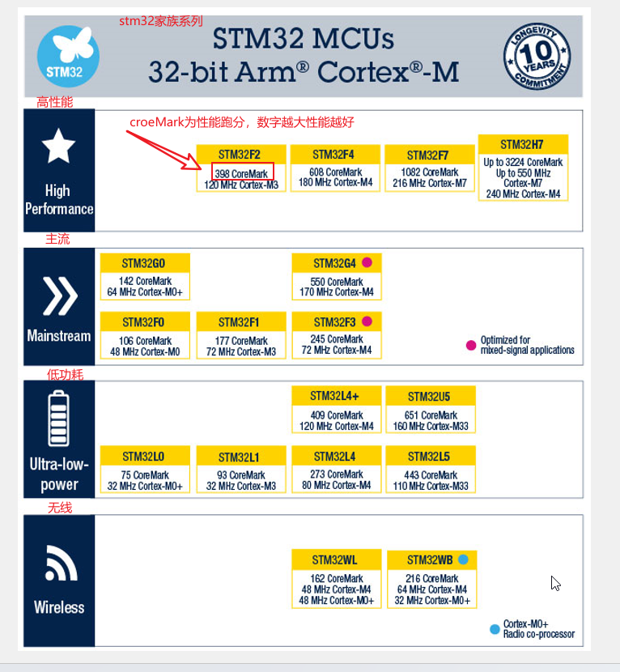
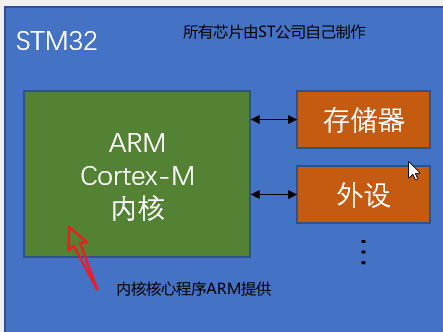
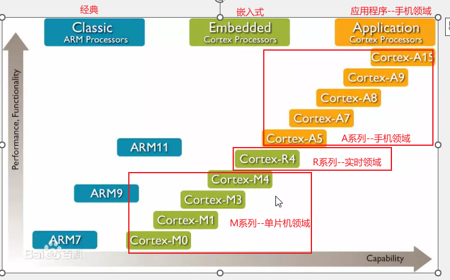
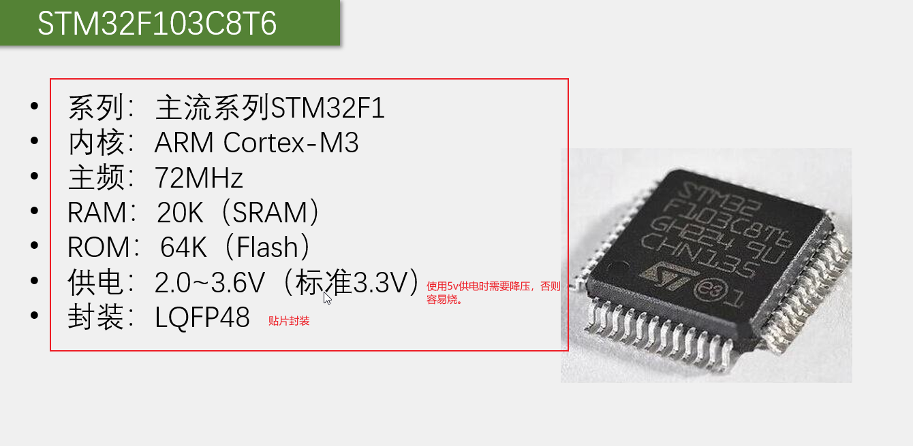
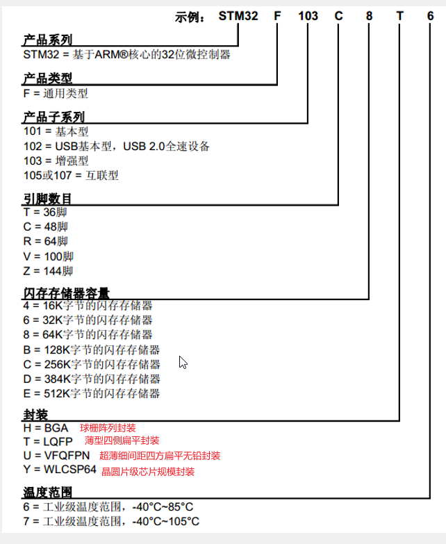
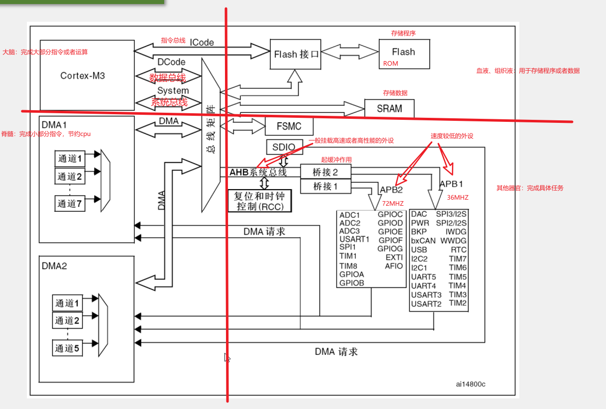
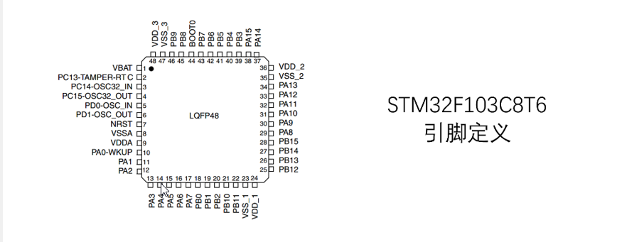
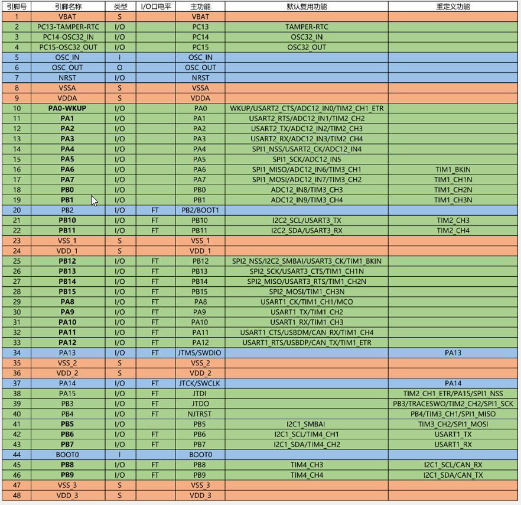
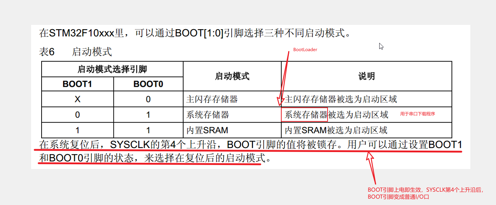
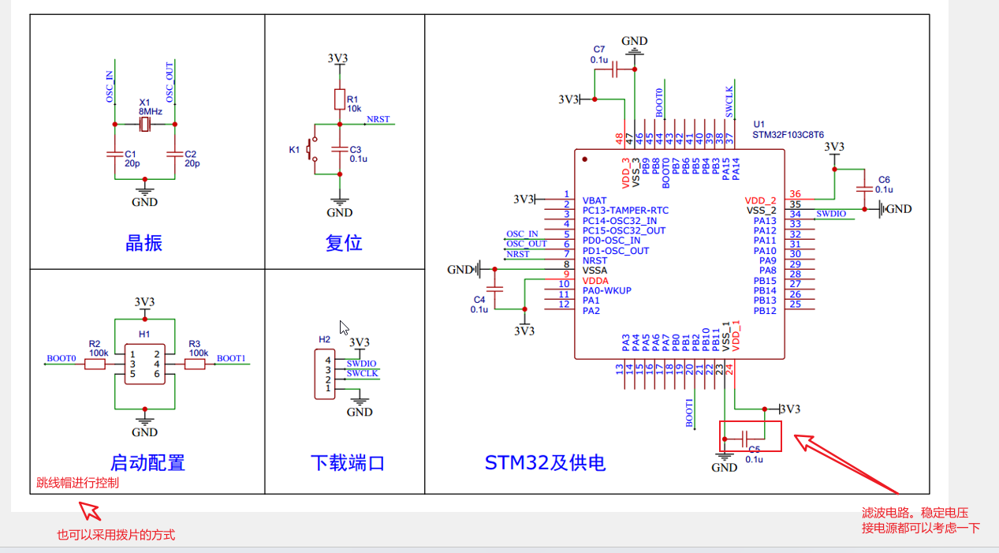

[TOC]

### 1、stm32

#### 1.1、stm32简介

>•STM32是ST公司基于ARM Cortex-M内核开发的32位微控制器
>
>•STM32常应用在嵌入式领域，如智能车、无人机、机器人、无线通信、物联网、工业控制、娱乐电子产品等
>
>•STM32功能强大、性能优异、片上资源丰富、功耗低，是一款经典的嵌入式微控制器

#### 1.2、ARM

>•ARM既指ARM公司，也指ARM处理器内核
>
>•ARM公司是全球领先的半导体知识产权（IP）提供商，全世界超过95%的智能手机和平板电脑都采用ARM架构
>
>•ARM公司设计ARM内核，半导体厂商完善内核周边电路并生产芯片

#### 1.3、STM32F103C8T6

#### 1.4、命名规则

#### 1.5、系统结构

#### 1.6、引脚定义

[引脚定义](STM32F103C8T6引脚定义.xlsx)

#### 1.7、启动配置

#### 1.8、最小系统电路

