[TOC]

### 1、stm32

#### 1.1、stm32简介

>•STM32是ST公司基于ARM Cortex-M内核开发的32位微控制器
>
>•STM32常应用在嵌入式领域，如智能车、无人机、机器人、无线通信、物联网、工业控制、娱乐电子产品等
>
>•STM32功能强大、性能优异、片上资源丰富、功耗低，是一款经典的嵌入式微控制器

#### 1.2、ARM

>•ARM既指ARM公司，也指ARM处理器内核
>
>•ARM公司是全球领先的半导体知识产权（IP）提供商，全世界超过95%的智能手机和平板电脑都采用ARM架构
>
>•ARM公司设计ARM内核，半导体厂商完善内核周边电路并生产芯片

#### 1.3、STM32F103C8T6

#### 1.4、命名规则

#### 1.5、系统结构

#### 1.6、引脚定义

[引脚定义](STM32F103C8T6引脚定义.xlsx)

#### 1.7、启动配置

#### 1.8、最小系统电路

### 2、keil新建stm32工程

[keil5_MDK安装教程](https://www.bilibili.com/video/BV1th411z7sn/?spm_id_from=333.1391.0.0&p=3&vd_source=5f8610a33e469a605635adbbdcc8c98e)

> 开发方式:
>
> - 基于寄存器的方式——类似51，程序直接配置寄存器
> - 基于标志库的方式（库函数）——使用ST官方封装好的库函数间接配置寄存器
> - 基于HAL方式——用图形化界面快速配置stm32

#### 2.1、新建Strat文件

>启动文件(官方下载的文件)
>
>STM32F10x_StdPeriph_Lib_V3.5.0\Libraries\CMSIS\CM3\DeviceSupport\ST\STM32F10x\startup\arm

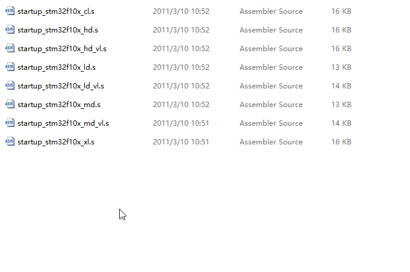

>| **缩写**  (文件后缀) | **释义**           | **Flash容量** | **型号**          |
>| -------------------- | ------------------ | ------------- | ----------------- |
>| LD_VL                | 小容量产品超值系列 | 16~32K        | STM32F100         |
>| MD_VL                | 中容量产品超值系列 | 64~128K       | STM32F100         |
>| HD_VL                | 大容量产品超值系列 | 256~512K      | STM32F100         |
>| LD                   | 小容量产品         | 16~32K        | STM32F101/102/103 |
>| MD                   | 中容量产品         | 64~128K       | STM32F101/102/103 |
>| HD                   | 大容量产品         | 256~512K      | STM32F101/102/103 |
>| XL                   | 加大容量产品       | 大于512K      | STM32F101/102/103 |
>| CL                   | 互联型产品         | -             | STM32F105/107     |

>外设寄存器描述以及system配置文件
>
>STM32F10x_StdPeriph_Lib_V3.5.0\Libraries\CMSIS\CM3\DeviceSupport\ST\STM32F10x
>
>​	stm32f10x.h 外设描述文件，类似REGX51.h
>
>​	system开头的文件：配置时钟

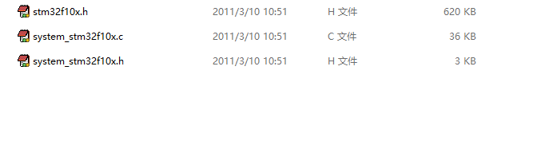

>内核寄存器描述
>
>STM32F10x_StdPeriph_Lib_V3.5.0\Libraries\CMSIS\CM3\CoreSupport

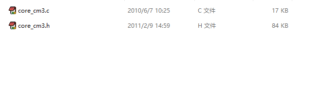

将上述文件复制，并在自己的项目中创建Start文件夹，并且复制到里面。在keil5中添加文件夹与文件

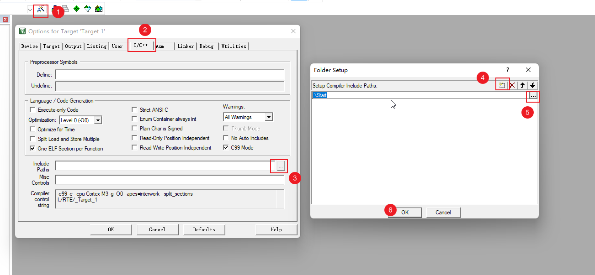

>项目中Start文件中实际添加的文件
>
> 	钥匙符号代表只读

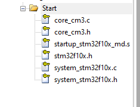

>在项目中添加文件路径（让keil知道去哪里找）

#### 2.2、新建User文件

>1.在项目中新建User文件夹（用于存放main函数和自己的代码）
>
>2.在keil5中创建组，并改名为User
>
>3.添加main函数
>
>4.创建main函数（注意：将路径改到User目录下）

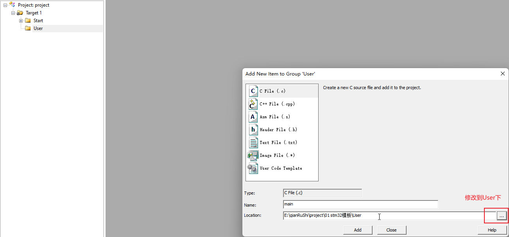

>调字体、调缩进、调编码格式

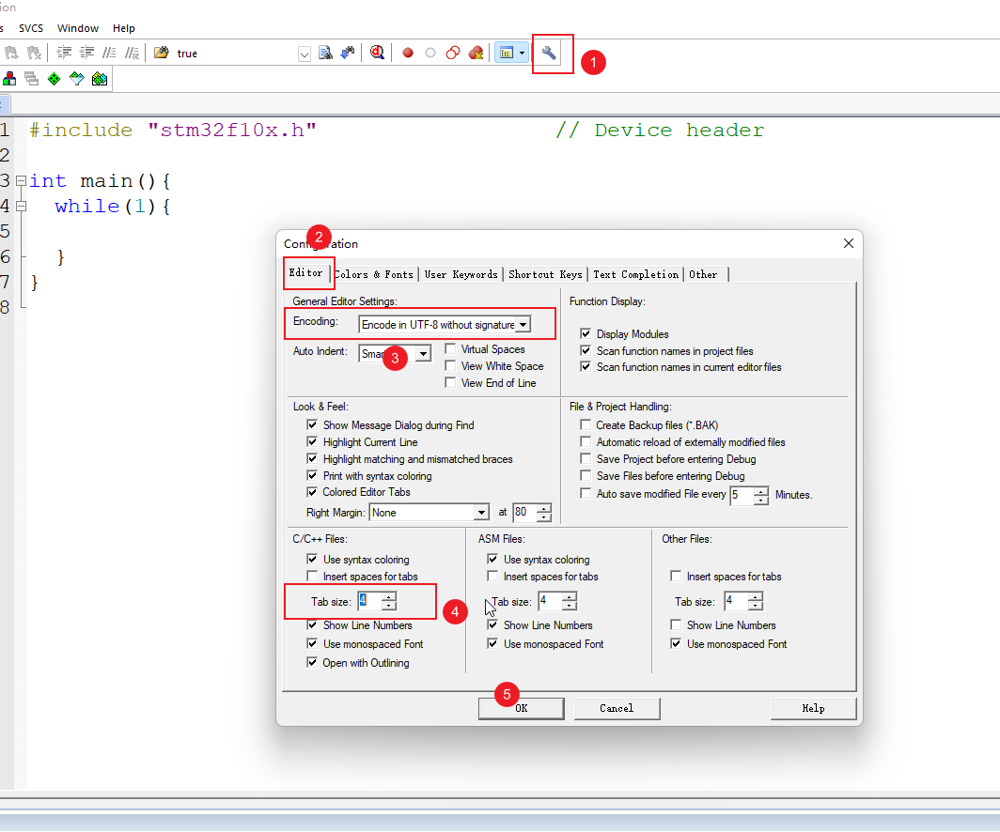

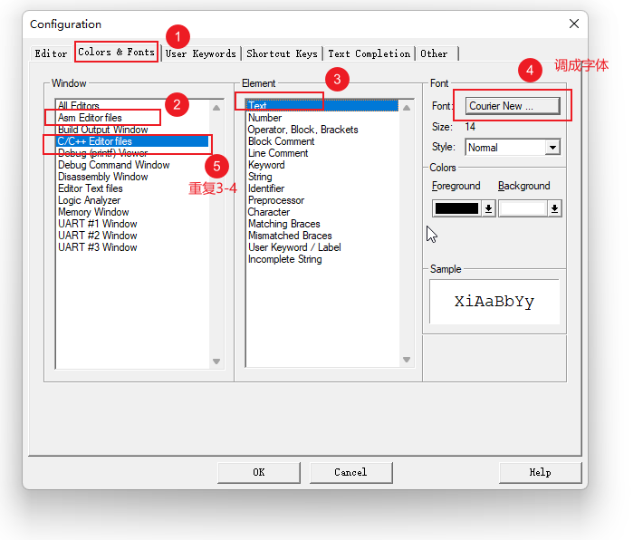

#### 2.3、配置调试器

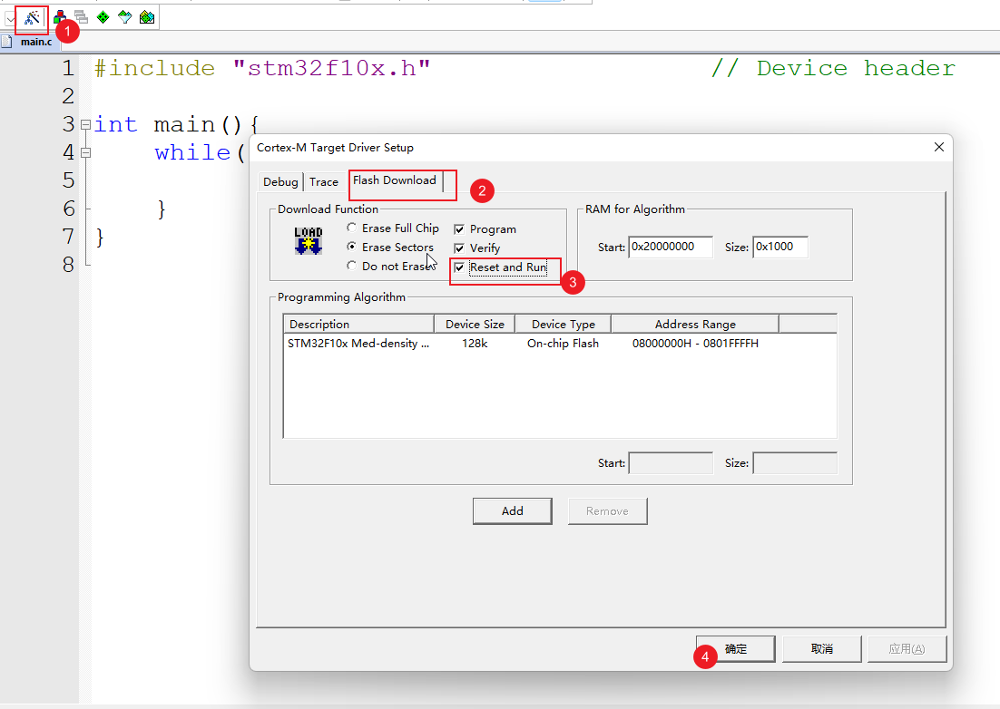

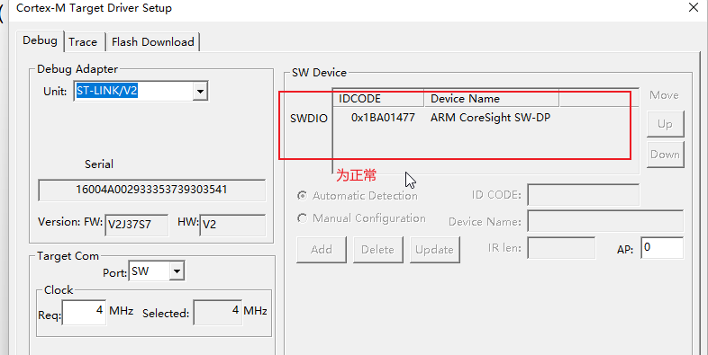

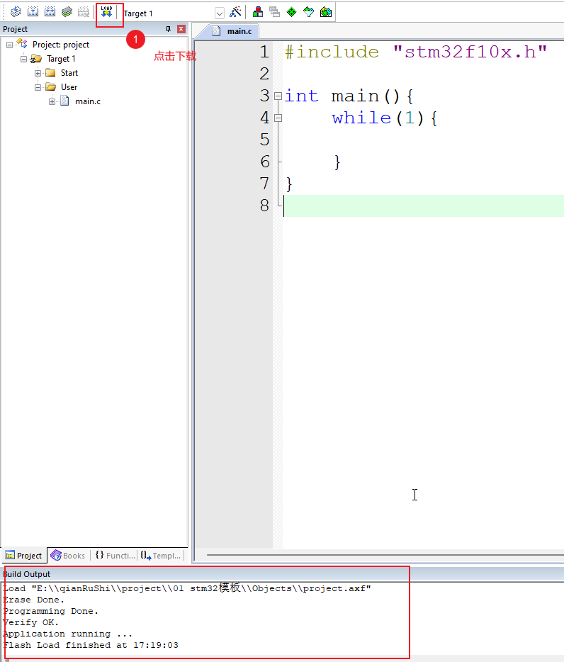

> 下载到实物上后（蓝色LED灯不在闪烁—闪烁原因：stm32内置的调试程序）

>以上的创建完，就可以用基于寄存器的开发方式写stm32了。

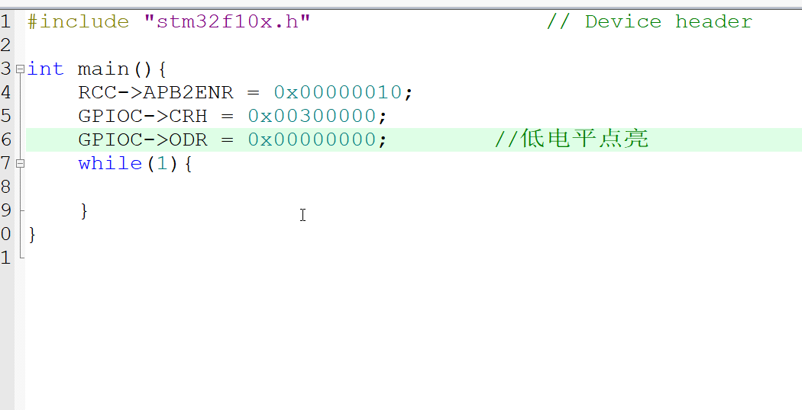

#### 2.4、新建Library文件

>1.在项目中新建Library文件夹
>
>2.在STM32F10x_StdPeriph_Lib_V3.5.0\Libraries\STM32F10x_StdPeriph_Driver\src与STM32F10x_StdPeriph_Lib_V3.5.0\Libraries\STM32F10x_StdPeriph_Driver\inc中复制库函数源文件和头文件，复制到Library中

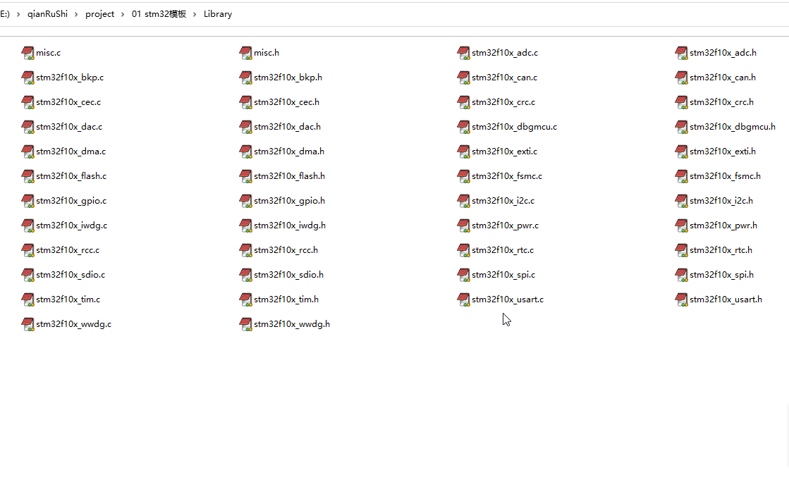

>3.在keil5的项目中新建Library组，并且添加上面的所有文件

#### 2.5、在User文件夹中新增文件

>在STM32F10x_StdPeriph_Lib_V3.5.0\Project\STM32F10x_StdPeriph_Template复制一下文件，复制到项目User目录下
>
>​		conf用于配置u库函数头文件的包含关系

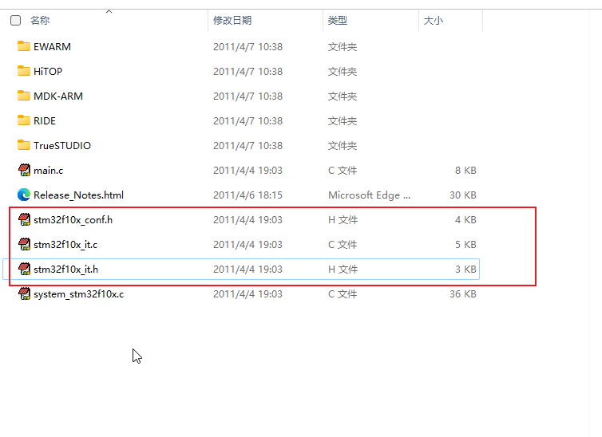

>在keil5的项目User文件下新增，并且设置宏定义（USE_STDPERIPH_DRIVER在stm32f10x.h文件的最后面）

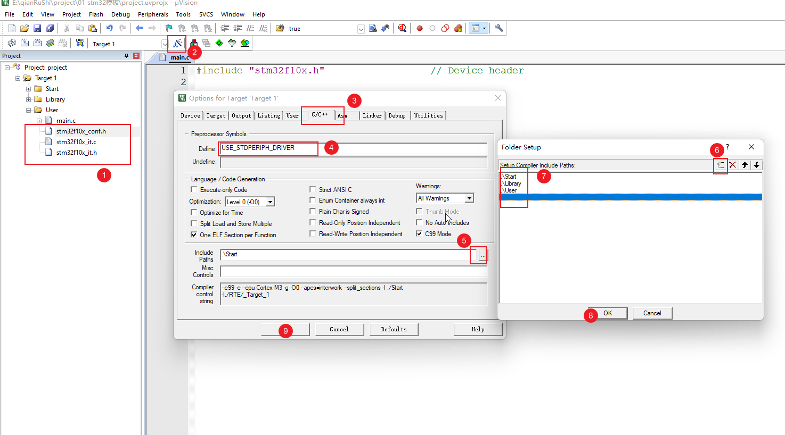

>以上为库函数开发方式

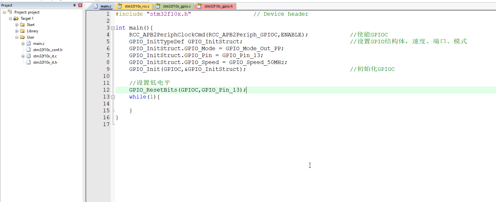

==新建文件步凑==

>•建立工程文件夹，Keil中新建工程，选择型号
>
>•工程文件夹里建立Start、Library、User等文件夹，复制固件库里面的文件到工程文件夹
>
>•工程里对应建立Start、Library、User等同名称的分组，然后将文件夹内的文件添加到工程分组里
>
>•工程选项，C/C++，Include Paths内声明所有包含头文件的文件夹
>
>•工程选项，C/C++，Define内定义USE_STDPERIPH_DRIVER
>
>•工程选项，Debug，下拉列表选择对应调试器，Settings，Flash Download里勾选Reset and Run

### 注意：

1、keil中CMSIS为红色，是因为支持包与MDK的版本不相符合
