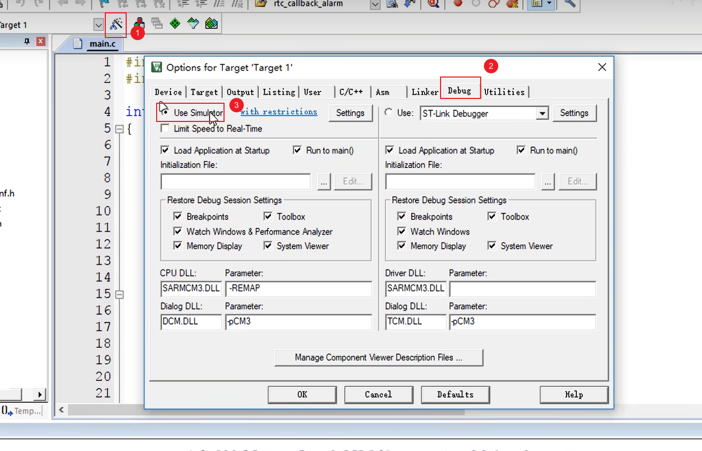
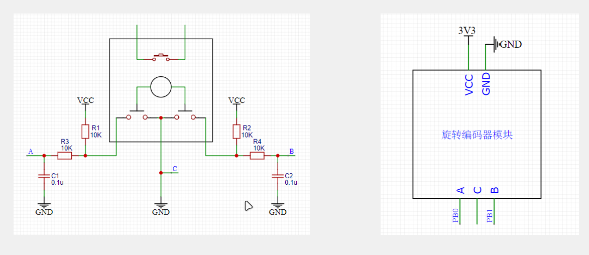
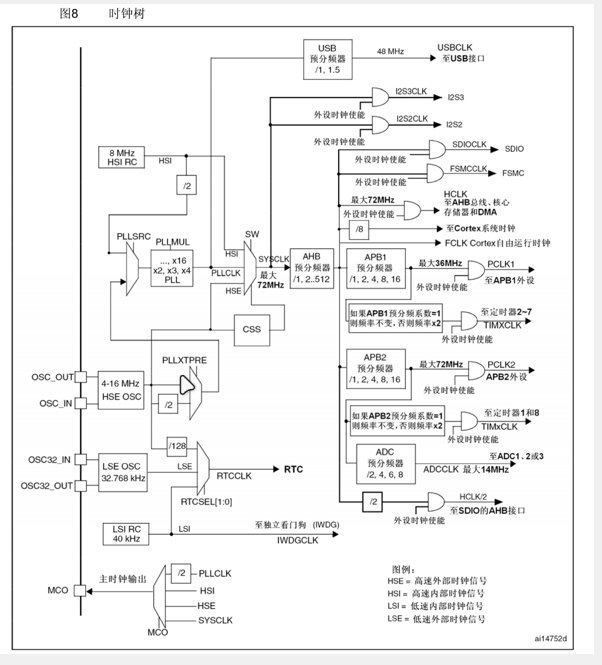

[TOC]

### 1、stm32

#### 1.1、stm32简介

>•STM32是ST公司基于ARM Cortex-M内核开发的32位微控制器
>
>•STM32常应用在嵌入式领域，如智能车、无人机、机器人、无线通信、物联网、工业控制、娱乐电子产品等
>
>•STM32功能强大、性能优异、片上资源丰富、功耗低，是一款经典的嵌入式微控制器


#### 1.2、ARM

>•ARM既指ARM公司，也指ARM处理器内核
>
>•ARM公司是全球领先的半导体知识产权（IP）提供商，全世界超过95%的智能手机和平板电脑都采用ARM架构
>
>•ARM公司设计ARM内核，半导体厂商完善内核周边电路并生产芯片


#### 1.3、STM32F103C8T6


#### 1.4、命名规则


#### 1.5、系统结构


#### 1.6、引脚定义


[引脚定义](STM32F103C8T6引脚定义.xlsx)

#### 1.7、启动配置


#### 1.8、最小系统电路


### 2、keil新建stm32工程

[keil5_MDK安装教程](https://www.bilibili.com/video/BV1th411z7sn/?spm_id_from=333.1391.0.0&p=3&vd_source=5f8610a33e469a605635adbbdcc8c98e)

> 开发方式:
>
> - 基于寄存器的方式——类似51，程序直接配置寄存器
> - 基于标志库的方式（库函数）——使用ST官方封装好的库函数间接配置寄存器
> - 基于HAL方式——用图形化界面快速配置stm32

#### 2.1、新建Strat文件

>启动文件(官方下载的文件)
>
>STM32F10x_StdPeriph_Lib_V3.5.0\Libraries\CMSIS\CM3\DeviceSupport\ST\STM32F10x\startup\arm


>| **缩写**  (文件后缀) | **释义**           | **Flash容量** | **型号**          |
>| -------------------- | ------------------ | ------------- | ----------------- |
>| LD_VL                | 小容量产品超值系列 | 16~32K        | STM32F100         |
>| MD_VL                | 中容量产品超值系列 | 64~128K       | STM32F100         |
>| HD_VL                | 大容量产品超值系列 | 256~512K      | STM32F100         |
>| LD                   | 小容量产品         | 16~32K        | STM32F101/102/103 |
>| MD                   | 中容量产品         | 64~128K       | STM32F101/102/103 |
>| HD                   | 大容量产品         | 256~512K      | STM32F101/102/103 |
>| XL                   | 加大容量产品       | 大于512K      | STM32F101/102/103 |
>| CL                   | 互联型产品         | -             | STM32F105/107     |


>外设寄存器描述以及system配置文件
>
>STM32F10x_StdPeriph_Lib_V3.5.0\Libraries\CMSIS\CM3\DeviceSupport\ST\STM32F10x
>
>​	stm32f10x.h 外设描述文件，类似REGX51.h
>
>​	system开头的文件：配置时钟


>内核寄存器描述
>
>STM32F10x_StdPeriph_Lib_V3.5.0\Libraries\CMSIS\CM3\CoreSupport


将上述文件复制，并在自己的项目中创建Start文件夹，并且复制到里面。在keil5中添加文件夹与文件


>项目中Start文件中实际添加的文件
>
> 	钥匙符号代表只读


>在项目中添加文件路径（让keil知道去哪里找）


#### 2.2、新建User文件

>1.在项目中新建User文件夹（用于存放main函数和自己的代码）
>
>2.在keil5中创建组，并改名为User
>
>3.添加main函数
>
>4.创建main函数（注意：将路径改到User目录下）


>调字体、调缩进、调编码格式


#### 2.3、配置调试器


> 下载到实物上后（蓝色LED灯不在闪烁—闪烁原因：stm32内置的调试程序）


>以上的创建完，就可以用基于寄存器的开发方式写stm32了。


#### 2.4、新建Library文件

>1.在项目中新建Library文件夹
>
>2.在STM32F10x_StdPeriph_Lib_V3.5.0\Libraries\STM32F10x_StdPeriph_Driver\src与STM32F10x_StdPeriph_Lib_V3.5.0\Libraries\STM32F10x_StdPeriph_Driver\inc中复制库函数源文件和头文件，复制到Library中


>3.在keil5的项目中新建Library组，并且添加上面的所有文件


#### 2.5、在User文件夹中新增文件

>在STM32F10x_StdPeriph_Lib_V3.5.0\Project\STM32F10x_StdPeriph_Template复制一下文件，复制到项目User目录下
>
>​		conf用于配置u库函数头文件的包含关系


>在keil5的项目User文件下新增，并且设置宏定义（USE_STDPERIPH_DRIVER在stm32f10x.h文件的最后面）


>以上为库函数开发方式


==新建文件步凑==

>•建立工程文件夹，Keil中新建工程，选择型号
>
>•工程文件夹里建立Start、Library、User等文件夹，复制固件库里面的文件到工程文件夹
>
>•工程里对应建立Start、Library、User等同名称的分组，然后将文件夹内的文件添加到工程分组里
>
>•工程选项，C/C++，Include Paths内声明所有包含头文件的文件夹
>
>•工程选项，C/C++，Define内定义USE_STDPERIPH_DRIVER
>
>•工程选项，Debug，下拉列表选择对应调试器，Settings，Flash Download里勾选Reset and Run


### 3、GPIO

#### 3.1、GPIO简介

>•GPIO（General Purpose Input Output）通用输入输出口
>
>•可配置为8种输入输出模式
>
>•引脚电平：0V~3.3V，部分引脚可容忍5V
>
>•输出模式下可控制端口输出高低电平，用以驱动LED、控制蜂鸣器、模拟通信协议输出时序等
>
>•输入模式下可读取端口的高低电平或电压，用于读取按键输入、外接模块电平信号输入、ADC电压采集、模拟通信协议接收数据等

#### 3.2、GPIO基本结构

>所有的GPIO都挂载在APB2总线上。
>
>GPIO中的寄存器为32位寄存器，P0~P15只是使用了低16位。
>
>驱动器负责增大驱动能力。


#### 3.3、GPIO位结构


>输入部分：
>
>①：保护二极管：保护电路。当输入电压大于VDD时，上部分的二极管导通，电流流向VDD；当输入电压小于VSS时，下部分的二极管导通，电流从VSS流向I/O引脚。只有在VSS~VDD之间才能输入。I/O引脚电压相对于VSS，可以存在负数。
>
>②、③：上拉电阻、下拉电阻。当②打开，③关闭时，为上拉输入（默认为高电平输入）；当③打开，②关闭时，为下拉输入（默认为低电平输入）；当②、③都关闭时，为浮空输入（及其不稳定）。上拉电阻与下拉电阻阻值一般比较大，所以是弱上拉与弱下拉，目的是为了不影响正常输入操作。
>
>④、TTL施密特触发器（由肖特基管构成）。对输入电压进行整形。虽然输入电压为数字信号，但是也会存在波动。
>
>
>
>输出部分：
>
>⑤、位设置/位清除寄存器：用于操作输出数据寄存器（只能整体读写）的某位进行置1或者置0。
>
>​	常见的位操作：
>
>​		a、将输出数据寄存器读出，通过&=和|=操作，在整体写入到输出数据寄存器中。
>
>​		b、设置位设置/位清除寄存器，对位设置/位清除寄存器中的某位进行操作，然后整体写入输出数据寄存器。
>
>​		c、读写stm32位带区域（等价于51位寻址）。
>
>⑥、⑦：PMOS管（低电平导通）、NMOS管（高电平导通）。==推挽输出模式==（强推模式）下，PMOS管和NMOS管均有效，当输出数据寄存器输出1时，PMOS管导通，NMOS管断开，I/O引脚直接接到VDD，输出高电平；当输出数据寄存器输出0时，PMOS管断开，NMOS管导通，I/O引脚直接接到VSS，输出低电平，==高低电平均匀驱动能力==。==开漏输出模式==下，PMOS管无效，NMOS管有效，当输出数据寄存器输出1时，NMOS管断开，输出断开，相当于高祖模式；当输出数据寄存器输出0时，NMOS管导通，I/O引脚直接接到VSS，输出低电平；开漏模式下，==只有低电平有驱动能力==，常用于通信协议的驱动，如：I2C。

#### 3.4、GPIO输入输出模式

>| **模式名称**                       | **性质** | **特征**                                                     |
>| ---------------------------------- | -------- | ------------------------------------------------------------ |
>| 浮空输入 （GPIO_Mode_IN_FLOATING） | 数字输入 | 可读取引脚电平，若引脚悬空，则电平不确定 ,使用时，端口一定要接上连续驱动源 |
>| 上拉输入  （GPIO_Mode_IPU）        | 数字输入 | 可读取引脚电平，内部连接上拉电阻，悬空时默认高电平           |
>| 下拉输入  （GPIO_Mode_IPD）        | 数字输入 | 可读取引脚电平，内部连接下拉电阻，悬空时默认低电平           |
>| 模拟输入 （GPIO_Mode_AIN ）        | 模拟输入 | GPIO无效，引脚直接接入内部ADC                                |
>| 开漏输出  （GPIO_Mode_Out_OD）     | 数字输出 | 可输出引脚电平，高电平为高阻态，低电平接VSS                  |
>| 推挽输出  （GPIO_Mode_Out_PP）     | 数字输出 | 可输出引脚电平，高电平接VDD，低电平接VSS                     |
>| 复用开漏输出（GPIO_Mode_AF_OD）    | 数字输出 | 由片上外设控制，高电平为高阻态，低电平接VSS                  |
>| 复用推挽输出  （GPIO_Mode_AF_PP）  | 数字输出 | 由片上外设控制，高电平接VDD，低电平接VSS                     |

>浮空/上拉/下拉输入
>
>

>模拟输入
>
>

>开漏/推挽输出（也可以进行简单的输入）
>
>

>复用开漏/推挽输出
>
>

#### 3.5、传感器模块

##### （1）简介

>•传感器模块：传感器元件（光敏电阻/热敏电阻/红外接收管等）的电阻会随外界模拟量的变化而变化，通过与定值电阻分压即可得到模拟电压输出，再通过电压比较器进行二值化即可得到数字电压输出


##### （2） 硬件电路


### 4、OLED调试

>调试方式	
>
>•串口调试：通过串口通信，将调试信息发送到电脑端，电脑使用串口助手显示调试信息
>
>•
>
>•显示屏调试：直接将显示屏连接到单片机，将调试信息打印在显示屏上
>
>•
>
>•Keil调试模式：借助Keil软件的调试模式，可使用单步运行、设置断点、查看寄存器及变量等功能

#### 4.1、简介

>•OLED（Organic Light Emitting Diode）：有机发光二极管
>
>•OLED显示屏：性能优异的新型显示屏，具有功耗低、相应速度快、宽视角、轻薄柔韧等特点
>
>•0.96寸OLED模块：小巧玲珑、占用接口少、简单易用，是电子设计中非常常见的显示屏模块
>
>•供电：3~5.5V，通信协议：I2C/SPI，分辨率：128*64
>
>

#### 4.2、硬件电路


>4引脚使用的是I2C协议，7引脚使用的是SPI引脚

### 5、keil调试方式

>选择进行仿真调试，并且连接好stm32



>点击编译，点击仿真按钮


>菜单介绍


>使用逻辑分析仪，需要在CPU DLL、Dialog DLL 输入**-**pSTM32F103ZE，以及在Dialog DLL下更改成DARMSTM.DLL
>
>
>
>引脚输入为PORTx.n
>
>


>注意：==每次退出仿真调试，需要重新编译，在进入==

### 6、EXTI外部中断

#### 6.1、中断

>•中断：在主程序运行过程中，出现了特定的中断触发条件（中断源），使得CPU暂停当前正在运行的程序，转而去处理中断程序，处理完成后又返回原来被暂停的位置继续运行
>
>•中断优先级：当有多个中断源同时申请中断时，CPU会根据中断源的轻重缓急进行裁决，优先响应更加紧急的中断源
>
>•中断嵌套：当一个中断程序正在运行时，又有新的更高优先级的中断源申请中断，CPU再次暂停当前中断程序，转而去处理新的中断程序，处理完成后依次进行返回

#### 6.2、STM32中断（部分型号）

>•68个可屏蔽中断通道，包含EXTI、TIM、ADC、USART、SPI、I2C、RTC等多个外设
>
>•使用==NVIC==统一管理中断，每个中断通道都拥有==16个可编程==的优先等级，可对优先级进行分组，进一步设置抢占优先级和响应优先级

>灰色部分为内核中断。
>
>白色为外设中断。
>
>向量表–>可以看成c语言的指针，里面存储的是，实际中断函数的地址。


#### 6.3、NVIC（嵌套中断向量控制器）——位于内核中

##### （1）、NVIC基本结构


##### （2）、NVIC优先级分组

>•NVIC的中断优先级由==优先级寄存器的4位==（0~15）决定（==数字越小优先级越高==），这4位可以进行切分，分为==高n位的抢占优先级==和==低4-n位的响应优先级==
>
>- 抢占优先级高的可以中断嵌套（打断当前中断）
>- 响应优先级高的可以优先排队（优先进入空闲的CPU）
>- 抢占优先级和响应优先级均相同的按中断号排队（根据中断向量表中的向量号决定）

>| **分组方式** | **抢占优先级**      | **响应优先级**      |
>| ------------ | ------------------- | ------------------- |
>| 分组0        | 0位，取值范围为0    | 4位，取值范围为0~15 |
>| 分组1        | 1位，取值范围为0~1  | 3位，取值范围为0~7  |
>| 分组2        | 2位，取值范围为0~3  | 2位，取值范围为0~3  |
>| 分组3        | 3位，取值范围为0~7  | 1位，取值范围为0~1  |
>| 分组4        | 4位，取值范围为0~15 | 0位，取值范围为0    |
>
>（抢占>响应>中断号，数字越小优先级越高，一个中断同时用于抢占优先级和响应优先级）

#### 6.4、EXTI

##### （1）、简介

>•EXTI（Extern Interrupt）外部中断
>
>•EXTI可以监测指定GPIO口的电平信号，当其指定的GPIO口产生电平变化时，EXTI将立即向NVIC发出中断申请，经过NVIC裁决后即可中断CPU主程序，使CPU执行EXTI对应的中断程序
>
>•支持的触发方式：上升沿/下降沿/双边沿(上升沿与下降沿均可以触发)/软件触发（程序中执行指令触发）
>
>•支持的GPIO口：所有GPIO口，但==相同的Pin不能同时触发中断==（不同GPIO的相同引脚口（GPIO_Pin_x）不能同时触发中断，如：PA0与PB0是不行，PA0与PB1是可以的）
>
>•通道数（==20个==）：16个GPIO_Pin，外加PVD输出、RTC闹钟、USB唤醒、以太网唤醒（后面4个是会利用到外部中断**从低功耗的停止模式下唤醒stm32的功能**）
>
>•触发响应方式：中断响应/事件响应

##### （2）、基本结构


##### （3）、AFIO复用IO口

>•AFIO主要用于引脚复用功能的选择和重定义
>
>•在STM32中，AFIO主要完成两个任务：复用功能引脚重映射、中断引脚选择


##### （4）、EXTI框图


#### 6.5、旋转编码器

##### （1）、简介

>•旋转编码器：用来测量位置、速度或旋转方向的装置，当其旋转轴旋转时，其输出端可以输出与旋转速度和方向对应的方波信号，读取方波信号的频率和相位信息即可得知旋转轴的速度和方向
>
>•类型：机械触点式/霍尔传感器式/光栅式

##### （2）、硬件电路



>本次使用的是机械触点式旋转编码器，利用A、B口出现波形的位置来判断方向（出现位置会相差90°，四分之一的波形）
>

### 7、TIM

#### 7.1、简介

>•TIM（Timer）定时器
>
>•定时器可以对输入的时钟进行计数，并在计数值达到设定值时触发中断
>
>•==16位计数器（计数）、预分频器（倍频）、自动重装寄存器（装入目标值，自动与计数器值比较）的时基单元==，在72MHz计数时钟下可以实现最大59.65s的定时（内部的预分频器与自动重载器都为16位——65536，（65536*（65536/72MHZ））us）。
>
>•不仅具备基本的定时中断功能，而且还包含内外时钟源选择、输入捕获、输出比较、编码器接口、主从触发模式等多种功能
>
>•根据复杂度和应用场景分为了高级定时器、通用定时器、基本定时器三种类型
>
>•STM32定时器支持定时器级联（一个定时器的输出作为另一个的定时器的输入，定时时间会成65536*65536的倍数增长）

#### 7.2、定时器类型

>| **高级定时器** | **TIM1** **、** **TIM8** | **APB2** | **拥有通用定时器全部功能，并额外具有重复计数器、死区生成、互补输出、刹车输入等功能** |
>| -------------- | ------------------------ | -------- | ------------------------------------------------------------ |
>| 通用定时器     | TIM2、TIM3、TIM4、TIM5   | APB1     | 拥有基本定时器全部功能，并额外具有内外时钟源选择、输入捕获、输出比较、编码器接口、主从触发模式等功能 |
>| 基本定时器     | TIM6、TIM7               | APB1     | 拥有定时中断、主模式触发DAC的功能                            |
>
>•STM32F103C8T6定时器资源：TIM1、TIM2、TIM3、TIM4

##### （1）、基本定时器

>CNT计数器支持模式：向上计数（从0开始自增到重装值，然后申请中断，清零，开始下一次计数循环）


##### （2）、通用定时器

>CNT计数器支持模式：向上计数、向下计数（从重载值开始自减到0，然后申请中断，恢复重载值，开始下一次计数循环）、中央对齐（从0开始自增到重装值，然后申请中断；下一次循环从重装值开始自减到0，然后申请中断；开始下一次计数。）


>- ①内部时钟源，该模式与基本定时器相同。
>
>- 外部时钟源（4种时钟源）：
>
>	- ②TIMx_ETR（本芯片复用在PA0上），如果选择配置③ETRF，那么该模式成为：外部时钟模式2；如果选择配置⑦TRGI，并且把TRGI的触发输入当作外部时钟。称作：外部时钟模式1。
>
>	-  ④ITR0~3，把其他定时器的输出当作外部时钟输入，来源为其他定时器的⑧TRGO（其他定时器将⑨更新事件映射到TRGO上）——定时器的级联。
>
>		
>
>	- ⑤TIF_ED（ED：边沿有效）,与TIMx_CH1相连。
>
>	- ⑥TI1FP1、TI2FP2：与⑩TIMx_CH1的TI1FP1相连、⑩TIMx_CH2的TI2FP2相连。
>
>		- 注意：使用外部时钟模式1，只要把TRGI的触发输入当作外部时钟就可以称为外部时钟模式1。
>
>- 下面的TIMx_CH1~4组成了输入捕获和输出比较，其中共用了捕获/比较寄存器。
>
>


##### （3）、高级定时器

>CNT计数器支持模式：向上计数、向下计数、中央对齐。
>
>图中，带影子的框图，都表示自带一个缓存机制——影子寄存器（用与不用可以自己决定）。
>
>- ①、重复次数计数器：让更新中断、更新事件，每隔几个周期更新一次（对中断结果进行了再一次的分频）。
>- ②、增加了死区生成电路（DTG），为了防止直通现象（直通就是一个桥臂上下两个开关管同时导通，此时会将电路给短路，同时可能烧毁开关管），增加了几对互补的PWM输出，为了驱动三相无刷电机（需要三个桥臂（每隔桥臂上有两个开关管））。
>- ③、当出现刹车信号、内部时钟失效，控制电路会自动切断电机输出，防止意外发生。


#### 7.3、时序

##### （1）、预分频器时序

>- CK_PSC：内部时钟频率
>- CNT_EN：预分频器使能
>- CK_CNT：分频之后的频率，中间比较密集的部分为1分频，后面比较稀疏的部分为2分频
>- 计数器寄存器（CNT）：FC为重装载值，ARR中的值。
>- UEV：更新事件（CNT == ARR）
>- 预分频控制寄存器：实际能操作的值，向其中写入PSC中的值（想要的分频系数）
>- 预分频缓存器：向预分频控制寄存器写入数据后，并不会马上改变预分频计数器，而是让预分频计数器完成一个周期之后，才让修改预分频计数器
>- 预分频计数器：计数，计数值等于预分频控制器中的值时，下一次计数（清零），让产生CNT的变化

$$
计数器计数频率：
CK\_CNT = CK\_PSC / (PSC + 1)
\\
注：PSC为预分频器的值
$$


##### （2）、计数器时序

>当UIF=1时，才会产生中断，且只能软件清零。

$$
计数器溢出频率：
CK\_CNT\_OV = CK\_CNT / (ARR + 1)
\\
加入计数器计数频率后:
					       CK\_CNT\_OV= CK\_PSC / (PSC + 1) / (ARR + 1)
\\
工作流程：
对CK\_PSC（时钟频率，单位;hz）缩小成（（PSC+1）/CK\_PSC）（频率,单位;hz），计数（ARR+1）次，就是计时（(PSC+1)*(ARR +1) / CK\_PSC）(时间，单位：s)					       
\\
计数器溢出时间：1/CK\_CNT\_OV
$$


##### （3）、计数器无预装时序（不启用影子寄存器）

>在改变ARR（自动加载寄存器）后，计数器的值，加到改变后ARR中的值，就产生了更新中断与更新事件


##### （4）、计数器有预装时序（启用影子寄存器）

>在改变ARR（自动加载寄存器）后，计数器的值，加到改变前ARR中的值，才产生了更新中断与更新事件


#### 7.4、RCC时钟树

>ST配置好的时钟初始化函数（SystemInit）




**==无论高级定时器、通用定时器、基本定时器其内部基准时钟都为72MHz==**


### C语言

>数据类型
>
>| **关键字**         | **位数** | **表示范围**                 | **stdint.h** **重定义关键字** | **ST** **关键字**（老版本） |
>| ------------------ | -------- | ---------------------------- | ----------------------------- | --------------------------- |
>| char               | 8        | -128 ~ 127                   | int8_t                        | s8                          |
>| unsigned char      | 8        | 0 ~ 255                      | uint8_t                       | u8                          |
>| ==short==          | ==16==   | ==-32768 ~ 32767==           | ==int16_t==                   | ==s16==                     |
>| unsigned short     | 16       | 0 ~ 65535                    | uint16_t                      | u16                         |
>| ==int==            | ==32==   | ==-2147483648 ~ 2147483647== | ==int32_t==                   | s32                         |
>| unsigned int       | 32       | 0 ~ 4294967295               | uint32_t                      | u32                         |
>| ==long==           | ==32==   | ==-2147483648 ~ 2147483647== |                               |                             |
>| unsigned long      | 32       | 0 ~ 4294967295               |                               |                             |
>| long long          | 64       | -(2^64)/2 ~ (2^64)/2-1       | int64_t                       |                             |
>| unsigned long long | 64       | 0 ~ (2^64)-1                 | uint64_t                      |                             |
>| float              | 32       | -3.4e38 ~ 3.4e38             |                               |                             |
>| double             | 64       | -1.7e308 ~ 1.7e308           |                               |                             |


>C语言宏定义
>
>•关键字：#define
>
>•用途：用一个字符串代替一个数字，便于理解，防止出错；提取程序中经常出现的参数，便于快速修改（==定义一个常量或者常用数据==）
>
>•定义宏定义：
>
> \#define ABC 12345
>
>•引用宏定义：
>
> int a = ABC; //等效于int a = 12345;


>C语言typedef
>
>•关键字：typedef
>
>•用途：将一个比较长的==变量==类型名换个名字，便于使用
>
>•定义typedef：
>
> typedef unsigned char uint8_t;
>
>•引用typedef：
>
>  uint8_t a; //等效于unsigned char a;


>C语言结构体
>
>•关键字：struct
>
>•用途：数据打包，不同类型变量的集合
>
>•定义结构体变量：
>
> struct{char x; int y; float z;} StructName;  				（匿名结构体）
>
>
>
>struct aaa {char x; int y; float z;} ;		
>
>struct aaa pStructName;
>
>或者
>
>typedef struct {char x; int y; float z;}  aaa；		（加typedef换名）
>
>aaa pStructName;
>
>\> StructName,pStructName为结构体变量   aaa 为结构体类型名 <
>
> ==因为结构体变量类型较长，所以通常用typedef更改变量类型名==
>
>•引用结构体成员：
>
> StructName.x = 'A';
>
> StructName.y = 66;
>
> StructName.z = 1.23;
>
>或 pStructName->x = 'A'; //pStructName为结构体的地址 （结构体指针）
>
>pStructName->y = 66;
>
> pStructName->z = 1.23;


>C语言枚举
>
>•关键字：enum
>
>•用途：定义一个取值受限制的整型变量，用于限制变量取值范围；宏定义的集合
>
>•定义枚举变量：
>
> enum{FALSE = 0, TRUE = 1} EnumName;
>
>或者
>
>typedef  enum{FALSE = 0, TRUE = 1} aaa;
>
>aaa EnumName;
>
> ==因为枚举变量类型较长，所以通常用typedef更改变量类型名==
>
>•引用枚举成员：
>
> EnumName = FALSE;
>
> EnumName = TRUE;
>
>>枚举类型多文件抛出
>>
>>xxxx.h
>>
>>```c
>>#ifndef __XXXX_h_
>>#define __XXXX_h_
>>
>>typedef enum {
>>	ON = 0, 
>>	OFF = !ON
>>} xxx;
>>
>>#endif
>>
>>```
>>
>>main.c
>>
>>```c
>>#include <stido.h>
>>#include "xxxx.h"
>>
>>int main(){
>>    printf ("%d\n"，ON);
>>    return 0;
>>}
>>```
>>
>>


### 注意：

1、keil中CMSIS为红色，是因为支持包与MDK的版本不相符合。

2、写main函数时，必须位int main(){while(1){}} 切main函数写完还有空一行，否则会出现两个警告。

3、System文件夹用于存放自定义函数（系统资源）、功能函数。

4、Hardware文件夹用于存放硬件驱动。

5、ctrl+alt+空格 可以在没有代码提示的时候出现代码提示。
