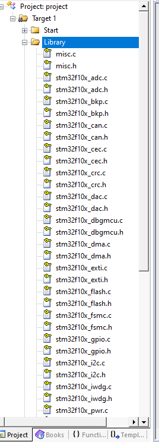
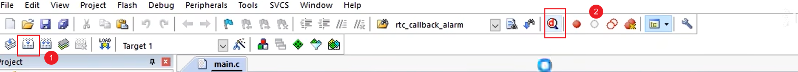
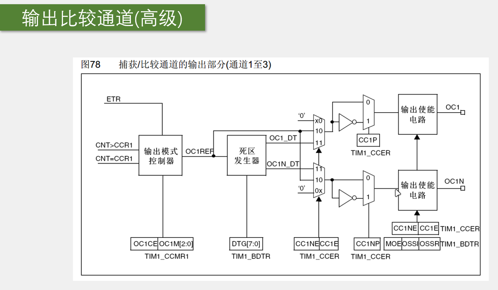
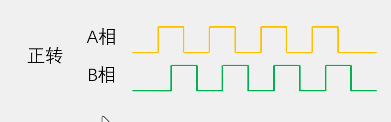
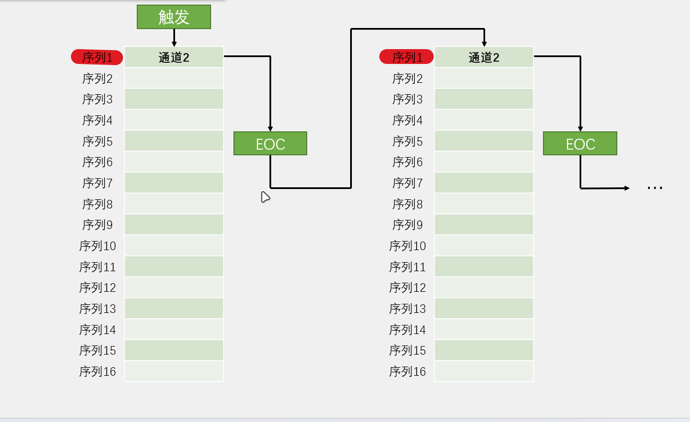

[TOC]

### 1、stm32

#### 1.1、stm32 简介

>•STM32 是 ST 公司基于 ARM Cortex-M 内核开发的 32 位微控制器
>
>•STM32 常应用在嵌入式领域，如智能车、无人机、机器人、无线通信、物联网、工业控制、娱乐电子产品等
>
>•STM32 功能强大、性能优异、片上资源丰富、功耗低，是一款经典的嵌入式微控制器


#### 1.2、ARM

>•ARM 既指 ARM 公司，也指 ARM 处理器内核
>
>•ARM 公司是全球领先的半导体知识产权（IP）提供商，全世界超过 95%的智能手机和平板电脑都采用 ARM 架构
>
>•ARM 公司设计 ARM 内核，半导体厂商完善内核周边电路并生产芯片


#### 1.3、STM32F103C8T6


#### 1.4、命名规则


#### 1.5、系统结构


#### 1.6、引脚定义


[引脚定义](STM32F103C8T6引脚定义.xlsx)

#### 1.7、启动配置


#### 1.8、最小系统电路


### 2、keil 新建 stm32 工程

[keil5_MDK 安装教程](https://www.bilibili.com/video/BV1th411z7sn/?spm_id_from=333.1391.0.0&p=3&vd_source=5f8610a33e469a605635adbbdcc8c98e)

> 开发方式:
>
> - 基于寄存器的方式——类似 51，程序直接配置寄存器
> - 基于标志库的方式（库函数）——使用 ST 官方封装好的库函数间接配置寄存器
> - 基于 HAL 方式——用图形化界面快速配置 stm32

#### 2.1、新建 Strat 文件

>启动文件(官方下载的文件)
>
>STM32F10x_StdPeriph_Lib_V3.5.0\Libraries\CMSIS\CM3\DeviceSupport\ST\STM32F10x\startup\arm


>| **缩写**  (文件后缀) | **释义**           | **Flash 容量** | **型号**          |
>| -------------------- | ------------------ | ------------- | ----------------- |
>| LD_VL                | 小容量产品超值系列 | 16~32K        | STM32F100         |
>| MD_VL                | 中容量产品超值系列 | 64~128K       | STM32F100         |
>| HD_VL                | 大容量产品超值系列 | 256~512K      | STM32F100         |
>| LD                   | 小容量产品         | 16~32K        | STM32F101/102/103 |
>| MD                   | 中容量产品         | 64~128K       | STM32F101/102/103 |
>| HD                   | 大容量产品         | 256~512K      | STM32F101/102/103 |
>| XL                   | 加大容量产品       | 大于 512K      | STM32F101/102/103 |
>| CL                   | 互联型产品         | -             | STM32F105/107     |


>外设寄存器描述以及 system 配置文件
>
>STM32F10x_StdPeriph_Lib_V3.5.0\Libraries\CMSIS\CM3\DeviceSupport\ST\STM32F10x
>
>​	stm32f10x.h 外设描述文件，类似 REGX51.h
>
>​	system 开头的文件：配置时钟


>内核寄存器描述
>
>STM32F10x_StdPeriph_Lib_V3.5.0\Libraries\CMSIS\CM3\CoreSupport


将上述文件复制，并在自己的项目中创建 Start 文件夹，并且复制到里面。在 keil5 中添加文件夹与文件


>项目中 Start 文件中实际添加的文件
>
> 	钥匙符号代表只读


>在项目中添加文件路径（让 keil 知道去哪里找）


#### 2.2、新建 User 文件

>1.在项目中新建 User 文件夹（用于存放 main 函数和自己的代码）
>
>2.在 keil5 中创建组，并改名为 User
>
>3.添加 main 函数
>
>4.创建 main 函数（注意：将路径改到 User 目录下）


>调字体、调缩进、调编码格式


#### 2.3、配置调试器


> 下载到实物上后（蓝色 LED 灯不在闪烁—闪烁原因：stm32 内置的调试程序）


>以上的创建完，就可以用基于寄存器的开发方式写 stm32 了。


#### 2.4、新建 Library 文件

>1.在项目中新建 Library 文件夹
>
>2.在 STM32F10x_StdPeriph_Lib_V3.5.0\Libraries\STM32F10x_StdPeriph_Driver\src 与 STM32F10x_StdPeriph_Lib_V3.5.0\Libraries\STM32F10x_StdPeriph_Driver\inc 中复制库函数源文件和头文件，复制到 Library 中


>3.在 keil5 的项目中新建 Library 组，并且添加上面的所有文件



#### 2.5、在 User 文件夹中新增文件

>在 STM32F10x_StdPeriph_Lib_V3.5.0\Project\STM32F10x_StdPeriph_Template 复制一下文件，复制到项目 User 目录下
>
>​		conf 用于配置 u 库函数头文件的包含关系


>在 keil5 的项目 User 文件下新增，并且设置宏定义（USE_STDPERIPH_DRIVER 在 stm32f10x.h 文件的最后面）


>以上为库函数开发方式


==新建文件步凑==

>•建立工程文件夹，Keil 中新建工程，选择型号
>
>•工程文件夹里建立 Start、Library、User 等文件夹，复制固件库里面的文件到工程文件夹
>
>•工程里对应建立 Start、Library、User 等同名称的分组，然后将文件夹内的文件添加到工程分组里
>
>•工程选项，C/C++，Include Paths 内声明所有包含头文件的文件夹
>
>•工程选项，C/C++，Define 内定义 USE_STDPERIPH_DRIVER
>
>•工程选项，Debug，下拉列表选择对应调试器，Settings，Flash Download 里勾选 Reset and Run


### 3、GPIO

#### 3.1、GPIO 简介

>•GPIO（General Purpose Input Output）通用输入输出口
>
>•可配置为 8 种输入输出模式
>
>•引脚电平：0V~3.3V，部分引脚可容忍 5V
>
>•输出模式下可控制端口输出高低电平，用以驱动 LED、控制蜂鸣器、模拟通信协议输出时序等
>
>•输入模式下可读取端口的高低电平或电压，用于读取按键输入、外接模块电平信号输入、ADC 电压采集、模拟通信协议接收数据等

#### 3.2、GPIO 基本结构

>所有的 GPIO 都挂载在 APB2 总线上。
>
>GPIO 中的寄存器为 32 位寄存器，P0~P15 只是使用了低 16 位。
>
>驱动器负责增大驱动能力。


#### 3.3、GPIO 位结构


>输入部分：
>
>①：保护二极管：保护电路。当输入电压大于 VDD 时，上部分的二极管导通，电流流向 VDD；当输入电压小于 VSS 时，下部分的二极管导通，电流从 VSS 流向 I/O 引脚。只有在 VSS~VDD 之间才能输入。I/O 引脚电压相对于 VSS，可以存在负数。
>
>②、③：上拉电阻、下拉电阻。当 ② 打开，③ 关闭时，为上拉输入（默认为高电平输入）；当 ③ 打开，② 关闭时，为下拉输入（默认为低电平输入）；当 ②、③ 都关闭时，为浮空输入（及其不稳定）。上拉电阻与下拉电阻阻值一般比较大，所以是弱上拉与弱下拉，目的是为了不影响正常输入操作。
>
>④、TTL 施密特触发器（由肖特基管构成）。对输入电压进行整形。虽然输入电压为数字信号，但是也会存在波动。
>
>
>
>输出部分：
>
>⑤、位设置/位清除寄存器：用于操作输出数据寄存器（只能整体读写）的某位进行置 1 或者置 0。
>
>​	常见的位操作：
>
>​		a、将输出数据寄存器读出，通过&= 和|= 操作，在整体写入到输出数据寄存器中。
>
>​		b、设置位设置/位清除寄存器，对位设置/位清除寄存器中的某位进行操作，然后整体写入输出数据寄存器。
>
>​		c、读写 stm32 位带区域（等价于 51 位寻址）。
>
>⑥、⑦：PMOS 管（低电平导通）、NMOS 管（高电平导通）。==推挽输出模式==（强推模式）下，PMOS 管和 NMOS 管均有效，当输出数据寄存器输出 1 时，PMOS 管导通，NMOS 管断开，I/O 引脚直接接到 VDD，输出高电平；当输出数据寄存器输出 0 时，PMOS 管断开，NMOS 管导通，I/O 引脚直接接到 VSS，输出低电平，==高低电平均匀驱动能力==。==开漏输出模式== 下，PMOS 管无效，NMOS 管有效，当输出数据寄存器输出 1 时，NMOS 管断开，输出断开，相当于高祖模式；当输出数据寄存器输出 0 时，NMOS 管导通，I/O 引脚直接接到 VSS，输出低电平；开漏模式下，==只有低电平有驱动能力==，常用于通信协议的驱动，如：I2C。

#### 3.4、GPIO 输入输出模式

>| **模式名称**                       | **性质** | **特征**                                                     |
>| ---------------------------------- | -------- | ------------------------------------------------------------ |
>| 浮空输入 （GPIO_Mode_IN_FLOATING） | 数字输入 | 可读取引脚电平，若引脚悬空，则电平不确定 , 使用时，端口一定要接上连续驱动源 |
>| 上拉输入  （GPIO_Mode_IPU）        | 数字输入 | 可读取引脚电平，内部连接上拉电阻，悬空时默认高电平           |
>| 下拉输入  （GPIO_Mode_IPD）        | 数字输入 | 可读取引脚电平，内部连接下拉电阻，悬空时默认低电平           |
>| 模拟输入 （GPIO_Mode_AIN ）        | 模拟输入 | GPIO 无效，引脚直接接入内部 ADC                                |
>| 开漏输出  （GPIO_Mode_Out_OD）     | 数字输出 | 可输出引脚电平，高电平为高阻态，低电平接 VSS                  |
>| 推挽输出  （GPIO_Mode_Out_PP）     | 数字输出 | 可输出引脚电平，高电平接 VDD，低电平接 VSS                     |
>| 复用开漏输出（GPIO_Mode_AF_OD）    | 数字输出 | 由片上外设控制，高电平为高阻态，低电平接 VSS                  |
>| 复用推挽输出  （GPIO_Mode_AF_PP）  | 数字输出 | 由片上外设控制，高电平接 VDD，低电平接 VSS                     |

>浮空/上拉/下拉输入
>
>

>模拟输入
>
>

>开漏/推挽输出（也可以进行简单的输入）
>
>

>复用开漏/推挽输出
>
>

#### 3.5、传感器模块

##### （1）简介

>•传感器模块：传感器元件（光敏电阻/热敏电阻/红外接收管等）的电阻会随外界模拟量的变化而变化，通过与定值电阻分压即可得到模拟电压输出，再通过电压比较器进行二值化即可得到数字电压输出


##### （2） 硬件电路


### 4、OLED 调试

>调试方式	
>
>•串口调试：通过串口通信，将调试信息发送到电脑端，电脑使用串口助手显示调试信息
>
>•
>
>•显示屏调试：直接将显示屏连接到单片机，将调试信息打印在显示屏上
>
>•
>
>•Keil 调试模式：借助 Keil 软件的调试模式，可使用单步运行、设置断点、查看寄存器及变量等功能

#### 4.1、简介

>•OLED（Organic Light Emitting Diode）：有机发光二极管
>
>•OLED 显示屏：性能优异的新型显示屏，具有功耗低、相应速度快、宽视角、轻薄柔韧等特点
>
>•0.96 寸 OLED 模块：小巧玲珑、占用接口少、简单易用，是电子设计中非常常见的显示屏模块
>
>•供电：3~5.5V，通信协议：I2C/SPI，分辨率：128*64
>
>

#### 4.2、硬件电路


>4 引脚使用的是 I2C 协议，7 引脚使用的是 SPI 引脚

### 5、keil 调试方式

>选择进行仿真调试，并且连接好 stm32


>点击编译，点击仿真按钮



>菜单介绍


>使用逻辑分析仪，需要在 CPU DLL、Dialog DLL 输入 **-** pSTM32F103ZE，以及在 Dialog DLL 下更改成 DARMSTM.DLL
>
>
>
>引脚输入为 PORTx.n
>
>


>注意：==每次退出仿真调试，需要重新编译，在进入==

### 6、EXTI 外部中断

#### 6.1、中断

>•中断：在主程序运行过程中，出现了特定的中断触发条件（中断源），使得 CPU 暂停当前正在运行的程序，转而去处理中断程序，处理完成后又返回原来被暂停的位置继续运行
>
>•中断优先级：当有多个中断源同时申请中断时，CPU 会根据中断源的轻重缓急进行裁决，优先响应更加紧急的中断源
>
>•中断嵌套：当一个中断程序正在运行时，又有新的更高优先级的中断源申请中断，CPU 再次暂停当前中断程序，转而去处理新的中断程序，处理完成后依次进行返回

#### 6.2、STM32 中断（部分型号）

>•68 个可屏蔽中断通道，包含 EXTI、TIM、ADC、USART、SPI、I2C、RTC 等多个外设
>
>•使用 ==NVIC== 统一管理中断，每个中断通道都拥有 ==16 个可编程== 的优先等级，可对优先级进行分组，进一步设置抢占优先级和响应优先级

>灰色部分为内核中断。
>
>白色为外设中断。
>
>向量表–> 可以看成 c 语言的指针，里面存储的是，实际中断函数的地址。


#### 6.3、NVIC（嵌套中断向量控制器）——位于内核中

##### （1）、NVIC 基本结构


##### （2）、NVIC 优先级分组

>•NVIC 的中断优先级由 ==优先级寄存器的 4 位==（0~15）决定（==数字越小优先级越高==），这 4 位可以进行切分，分为 ==高 n 位的抢占优先级== 和 ==低 4-n 位的响应优先级==
>
>- 抢占优先级高的可以中断嵌套（打断当前中断）
>- 响应优先级高的可以优先排队（优先进入空闲的 CPU）
>- 抢占优先级和响应优先级均相同的按中断号排队（根据中断向量表中的向量号决定）

>| **分组方式** | **抢占优先级**      | **响应优先级**      |
>| ------------ | ------------------- | ------------------- |
>| 分组 0        | 0 位，取值范围为 0    | 4 位，取值范围为 0~15 |
>| 分组 1        | 1 位，取值范围为 0~1  | 3 位，取值范围为 0~7  |
>| 分组 2        | 2 位，取值范围为 0~3  | 2 位，取值范围为 0~3  |
>| 分组 3        | 3 位，取值范围为 0~7  | 1 位，取值范围为 0~1  |
>| 分组 4        | 4 位，取值范围为 0~15 | 0 位，取值范围为 0    |
>
>（抢占 > 响应 > 中断号，数字越小优先级越高，一个中断同时用于抢占优先级和响应优先级）

#### 6.4、EXTI

##### （1）、简介

>•EXTI（Extern Interrupt）外部中断
>
>•EXTI 可以监测指定 GPIO 口的电平信号，当其指定的 GPIO 口产生电平变化时，EXTI 将立即向 NVIC 发出中断申请，经过 NVIC 裁决后即可中断 CPU 主程序，使 CPU 执行 EXTI 对应的中断程序
>
>•支持的触发方式：上升沿/下降沿/双边沿(上升沿与下降沿均可以触发)/软件触发（程序中执行指令触发）
>
>•支持的 GPIO 口：所有 GPIO 口，但 ==相同的 Pin 不能同时触发中断==（不同 GPIO 的相同引脚口（GPIO_Pin_x）不能同时触发中断，如：PA0 与 PB0 是不行，PA0 与 PB1 是可以的）
>
>•通道数（==20 个==）：16 个 GPIO_Pin，外加 PVD 输出、RTC 闹钟、USB 唤醒、以太网唤醒（后面 4 个是会利用到外部中断 **从低功耗的停止模式下唤醒 stm32 的功能**）
>
>•触发响应方式：中断响应/事件响应

##### （2）、基本结构


##### （3）、AFIO 复用 IO 口

>•AFIO 主要用于引脚复用功能的选择和重定义
>
>•在 STM32 中，AFIO 主要完成两个任务：复用功能引脚重映射、中断引脚选择


##### （4）、EXTI 框图


#### 6.5、旋转编码器

##### （1）、简介

>•旋转编码器：用来测量位置、速度或旋转方向的装置，当其旋转轴旋转时，其输出端可以输出与旋转速度和方向对应的方波信号，读取方波信号的频率和相位信息即可得知旋转轴的速度和方向
>
>•类型：机械触点式/霍尔传感器式/光栅式

##### （2）、硬件电路


>本次使用的是机械触点式旋转编码器，利用 A、B 口出现波形的位置来判断方向（出现位置会相差 90°（整个周期 360°），四分之一的波形）
>
>[具体图示见 7.7.2、正交编码器](#####7.7.2、正交编码器)
>
>中间两对触点，以相位相差 90° 的方式交替导通（与 c 导通——接地）。

### 7、TIM

#### 7.1、简介

>•TIM（Timer）定时器
>
>•定时器可以对输入的时钟进行计数，并在计数值达到设定值时触发中断
>
>•==16 位计数器（计数）、预分频器（倍频）、自动重装寄存器（装入目标值，自动与计数器值比较）的时基单元==，在 72MHz 计数时钟下可以实现最大 59.65s 的定时（内部的预分频器与自动重载器都为 16 位——65536，（65536*（65536/72MHZ））us）。
>
>•不仅具备基本的定时中断功能，而且还包含内外时钟源选择、输入捕获、输出比较、编码器接口、主从触发模式等多种功能
>
>•根据复杂度和应用场景分为了高级定时器、通用定时器、基本定时器三种类型
>
>•STM32 定时器支持定时器级联（一个定时器的输出作为另一个的定时器的输入，定时时间会成 65536*65536 的倍数增长）

#### 7.2、定时器类型

>| **高级定时器** | **TIM1** **、** **TIM8** | **APB2** | **拥有通用定时器全部功能，并额外具有重复计数器、死区生成、互补输出、刹车输入等功能** |
>| -------------- | ------------------------ | -------- | ------------------------------------------------------------ |
>| 通用定时器     | TIM2、TIM3、TIM4、TIM5   | APB1     | 拥有基本定时器全部功能，并额外具有内外时钟源选择、输入捕获、输出比较、编码器接口、主从触发模式等功能 |
>| 基本定时器     | TIM6、TIM7               | APB1     | 拥有定时中断、主模式触发 DAC 的功能                            |
>
>•STM32F103C8T6 定时器资源：TIM1、TIM2、TIM3、TIM4

##### （1）、基本定时器

>CNT 计数器支持模式：向上计数（从 0 开始自增到重装值，然后申请中断，清零，开始下一次计数循环）


##### （2）、通用定时器

>CNT 计数器支持模式：向上计数、向下计数（从重载值开始自减到 0，然后申请中断，恢复重载值，开始下一次计数循环）、中央对齐（从 0 开始自增到重装值，然后申请中断；下一次循环从重装值开始自减到 0，然后申请中断；开始下一次计数。）


>- ① 内部时钟源，该模式与基本定时器相同。
>
>- 外部时钟源（4 种时钟源）：
>
>	- ②TIMx_ETR（本芯片复用在 PA0 上），如果选择配置 ③ETRF，那么该模式成为：外部时钟模式 2；如果选择配置 ⑦TRGI，并且把 TRGI 的触发输入当作外部时钟。称作：外部时钟模式 1。
>
>	-  ④ITR0~3，把其他定时器的输出当作外部时钟输入，来源为其他定时器的 ⑧TRGO（其他定时器将 ⑨ 更新事件映射到 TRGO 上）——定时器的级联。
>
>		
>
>	- ⑤TIF_ED（ED：边沿有效）, 与 TIMx_CH1 相连。
>
>	- ⑥TI1FP1、TI2FP2：与 ⑩TIMx_CH1 的 TI1FP1 相连、⑩TIMx_CH2 的 TI2FP2 相连。
>
>		- 注意：使用外部时钟模式 1，只要把 TRGI 的触发输入当作外部时钟就可以称为外部时钟模式 1。
>
>- 下面的 TIMx_CH1~4 组成了输入捕获和输出比较，其中共用了捕获/比较寄存器。
>
>


##### （3）、高级定时器

>CNT 计数器支持模式：向上计数、向下计数、中央对齐。
>
>图中，带影子的框图，都表示自带一个缓存机制——影子寄存器（用与不用可以自己决定）。
>
>- ①、重复次数计数器：让更新中断、更新事件，每隔几个周期更新一次（对中断结果进行了再一次的分频）。
>- ②、增加了死区生成电路（DTG），为了防止直通现象（直通就是一个桥臂上下两个开关管同时导通，此时会将电路给短路，同时可能烧毁开关管），增加了几对互补的 PWM 输出，为了驱动三相无刷电机（需要三个桥臂（每隔桥臂上有两个开关管））。
>- ③、当出现刹车信号、内部时钟失效，控制电路会自动切断电机输出，防止意外发生。


#### 7.3、时序

##### （1）、预分频器时序

>- CK_PSC：内部时钟频率
>- CNT_EN：预分频器使能
>- CK_CNT：分频之后的频率，中间比较密集的部分为 1 分频，后面比较稀疏的部分为 2 分频
>- 计数器寄存器（CNT）：FC 为重装载值，ARR 中的值。
>- UEV：更新事件（CNT == ARR）
>- 预分频控制寄存器：实际能操作的值，向其中写入 PSC 中的值（想要的分频系数）
>- 预分频缓存器：向预分频控制寄存器写入数据后，并不会马上改变预分频计数器，而是让预分频计数器完成一个周期之后，才让修改预分频计数器
>- 预分频计数器：计数，计数值等于预分频控制器中的值时，下一次计数（清零），让产生 CNT 的变化

$$
计数器计数频率：
CK\_CNT = CK\_PSC / (PSC + 1)
\\
注：PSC 为预分频器的值
$$


##### （2）、计数器时序

>当 UIF = 1 时，才会产生中断，且只能软件清零。

$$
计数器溢出频率：
CK\_CNT\_OV = CK\_CNT / (ARR + 1)
\\
加入计数器计数频率后:
					       CK\_CNT\_OV = CK\_PSC / (PSC + 1) / (ARR + 1)
\\
\\
工作流程：
对 CK\_PSC（时钟频率，单位; hz）缩小成（（PSC+1）/CK\_PSC）（频率, 单位; hz），
\\计数（ARR+1）次，就是计时（(PSC+1)*(ARR +1) / CK\_PSC）(时间，单位：s)					       
\\
\\
计数器溢出时间：1/CK\_CNT\_OV
$$


##### （3）、计数器无预装时序（不启用影子寄存器）

>在改变 ARR（自动加载寄存器）后，计数器的值，加到改变后 ARR 中的值，就产生了更新中断与更新事件


##### （4）、计数器有预装时序（启用影子寄存器）

>在改变 ARR（自动加载寄存器）后，计数器的值，加到改变前 ARR 中的值，才产生了更新中断与更新事件


#### 7.4、RCC 时钟树

>ST 配置好的时钟初始化函数（SystemInit）


**==无论高级定时器、通用定时器、基本定时器其内部基准时钟都为 72MHz==**

```html
定时器总结：
//第一步，RCC开启时钟，这个基本上每个代码都是第一步，打开时钟后，定时器的基准时钟和整个外设的工作时钟就都会同时打开了
//第二步，选择时基单元的时钟源，对于定时中断，我们选择内部时钟源
//第三步，配置时基单元，用一个结构体来配置这里的预分频器、自动重装器、计数器（模式）等等
//第四步，配置输出中断控制，允许更新中断输出到NVIC
//第五步，配置NVIC，在NVIC中打开定时器中断的通道，并分配一个优先级
//第六步，运行控制（使能计数器，不然其不运行） 	 	
```


#### 7.5、输出比较

>•OC（Output Compare）输出比较
>
>•输出比较可以通过比较 CNT 与 CCR（捕获/比较寄存器）寄存器值的关系，来对输出电平进行置 1、置 0 或翻转的操作，用于输出一定频率和占空比的 PWM 波形
>
>•每个高级定时器和通用定时器都拥有 4 个输出比较通道
>
>•高级定时器的前 3 个通道额外拥有死区生成和互补输出的功能
>
>•CC（Capture Compare）输入捕获与输出比较的单元。
>
>•CCR 是一个人为制定的固定值。

##### 7.5.1、输出比较通道

###### （1）、通用定时器输出比较通道

>①：CCR 捕获/输出寄存器与 CNT 计数器比较，CCR = CNT 或者 CCR < CNT 输出对应的电平。
>
>②：输出模式的控制器的模式由 OC1M [2:0] 决定。
>
>③：OC1M [2:0]：输出比较 1 模式 (Output compare 1 enable) 该 3 位定义了输出参考信号 OC1REF 的动作，而 OC1REF 决定了 OC1 的值。 OC1REF 是高电平 有效，而 OC1 的有效电平取决于 CC1P 位。
>
>输出比较模式
>
>| **模式**                  | **描述**                                                     |
>| ------------------------- | :----------------------------------------------------------- |
>| 冻结                      | CNT 与 CCR 比较无效，REF 保持为原状态                            |
>| 匹配时置有效电平          | CNT = CCR 时，REF 置有效电平 （置高）                            |
>| 匹配时置无效电平          | CNT = CCR 时，REF 置无效电平  （置低）                           |
>| 匹配时电平翻转            | CNT = CCR 时，REF 电平翻转                                       |
>| 强制为无效电平            | CNT 与 CCR 无效，REF 强制为无效电平                              |
>| 强制为有效电平            | CNT 与 CCR 无效，REF 强制为有效电平                              |
>| PWM 模式 1                  | 向上计数：CNT <CCR时，REF置有效电平，CNT≥CCR时，REF置无效电平      向下计数：CNT> CCR 时，REF 置无效电平，CNT≤CCR 时，REF 置有效电平 |
>| PWM 模式 2（PWM 模式 1 取反） | 向上计数：CNT <CCR时，REF置无效电平，CNT≥CCR时，REF置有效电平      向下计数：CNT> CCR 时，REF 置有效电平，CNT≤CCR 时，REF 置无效电平 |
>
>④：OC1 ref，输出模式控制器的输出，这里指该位置的高低电平。ref（reference）参考信号。
>
>⑤：OC1 REF 可以映射到主模式上的 TRGO 输出。
>
>⑥、⑦：OC1 REF 的主要去向。⑥：极性选择器。CC1P 为 1，会将 OC1  REF 信号翻转；为 0 则不会翻转。⑦：输出使能电路，CC1E 为 1 会使能，为 0 不使能。其中 CC1E 与 CC1P 分别是 TIM1_CCER 寄存器上的一位。
>
>⑧：ETRF，定时器的小功能，一般不用。


###### （2）、高级定时器输出比较通道



##### 7.5.2、PWM

###### （1）、简介

>•PWM（Pulse Width Modulation）脉冲宽度调制
>
>•在具有 ==惯性的系统== 中，可以通过对一系列脉冲的宽度进行调制，来等效地获得所需要的模拟参量，常应用于电机控速等领域
>
>•PWM 参数：
>
>   频率 = 1 / T~S~      占空比 = T~ON~ / T~S~           分辨率 = 占空比变化步距
>
>•解释：T~S~  ：方波一个周期；T~ON~：打开时间；T~OFF~：关闭时间。分辨率，比如有的占空比只能是 1%、2%、3%等等这样以 1%的步距跳变，那他的分辨率就是 1%；如果可以 1.1%、1.2%、1.3%等等这样以 0.1%的步距跳变，那他的分辨率就是 0.1% 。所以这个分辨率就是占空比变化的精细程度，这个分辨率需要多高，取决于项目的需求。
>
>

###### （2）、PWM 基本结构


###### （3）、参数计算

$$
PWM 频率(计数器频率)：	Freq = CK\_PSC / (PSC + 1) / (ARR + 1)
\\
PWM 占空比：	Duty = CCR / (ARR + 1)
\\
PWM 分辨率：	Reso = 1 / (ARR + 1)
$$

##### 7.5.3、SG90 舵机

###### （1）、简介

>•舵机是一种根据输入 PWM 信号占空比来控制输出角度的装置
>
>•输入 PWM 信号要求：周期为 20ms，高电平宽度为 0.5ms~2.5ms


###### （2）、硬件电路

>==5v 供电==


##### 7.5.4、直流电机及驱动介绍

###### （1）、简介

>•直流电机是一种将电能转换为机械能的装置，有两个电极，当电极正接时，电机正转，当电极反接时，电机反转
>
>•直流电机属于大功率器件，GPIO 口无法直接驱动，需要配合电机驱动电路来操作
>
>•TB6612 是一款双路 H 桥型的直流电机驱动芯片，可以驱动两个直流电机并且控制其转速和方向


###### （2）、硬件电路


```html
PWM总结：
	//第一步，RCC开启时钟，把TIM外设和GPIO外设的时钟打开
	//第二步，配置时基单元
	//第三步，配置输出比较单元（CCR值、输出比较模式、极性选择、输出使能）
	//第四步，配置GPIO，把对应的GPIO口，初始化为复用推挽输出配置
	//第五步，启动计数器（运行控制），这样子就可以输出PWM了
```

#### 7.6、输入捕获

##### 7.6.1 、简介

>•IC（Input Capture）输入捕获
>
>•输入捕获模式下，当通道输入引脚出现指定电平跳变时，当前 CNT 的值将被锁存到 CCR 中，可用于测量 PWM 波形的频率、占空比、脉冲间隔、电平持续时间等参数 
>
>•每个高级定时器和通用定时器都拥有 4 个输入捕获通道
>
>•可配置为 PWMI 模式，同时测量频率和占空比
>
>•可配合主从触发模式，实现硬件全自动测量

##### 7.6.2、频率测量方法


$$
测频法：在闸门时间 T 内，对上升沿（/下降沿）计次，得到 N，则频率
\\
𝑓_𝑥 = 𝑁 / 𝑇
\\
测周法：两个上升沿内，以标准频率 fc 计次，得到 N ，则频率
\\
𝑓_𝑥 = 𝑓_𝑐  / 𝑁
\\
\\
中界频率：测频法与测周法误差相等的频率点
\\
𝑓_𝑚 =\sqrt{(𝑓_𝑐  / 𝑇)}
$$

>对于 stm32 测频率而言，它只能测量数字信号，所以测量之前，需要信号预处理电路（比较器）。如果测量信号的电压非常高，还需要考虑隔离问题（用隔离放大器、电压互感器）。
>
>- 测频法：一定时间 T 内，重复出现了 N 个周期，所以频率为 N *（1/T）。适合用在* *高频率**的测量中，测量结果更新慢，数据稳定。（以前的对射式红外传感器，加上定时时间，就能简单实现）。
>- 测周法：一个周期中，用了多少时间（用已知频率去计次测量）。适合用在 **低频率** 的测量中，测量结果更新快，数据跳变快。
>	- 如果使用定时器测量，fc = 72Mhz/（PSC+1）
>- 以上两种方法都存在+1 或者-1 的误差（本质是计次，所以实际会舍去或者加入半个周期）
>- 中界频率：用于区分低频率还是高频率的标志频率。令测频法与测周法计次 N 相等。

##### 7.6.3、结构

###### （1）、捕获粗略结构

>①：异或门，用于服务三相无刷电机，连接三相无刷电机中的霍尔传感器，驱动换相电路工作。
>
>②：内部有 2 对输入滤波器（信号整形）和边沿检测器（信号检测），一对输入滤波器和边沿检测器（用上升沿触发）连接 T1FP2，输入给 IC1；另一对输入滤波器和边沿检测器（用下降沿触发）连接 T1FP2，输入给 IC2。主要用于 PWMI，实现对一个信号的频率与占空比检测。
>
>​	该结构 TI1 和 TI2、TI3 和 TI4 可以分别组成一对，实现一个通道（ICx）切换两个引脚，或者两个通道捕获一个引脚。
>
>③：信号来源为 ⑦，服务于无刷电机。
>
>④：向后面输入分频后触发信号。
>
>⑤：该信号，用于将 CNT 的值转运到 CCR 保存。
>
>⑥：捕获事件，可以在触发一次之后，执行中断或者事件。


###### （2）、输入捕获通道


######  （3）、主从触发模式

>主模式：将左边的定时器内部信号，映射到 TRGO 上，用于触发别的外设—–控制别人。


>从模式：接收其他外设或者自身外设的一些信号（触发源选择），用于控制自身定时器的运行——被别人控制。
>
>具体描述见数据手册。


###### （4）、输入捕获基本结构（测周法测量频率）


>第一步：RCC 开启时钟，把 GPIO 与 TIM 的时钟打开。
>
>第二步：GPIO 初始化，配置成输出模式。
>
>第三步：配置时基单元。
>
>第四步：配置输入捕获单元，包含滤波器、极性选择、直连通道还是交叉通道、分频器。
>
>第五步：选择从模式触发源，为 TI1FP1。
>
>第六步：选择触发之后执行操作（Reset 操作）。

###### （5）、PWMI 基本结构（测量频率和占空比）


#### 7.7、编码器接口

##### 7.7.1、简介

>•Encoder Interface 编码器接口（基本上相当于使用了一个带方向选择的外部时钟）
>
>•编码器接口可接收增量（正交）编码器的信号，根据编码器旋转产生的正交信号脉冲（更加抗噪声），自动控制 CNT 自增或自减，从而指示编码器的位置、旋转方向和旋转速度
>
>•每个高级定时器和通用定时器都拥有 1 个编码器接口
>
>•两个输入引脚借用了输入捕获的通道 1 和通道 2
>
>本质上是利用测频法测正交脉冲的频率，只是编码器接口能根据旋转方向，进行自增计次或者自减计次。

##### 7.7.2、正交编码器

| **边沿** | **另一相状态** |
| -------- | -------------- |
| A 相 ↑     | B 相低电平      |
| A 相 ↓     | B 相高电平      |
| B 相 ↑     | A 相高电平      |
| B 相 ↓     | A 相低电平      |



| **边沿** | **另一相状态** |
| -------- | -------------- |
| A 相 ↑     | B 相高电平      |
| A 相 ↓     | B 相低电平      |
| B 相 ↑     | A 相低电平      |
| B 相 ↓     | A 相高电平      |


##### 7.7.3、编码器的电路结构

>①：编码器使用的是输入捕获 1 和 2 的接口。
>
>④：编码器的信号来源为 ② 和 ③。
>
>⑥：时基单元中，不在使用 72MHZ 的内部时钟，而是由编码器接口直接控制（⑤）；同时，不会确定计数模式（⑦），由编码器接口直接控制。
>
>


##### 7.7.4、编码器基本结构

>ARR 自动重装器：一般是给 65535 的最大量程。目的为能表示负数，利用补码手写一个操作程序（符号自己加），比如 65535（1111 1111 1111 1111 1111 1111 1111 1111） —— -1 （取反+1 0000 0000 0000 0000 0000 0000 0000 0001）


>第一步，RCC 开启时钟，开启 GPIO 和定时器
>
>第二步，配置 GPIO，引脚配置为输入模式
>
>第三步，配置时基单元，PSC 不分频，ARR 最大值 65535
>
>第四步，配置输入捕获单元，主要配置滤波器和极性选择
>
>第五步，配置编码器接口
>
>第六步，启动定时器

##### 7.7.5、工作模式


>TI1 反相之后，需要把 TI1 的输入信号，整体取反，在进行判断。


### 8、ADC 模数转换器

#### 8.1、简介

>•ADC（Analog-Digital Converter）模拟-数字转换器
>
>•ADC 可以将引脚上连续变化的模拟电压转换为内存中存储的数字变量，建立模拟电路到数字电路的桥梁
>
>•12 位(0~4095)逐次逼近型 ADC，1us 转换时间，适合用于转换频率小于 1MHZ（1/1us）
>
>•输入电压范围：0~3.3V，转换结果范围：0~4095
>
>•18 个输入通道，可测量 16 个外部（16 个 GPIO 口，直接接模拟信号）和 2 个内部信号源（内部温度传感器（可以测量 CPU 温度——电脑能显示 CPU 温度的根本原因）和内部参考电压（固定的 1.2v 基准电压——能够进行校准））
>
>•规则组（用于常规情况。组：能进行多个数值转换）和注入组（用于突发事件的情况）两个转换单元
>
>•模拟看门狗（进行阈值判断，满足申请中断）自动监测输入电压范围
>
>
>
>•STM32F103C8T6 ADC 资源：ADC1、ADC2，10 个外部输入通道

#### 8.2、stm32f103C8T6 的 ADC 框图

>①：模拟信号的输入口。
>
>②、⑤：构成注入组，其中注入通道（②），最多能同时处理 4 个通道模拟信号。注入通道数据寄存器（⑤），有 4 个 16 位的寄存器，同时存储 4 个转换后的数字信号。
>
>③、⑥：构成规则组，其中注入通道（③），最多能同时处理 16 个通道模拟信号。规则通道数据寄存器（⑥），最有一个 16 位的寄存器，如果不利用 DMA（可将数据转存到其他地方）的话，⑥ 中存储的为最后进入的信号（用 16 个通道的话，只存第 16 个的数字信号）。如果利用 DMA，其他数据会转存到其他地方，防止被覆盖。
>
>④：模拟至数字转换器，里面用的是逐次逼近型 ADC 的原理（详见单片机.pdf 或者江科大单片机 AD/DA 章节）。
>
>⑦：DMA 请求，用于转存其他数据。
>
>⑧：ADC 的时钟，详见第二张图，且 ADC 预分频器只能选择 6 分频（72MHZ / 6 = 12MHZ  <  14MHZ）。
>
>⑨：硬件触发转换。类似 start 信号（开始转换信号），其中信号源可以是 TIM 的通道或者 TRGO（多使用主从模式的 TRGO 信号源触发——自动触发），亦或者外部中断。另一种触发方式为软件触发（调用 ST 库函数）。
>
>⑩：规则组或注入组转换结束标志位——EOC，注入转换结束标志位——JEOC，模拟看门狗触发标志位——AWD。
>
>⑪：模拟看门狗，管理阈值，高于阈值高限或者低于阈值低限触发中断。
>
>V~REF~ ~+/-~：参考电压引脚（本型号的芯片与 V~DDA~  ~/SSA~连接在一起了）。
>
>V~DDA~  ~/SSA~：供电引脚。


#### 8.3、ADC 基本结构框图


>第一步，开启 RCC 时钟，包括 ADC、GPIO，配置 ADC CLOCK（ADC 的预分频器）
>
>第二步，配置 GPIO，模拟输入
>
>第三步，配置多路开关（通道和采样时间），匹配通道与序列。
>
>第四步，配置 AD 转换器与 AD 数据寄存器、触发控制等。
>
>==第五步（可选），配置模拟看门狗==
>
>==第六步（可选），配置中断==
>
>==第七步（可选），配置 NVIC==
>
>第八步，打开 ADC 开关
>
>**第九步（可选），校准（手册推荐写）**

#### 8.4、输入通道

>c8t6 芯片只有 ADC1 和 ADC2。其中 ADC1 和 ADC2 共用一组通道及通道 0\~通道 9《=》PA0\~PA7、PB0、PB1；这样子设计的目的：能使用双 ADC 功能（该功能有多种模式——同步模式、交叉模式等）。
>
>通道 16、17 只有 ADC1 有。


#### 8.5、转换模式（规则组）

##### （1）、单次转换，非扫描模式

>该模式下，只有序列 1 有效，将序列 1 连接自己想要使用的通道（如：通道 2）。（单个序列）		EOC—> 转换结束标志位
>
>启动第一次后（给了触发转换——start 信号），会在转换完成之后立即停止，下一次的转换，需要重新启动（触发）。  （多次启动）


##### （2）、连续转换，非扫描模式

>该模式下，只有有序列 1 有效，序列 1 可接自己想要的转换通道。（单个序列有效）
>
>启动第一次后，在转换结束之后，不会停止，会持续的进行转换。（启动一次）



##### （3）、单次转换，扫描模式

>该模式下，通过 **通道数目** 决定多少个序列有效。（多个序列）
>
>启动第一次后，在转换结束之后，不会停止（中间的序列数值，需要通过 DMA 转存到其他地方），会持续的进行转换。（启动一次）


##### （4）、连续转换，扫描模式

>该模式下，通过 **通道数目** 决定多少个序列有效。（多个序列）
>
>启动第一次后，会在最后一个序列转换完成之后立即停止，同时在每个序列转换完成之后要尽快利用 DMA 将数据转存，下一次的转换，需要重新启动。  （多次启动）


>在扫描模式的情况下，还有一种间断模式，每隔几个序列，暂停一次。

#### 8.6、规则组的触发控制

>通过配置 EXTSEL [2:0] 来控制触发源。
>
>其中倒数第二个触发源，具体是引脚还是定时器，需要用 AFIO 重映射决定。


#### 8.7、数据对齐

> •数据右对齐（经常使用）：


>•数据左对齐（非高精度环境下使用，直接读取高 8 位）：


#### 8.8、转换时间

>•AD 转换的步骤：<span style="color: #FF0000;"> 采样，保持 </span>，<span style="color: #8080FF;"> 量化，编码 </span>
>
>
>
>•STM32 ADC 的总转换时间为：
>
> TCONV = 采样时间（采样+保持） + 12.5 个 ADC 周期（量化+编码）
>
>其中，ADC 周期为 RCC 中 ADCCLK 的分频，即 [ADC 框图中的 ⑧](#####8.2、stm32f103C8T6的ADC框图)
>
>
>
>•例如：当 ADCCLK = 14MHz，采样时间为 1.5 个 ADC 周期
>
> TCONV = 1.5 + 12.5 = 14 个 ADC 周期 = 1μs

#### 8.9、校准

>•ADC 有一个内置自校准模式。校准可大幅减小因内部电容器组的变化而造成的准精度误差。校准期间，在每个电容器上都会计算出一个误差修正码(数字值)，这个码用于消除在随后的转换中每个电容器上产生的误差
>
>
>
>•建议在每次上电后执行一次校准
>
>
>
>•启动校准前， ADC 必须处于关电状态超过至少两个 ADC 时钟周期
>
>
>**实际使用时，在 ADC 初始化后，加几条代码。**

#### 8.10、硬件电路


### 9、DMA 直接存储器

#### 9.1、简介

>•DMA（Direct Memory Access）直接存储器存取
>
>•DMA 可以提供外设（外设的寄存器——一般为数据寄存器 DR（Data Register））和存储器（SRAM、Flash）或者存储器和存储器之间的高速数据传输，**无须 CPU 干预，节省了 CPU 的资源**
>
>•12 个独立可配置的通道： DMA1（7 个通道）， DMA2（5 个通道）
>
>•每个通道都支持软件触发和特定的硬件触发
>
>
>
>•STM32F103C8T6 DMA 资源：DMA1（7 个通道）

#### 9.2、stm32 存储器映像

<table border="1" align="center" text-align="center" cellpadding="10"> 
        <tr bgcolor="#cccccc">
            <th> 类型 </th>
            <th> 起始地址 </th>
            <th> 存储器 </th>
            <th> 用途 </th>
        </tr>
        <tr>
            <td rowspan="3"> ROM </td>
            <td> 0x0800 0000 </td>
            <td> 程序存储器 Flash </td>
            <td> 存储 c 语言编译后的程序代码、常量数据 </td>
        </tr>
        <tr>
            <td> 0x1FFF F000 </td>
            <td> 系统存储器 </td>
            <td> 存储 BootLoader，用于串口下载 </td>
        </tr>
        <tr>
            <td> 0x1FFF F800 </td>
            <td> 选项字节（存储 Flash 的读保护、写保护，看门狗的配置等）</td>
            <td> 存储一些独立于程序代码的配置参数 </td>
        </tr>
        <tr>
            <td rowspan="3"> RAM </td>
            <td> 0x2000 0000 </td>
            <td> 运行内存 SRAM </td>
            <td> 存储运行过程中的临时变量 </td>
        </tr>
        <tr>
            <td> 0x4000 0000 </td>
            <td> 外设寄存器 </td>
            <td> 存储各个外设的配置参数 </td>
        </tr>
        <tr>
            <td> 0xE000 0000 </td>
            <td> 内核外设寄存器 </td>
            <td> 存储内核各个外设的配置参数 </td>
        </tr>
    </table>

####  9.3、DMA 框图

>- ①：DAM 有三个总线，DMA1（7 个通道）通过一条 DMA 总线连接总线矩阵，DMA2（5 个通道）通过另一条 DMA 总线连接总线矩阵，以太网 MAC 通过自己私有的 DMA 总线连接总线矩阵。
>- ②：仲裁器，让多通道分时复用一条 DAN 总线（决定通道优先级）。
>- ③：AHB 从设备，让 CPU（内核）能访问 DMA 的寄存器。
>- ④：总线矩阵，包含多个总线。内含总线仲裁器，处理各个总线的冲突（如：CPU 与 DMA 访问同一个目标时，总线仲裁器会让限制 CPU，让它得到一半的带宽（传输速度），在保证 CPU 正常功能不受影响的同时，让 DMA 优先访问）。
>- 在 ④（总线矩阵）左端连接的是主动单元（能访问被动单元的权力），右端连接的是被动单元（只能被主动单元读写）。
>- DMA 作为主动单元时，路线为红线 ⑥，访问外设和存储器。
>- DMA 作为被动单元时，CPU 访问的 DMA 的路线为蓝线 ⑤。
>	- DMA 既是主动单元，也是被动单元。
>- 黑箭头 ⑦：DMA 请求，为外设的硬件触发 DMA。


#### 9.4、DMA 基本结构

>方向为：外设-> 存储器时
>
>左边的 ”外设” 可以理解成 “起始 或者 源端“
>
>右边的 “存储器” 可以理解成 “目的地 或者 目标”
>
>
>
>方向为：存储器-> 外设时
>
>左边的  “外设”  可以理解成  “目的地 或者 目标”
>
>右边的  “存储器”   可以理解成  ”起始 或者 源端“
>
>
>
>传输计数器：转移次数，自减。==给传输计数器写值时（没有使用自动重装器的前提），必须先关闭 DMA，再写入值。==
>
>自动重装器：是否循环转运（传输计数器清零后自动重装），开启—》循环转运，关闭—》单词转运。
>
>M2M：里面的值，决定触发方式。1，软件触发（非调用函数，而用最快的速度，连续不断触发 DMA，让传输计数器值清零——连续触发）（软件触发不能与自动重装器一起使用）；0，硬件触发。


>第一步，RCC 开启 DMA 时钟。
>
>第二步，初始化 DMA 各个参数。
>
>第三步，打开 DMA 开关。
>
>第四步（硬件触发），再对应外设打开 DMA（xxx_DMACmd()）。
>
>
>后续操作，关闭 DMA，写入传输计数器，打开 DMA。

#### 9.5、DMA 请求

>①：外设请求信号，想要接收这些信号源，需要打开自己 DMA 使能。（如：想要使用 ADC1，需要再初始化时，打开自己的 DMA（TIM_DMACmd()））。
>
>②：EN 位（DMA_CCRx 寄存器的第 0 位），是否让数据选择器工作。DMA 的开关控制。
>
>③：MEM~2~MEM 位（DMA_CCRx 寄存器的第 14 位）  ：为 1 时，软件触发；为 0 时，硬件触发（上面的硬件请求生效）。
>
>**注意：每个通道所对应的请求信号不同。**


#### 9.6、数据宽度与对齐

>源端宽度（起始的数据宽度）= 目标宽度（目的地的数据宽度），将源端的数据完整的转移到目标里面。
>
>源端宽度（起始的数据宽度）< 目标宽度（目的地的数据宽度）, 将源端的数据完整的转移到目标的低位，目标中剩余没有填充的高位补 0。
>
>源端宽度（起始的数据宽度）> 目标宽度（目的地的数据宽度）, 将源端的低位数据转移到目标里面。（舍弃源端多余的高位）。
>
>存储方式为：小端存储（高位放在高地址，低位放在低地址）。


#### 9.7、例子


### 10、USART 串口协议（单片机.pdf 串口章节）

#### 10.1、通信协议

>•通信的目的：将一个设备的数据传送到另一个设备，扩展硬件系统
>
>•通信协议：制定通信的规则，通信双方按照协议规则进行数据收发

>USART 有异步和同步两种，UART 只有异步。

>单端：高低电平都是对 GND 的电压差，所以单端信号的双方必须要共地，也就是把 GND 接在一起。
>
>差分：两个差分引脚的电压差，来传递信号。（抗干扰能力更强）

| **名称** | **引脚**             | **双工** | **时钟**                  | **电平** | **设备** |
| -------- | -------------------- | -------- | ------------------------- | -------- | -------- |
| USART    | TX、RX               | 全双工   | 异步  /  同步（有时钟线） | 单端     | 点对点   |
| I2C      | SCL、SDA             | 半双工   | 同步                      | 单端     | 多设备   |
| SPI      | SCLK、MOSI、MISO、CS | 全双工   | 同步                      | 单端     | 多设备   |
| CAN      | CAN_H、CAN_L         | 半双工   | 异步                      | 差分     | 多设备   |
| USB      | DP(D+)、DM(D-)       | 半双工   | 异步                      | 差分     | 点对点   |

#### 10.2、串口协议（低位先行）

##### (1)、简介

>•串口是一种应用十分广泛的通讯接口，串口成本低、容易使用、通信线路简单，可实现两个设备的互相通信
>
>•单片机的串口可以使单片机与单片机、单片机与电脑、单片机与各式各样的模块互相通信，极大地扩展了单片机的应用范围，增强了单片机系统的硬件实力


##### (2)、硬件电路

>•简单双向串口通信有两根通信线（发送端 TX 和接收端 RX）
>
>•TX 与 RX 要交叉连接
>
>•当只需单向的数据传输时，可以只接一根通信线
>
>•当电平标准不一致时，需要加电平转换芯片


##### (3)、电平标准

>•电平标准是数据 1 和数据 0 的表达方式，是传输线缆中人为规定的电压与数据的对应关系，串口常用的电平标准有如下三种：
>
>
>
>•TTL 电平：+3.3V 或+5V 表示 1，0V 表示 0
>
>•RS232 电平：-3\~-15V 表示 1，+3~+15V 表示 0
>
>•RS485 电平：两线压差+2\~+6V 表示 1，-2~-6V 表示 0（差分信号）

##### (4)、串口参数及时序

>•波特率：串口通信的速率（单位：码元/s    码元：数据帧里的数据位）
>
>•起始位：标志一个数据帧的开始，固定为低电平
>
>•数据位：数据帧的有效载荷，1 为高电平，0 为低电平，低位先行
>
>•校验位：用于数据验证，根据数据位计算得来
>
>•停止位：用于数据帧间隔，固定为高电平

>图中 RB8/TB8：奇偶校验位。


##### (5)、串口时序


>TX 定时发送翻转电平，RX 定时读取翻转电平。

#### 10.3、stm32F103C8T6 中的 USART 外设

##### (1)、USART简介

>•USART（Universal Synchronous/Asynchronous Receiver/Transmitter）通用同步/异步收发器
>
>•USART是STM32内部集成的硬件外设，可根据数据寄存器的一个字节数据==自动生成数据帧时序，从TX引脚发送出去==，也可==自动接收==RX引脚的数据帧时序，拼接为一个字节数据，存放在数据寄存器里
>
>•**自带波特率发生器**（配置波特率，本质是分频器，将APB2的72MHZ，分频成指定波特率的时钟），最高达4.5Mbits/s
>
>•可配置数据位长度（8/9）、停止位长度（0.5/1/1.5/2）
>
>•可选校验位（无校验/奇校验/偶校验）
>
>•支持同步模式、硬件流控制（会多一根信号线，传递是否准备就绪的信号，只有就绪，才会传输数据）、DMA、智能卡、IrDA（另一种的红外通信）、LIN（汽车等领域通信协议）
>
>
>
>•STM32F103C8T6 USART资源： USART1、 USART2、 USART3

##### (2)、USART框图

>①：TX，发送引脚口。
>
>②：RX，接收引脚口。
>
>③、⑤：TDR、RDR。在程序中共用一个物理地址（数据寄存器DR）。
>
>④：发送移位寄存器。与TX相连，且发送数据方向（低位开始发送）。
>
>⑥：接收移位寄存器。与RX相连，且接收数据方向（从低位开始接收）。
>
>⑦：TXE，发送数据寄存器空的标志位。为1，则表示发送数据寄存器为空；为0，则表示为发送数据寄存器不为空。
>
>⑧：RXDE，接收数据寄存器非空。为1，表示接收数据寄存器为非空；为0，表示接收数据寄存器为空。
>
>写操作（低位先行）：向③（TDR）写入一个字节数据后，检测④（发送移位寄存器）是否正在移位，如果④（发送移位寄存器）没有移位，会自动将数据整体移到④（发送移位寄存器）中，由⑪（发送控制器）控制下从低位输出，数据一位一位右移到最低位，然后向①（TX）输出数据，同时将⑦（TXE）置1，让下一个数据写入③（TDR）；如果④（发送移位寄存器）有移位，则等待移位完成后。
>
>读操作（低位先收）：②（RX）接收到数据时，⑫（接收控制器）驱动下读取②（RX）的电平，先放在⑥（接收移位寄存器）的高位，然后一位一位的右移到低位，移位八次后，就能接收一个字节。将数据整体转移到⑤（RDR），同时将⑧（RXDE）置1。
>
>
>硬件数据流控：
>
>⑨：nRTS（n表示低电平有效），请求发送。告诉别人，我当前能不能接收数据。输出引脚。
>
>⑩：nCTS（低电平有效），清除发送。用于接收别人的nRTS的信号。 输入引脚。
>
>
>
>⑬：唤醒单元，用于实现挂载多个设备。
>
>
>
>⑭~⑳：组成波特率发生器。
>
>- ⑯：f~PCLKx~，当x为1时，该USART挂载在APB1上，频率为36MHz；当x为2时，该USART挂载在APB2上，频率为72MHz
>- ⑰：USARTDIV，预分频系数。包含了⑱、⑲、⑳
>	- ⑱：左边为预分频系数的整数部分，右边为小数部分（4位）
>	- ⑲：发送器波特率控制，TE=1，发送部分的波特率有效。
>	- ⑳：接收器波特率控制，RE=1，接收部分的波特率有效。
>- ⑰的左边的/16：为固定的16分频。分频之后形成⑭、⑮两个时钟。
>
>
>
>
>㉑：SCLK控制，用于产生同步的时钟信号，发送移位寄存器移位一次，同步时钟电平跳变一个周期。SCLK引脚，输出引脚。实际作用：兼容别的协议；做自适应波特率（通过读取该引脚的时钟，计算需要的波特率（不知道波特率的前提））。


##### (3)、USART基本结构


>
>
>

##### (4)、数据帧


###### Ⅰ、停止位


###### Ⅱ、接收起始位侦测

>每次采样的时间【发送器时钟】（①）=一位的时间长度【自带波特率发生器配置的波特率时钟】（②）/  16   
>
>
>
>判断起始位的条件：
>
>1. 在单位采样时间内检测到下降沿（③）
>
>2. ③之后的数据采样中第3次、第5次、第7次中至少有2个0
>
>3. 在数据采样的第8次、第9次、第10次中至少有2个0
>
>	（解释：检测到下降沿之后的16次数据采样中，第一组（第3次、第5次、第7次）和第二组（第8次、第9次、第10次）分别都至少含有2个0。如果两组都分别有3个0，则为无噪点，继续读取后面的数据帧；如果有一组中出现2个0，则为有噪点，将噪点标志位置1（NE=1），继续读取后面的数据帧；如果其中一组最多只有1个0，则不算检测到起始位，将会舍弃这16个采样，重新检测下降沿）
>
>⑥：噪点。（信号受到了干扰）


###### Ⅲ、数据接收侦测

>第8次、第9次、第10次连续采样
>
>| 第8次、第9次、第10次状态  | 接收到的数据 | 噪点标志位（NE，=1，有噪点；=0，无噪点） |
>| :-----------------------: | :----------: | :--------------------------------------: |
>|   1：0 = 3：0（全为1）    |      1       |                    0                     |
>| 1：0 = 2：1（2个1，1个0） |      1       |                    1                     |
>| 1：0 = 1：2（2个0，1个1） |      0       |                    1                     |
>|   1：0 = 0：3（全为0）    |      0       |                    0                     |


(5)、波特率发生器

>•发送器和接收器的波特率由波特率寄存器BRR里的DIV确定

$$
计算公式：
\\
波特率 = f_{PCLK2 or 1} / (16 * DIV)
$$


### C 语言

>数据类型
>
>| **关键字**         | **位数** | **表示范围**                 | **stdint.h** **重定义关键字** | **ST** **关键字**（老版本） |
>| ------------------ | -------- | ---------------------------- | ----------------------------- | --------------------------- |
>| char               | 8        | -128 ~ 127                   | int8_t                        | s8                          |
>| unsigned char      | 8        | 0 ~ 255                      | uint8_t                       | u8                          |
>| ==short==          | ==16==   | ==-32768 ~ 32767==           | ==int16_t==                   | ==s16==                     |
>| unsigned short     | 16       | 0 ~ 65535                    | uint16_t                      | u16                         |
>| ==int==            | ==32==   | ==-2147483648 ~ 2147483647== | ==int32_t==                   | s32                         |
>| unsigned int       | 32       | 0 ~ 4294967295               | uint32_t                      | u32                         |
>| ==long==           | ==32==   | ==-2147483648 ~ 2147483647== |                               |                             |
>| unsigned long      | 32       | 0 ~ 4294967295               |                               |                             |
>| long long          | 64       | -(2^64)/2 ~ (2^64)/2-1       | int64_t                       |                             |
>| unsigned long long | 64       | 0 ~ (2^64)-1                 | uint64_t                      |                             |
>| float              | 32       | -3.4e38 ~ 3.4e38             |                               |                             |
>| double             | 64       | -1.7e308 ~ 1.7e308           |                               |                             |


>C 语言宏定义
>
>•关键字：#define
>
>•用途：用一个字符串代替一个数字，便于理解，防止出错；提取程序中经常出现的参数，便于快速修改（==定义一个常量或者常用数据==）
>
>•定义宏定义：
>
> \#define ABC 12345
>
>•引用宏定义：
>
> int a = ABC; //等效于 int a = 12345;


>C 语言 typedef
>
>•关键字：typedef
>
>•用途：将一个比较长的 ==变量== 类型名换个名字，便于使用
>
>•定义 typedef：
>
> typedef unsigned char uint8_t;
>
>•引用 typedef：
>
>  uint8_t a; //等效于 unsigned char a;


>C 语言结构体
>
>•关键字：struct
>
>•用途：数据打包，不同类型变量的集合
>
>•定义结构体变量：
>
> struct{char x; int y; float z;} StructName;  				（匿名结构体）
>
>
>
>struct aaa {char x; int y; float z;} ;		
>
>struct aaa pStructName;
>
>或者
>
>typedef struct {char x; int y; float z;}  aaa；		（加 typedef 换名）
>
>aaa pStructName;
>
>\> StructName, pStructName 为结构体变量   aaa 为结构体类型名 <
>
> ==因为结构体变量类型较长，所以通常用 typedef 更改变量类型名==
>
>•引用结构体成员：
>
> StructName.x = 'A';
>
> StructName.y = 66;
>
> StructName.z = 1.23;
>
>或 pStructName-> x = 'A'; //pStructName 为结构体的地址 （结构体指针）
>
>pStructName-> y = 66;
>
> pStructName-> z = 1.23;


>C 语言枚举
>
>•关键字：enum
>
>•用途：定义一个取值受限制的整型变量，用于限制变量取值范围；宏定义的集合
>
>•定义枚举变量：
>
>enum{FALSE = 0, TRUE = 1} EnumName;
>
>或者
>
>typedef  enum{FALSE = 0, TRUE = 1} aaa;
>
>aaa EnumName;
>
>==因为枚举变量类型较长，所以通常用 typedef 更改变量类型名==
>
>•引用枚举成员：
>
>EnumName = FALSE;
>
>EnumName = TRUE;
>
>>枚举类型多文件抛出
>
>>xxxx.h
>
>>```c
>>#ifndef __XXXX_h_
>>#define __XXXX_h_
>>    typedef enum {
>>        ON = 0, 
>>        OFF = !ON
>>    } xxx;
>>
>>#endif
>
>>main.c
>
>>```c
>>#include <stido.h>
>>#include "xxxx.h"
>>
>>int main(){
>>    printf ("%d\n"，ON);
>>    return 0;
>>}
>


### 注意：

1、keil 中 CMSIS 为红色，是因为支持包与 MDK 的版本不相符合。

2、写 main 函数时，必须位 int main(){while(1){}} 切 main 函数写完还有空一行，否则会出现两个警告。

3、System 文件夹用于存放自定义函数（系统资源）、功能函数。

4、Hardware 文件夹用于存放硬件驱动。

5、ctrl+alt+空格 可以在没有代码提示的时候出现代码提示。


Keil 技巧：Alt+鼠标左键 ——矩形框选
