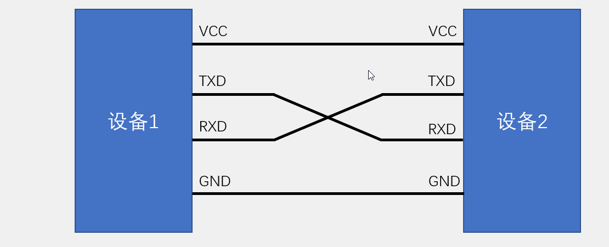
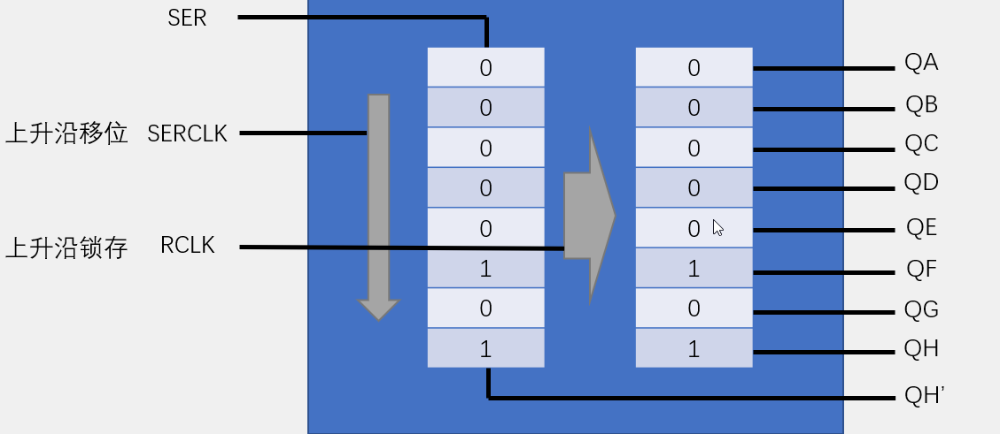
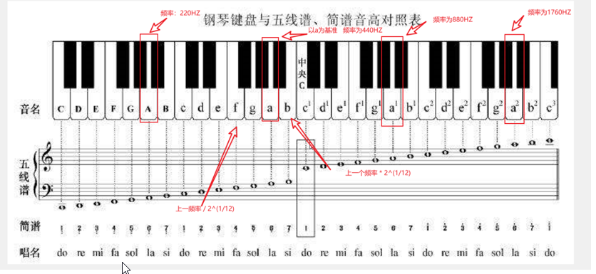

[TOC]


### 一、单片机的概念

一片半导体硅片集成：中央处理单元（CPU）、存储器（RAM、ROM）、并行I/O、串行I/O、定时器/计数器、中断系统、系统时钟电路及系统总线。
用于==测控领域==的单片微型计算机，简称单片机

### 二、电平特性

>TTL 电路和 CMOS 电路的逻辑电平关系如下：
>
>①VOH：逻辑电平 1 的输出电压。 
>
>②VOL：逻辑电平 0 的输出电压。 
>
>③VIH：逻辑电平 1 的输入电压。 
>
>④VIL：逻辑电平 0 的输入电压。 


>TTL 电平临界值： 
>
>①VOHmin=2.4V，VOLmax=0.4V。
>
> ②VIHmin=2.0V，VILmax=0.8V。


>CMOS 电平临界值（假设电源电压为+5V）：
>
>①VOHmin=4.99V，VOLmax=0.01V。
>
>②VIHmin=3.5V，VILmax=1.5V。

### 三、学习

#### 1、按键

>在按下按键的时候需要**==消抖==**
>按键抖动：对于机械开关，当机械触点断开、闭合时，由于机械触点的弹性作用，一个开关在闭合时不会马上稳定地接通，在断开时也不会一下子断开，所以在开关闭合及断开的瞬间会伴随一连串的抖动


> 消抖代码：

```c
...
if(P2 == 0){		//判断按键按下
    delay(20);		//延时20ms，消抖
    while(P2==0);		//检查是否抬起
    delay(20);		//延时20ms，消抖 
}

...
```

#### 2、数码管

##### 1.数码管种类

共阴极数码管：公共端接低电平。


共阳极数码管：公共端接高电平。


##### 2.多个数码管的连接

将各个数码管的公共端连接到74HC138译码器（将三个信号转换为8个信号）。


另一端分别一起连接到74HC245（双向数据缓冲器），当DIR端为高电平时，由a->b传输数据；当DIR端为低电平时，由b->a传输数据。


##### 3.多个数码管的控制

数码管的多位显示，实际上利用的是人的==视觉暂留==实现的,让单片机不断扫描。

数码管多位显示，会出现下一位数码管，残留的显示上一个数码管的数字，所以需要消影（加延时，并且清零）.

```c
unsigned char NixieTable[] = {0x3F,0x06,0x5B,0x4F,0x66,0x6D,0x7D,0x07,0x7F,0x6F};	//0 1 2 3 4 5 6 7 8 9
/*******************************************************************************
* 函 数 名: 数码管控制函数
* 函数功能:控制第几号的数码管亮数字几
* 参   数:Location 控制第几个灯亮（位选） （1~8）
* 参   数:Number 控制数码管亮数字几(段选) （0~9）
* 返 回 值: 无
* 说   明: 使用的是8个共阴极的数码管
*******************************************************************************/

void NiXie(unsigned	char Location,unsigned char Number){
    //第几个灯亮
    switch(Location){
        case 1:
			P2_4 = 1;P2_3 = 1;P2_2 = 1;
		break;
		case 2:
			P2_4 = 1;P2_3 = 1;P2_2 = 0;
		break;
		case 3:
			P2_4 = 1;P2_3 = 0;P2_2 = 1;
		break;
		case 4:
			P2_4 = 1;P2_3 = 0;P2_2 = 0;
		break;
		case 5:
			P2_4 = 0;P2_3 = 1;P2_2 = 1;
		break;
		case 6:
			P2_4 = 0;P2_3 = 1;P2_2 = 0;
		break;
		case 7:
			P2_4 = 0;P2_3 = 0;P2_2 = 1;
		break;
		case 8:
			P2_4 = 0;P2_3 = 0;P2_2 = 0;
		break;
    }
    //亮哪个数字
	P0 = NixieTable[Number];
    //清零，消影
    Delay(10);
    P0 = 0x00;
}
```

数码管专用驱动芯片：TM1640（2根线控制16个数码管）

#### 3、模块化编程

> .h文件  可被外部调用的函数、变量的声明

```.h
#ifndef __xxxx_H_
#define __xxxx_H_
//函数的声明
#endif
```

> .c文件 函数、变量的定义

```.c
include "xxxx.h"		//自己的对应.h文件  
//函数的定义 任何自定义的变量、函数在调用前必须有定义或声明（同一个.c）
```

> keil5引入不同文件夹的文件方法
>
> 1. 点击
>
> 	
>
> 2. 点击
>
> 	
>
> 	```c
> 	//正常引用
> 	#include "xxx.h"
> 	```
>
> 	


#### 4、矩阵键盘

>一般由多行多列的按钮组合而成，例如：4*4的矩阵键盘。 
>
>矩阵键盘一般是为了节约I/O口


>读取矩阵键盘：逐行或者逐列 扫描 (给P14-P17置1，扫描P10~P13谁为0——逐行扫描)
>
>


>52单片机I/O口：准双向口(弱上拉强下拉)
>
>

> 矩阵键盘的扫描方法：
> ①、行/列直接扫描
>
> ```c
> #include <REGX52.H>
> #define uchar unsigned char
> 
> /**
>   * @brief（名称）  		矩阵按键读取按键的键码 
>   * @param（参数）		无
>   * @retval（返回值） 	按下按键的键码值
>   *						如果按键按下不放，程序会停留在此函数中，松手的一瞬间，返回按键码，没有按下按键，返回0
>   */
> 
> uchar MatrixKey(){
> 	uchar KeyNumber = 0;
> 	//一列一列的扫描
> 	P1 = 0xFF;
> 	P1_3 = 0; 
> 	if(P1_7 == 0){Delay(20); while(P1_7 == 0); Delay(20); KeyNumber = 1;}
> 	if(P1_6 == 0){Delay(20); while(P1_6 == 0); Delay(20); KeyNumber = 5;}
> 	if(P1_5 == 0){Delay(20); while(P1_5 == 0); Delay(20); KeyNumber = 9;}
> 	if(P1_4 == 0){Delay(20); while(P1_4 == 0); Delay(20); KeyNumber = 13;}
> 	
> 	P1 = 0xFF;
> 	P1_2 = 0; 
> 	if(P1_7 == 0){Delay(20); while(P1_7 == 0); Delay(20); KeyNumber = 2;}
> 	if(P1_6 == 0){Delay(20); while(P1_6 == 0); Delay(20); KeyNumber = 6;}
> 	if(P1_5 == 0){Delay(20); while(P1_5 == 0); Delay(20); KeyNumber = 10;}
> 	if(P1_4 == 0){Delay(20); while(P1_4 == 0); Delay(20); KeyNumber = 14;}
> 	
> 	P1 = 0xFF;
> 	P1_1 = 0; 
> 	if(P1_7 == 0){Delay(20); while(P1_7 == 0); Delay(20); KeyNumber = 3;}
> 	if(P1_6 == 0){Delay(20); while(P1_6 == 0); Delay(20); KeyNumber = 7;}
> 	if(P1_5 == 0){Delay(20); while(P1_5 == 0); Delay(20); KeyNumber = 11;}
> 	if(P1_4 == 0){Delay(20); while(P1_4 == 0); Delay(20); KeyNumber = 15;}
> 	
> 	P1 = 0xFF;
> 	P1_0 = 0; 
> 	if(P1_7 == 0){Delay(20); while(P1_7 == 0); Delay(20); KeyNumber = 4;}
> 	if(P1_6 == 0){Delay(20); while(P1_6 == 0); Delay(20); KeyNumber = 8;}
> 	if(P1_5 == 0){Delay(20); while(P1_5 == 0); Delay(20); KeyNumber = 12;}
> 	if(P1_4 == 0){Delay(20); while(P1_4 == 0); Delay(20); KeyNumber = 16;}
> 
> //按行扫描
> //	P1 = 0xFF;
> //	P1_7 = 0;
> //	if(P1_3 == 0){Delay(20); while(P1_3 == 0); Delay(20); KeyNumber = 1;}
> //	if(P1_2 == 0){Delay(20); while(P1_2 == 0); Delay(20); KeyNumber = 2;}
> //	if(P1_1 == 0){Delay(20); while(P1_1 == 0); Delay(20); KeyNumber = 3;}
> //	if(P1_0 == 0){Delay(20); while(P1_0 == 0); Delay(20); KeyNumber = 4;}
> //	
> //	P1 = 0xFF;
> //	P1_6 = 0;
> //	if(P1_3 == 0){Delay(20); while(P1_3 == 0); Delay(20); KeyNumber = 5;}
> //	if(P1_2 == 0){Delay(20); while(P1_2 == 0); Delay(20); KeyNumber = 6;}
> //	if(P1_1 == 0){Delay(20); while(P1_1 == 0); Delay(20); KeyNumber = 7;}
> //	if(P1_0 == 0){Delay(20); while(P1_0 == 0); Delay(20); KeyNumber = 8;}
> //	
> //	P1 = 0xFF;
> //	P1_5 = 0;
> //	if(P1_3 == 0){Delay(20); while(P1_3 == 0); Delay(20); KeyNumber = 9;}
> //	if(P1_2 == 0){Delay(20); while(P1_2 == 0); Delay(20); KeyNumber = 10;}
> //	if(P1_1 == 0){Delay(20); while(P1_1 == 0); Delay(20); KeyNumber = 11;}
> //	if(P1_0 == 0){Delay(20); while(P1_0 == 0); Delay(20); KeyNumber = 12;}
> //	
> //	P1 = 0xFF;
> //	P1_4 = 0;
> //	if(P1_3 == 0){Delay(20); while(P1_3 == 0); Delay(20); KeyNumber = 13;}
> //	if(P1_2 == 0){Delay(20); while(P1_2 == 0); Delay(20); KeyNumber = 14;}
> //	if(P1_1 == 0){Delay(20); while(P1_1 == 0); Delay(20); KeyNumber = 15;}
> //	if(P1_0 == 0){Delay(20); while(P1_0 == 0); Delay(20); KeyNumber = 16;}
> 	
> 	return KeyNumber;
> }
> ```
>
> ②、线翻转法（先扫描行（高4位输入，低4位输出），再扫描列（高4位输出，低4位输入），两次读出的P1相加，就是按下的按键位置,）
>
> ```c
> #include <REGX52.H>
> unsigned char MatrixKey(){
>     unsigned char keynum;
>     unsigned char num1,num2,s_num ;	//存储两次扫描结果以及和
>     unsigned char keyTemp;    
>     P1 = 0xf0;	
>     keyTemp = P1;
>     if(keyTemp != 0xf0){	//检查是否按下按钮
>         Deley(20);	//延时消抖
>         num1 = keyTemp & 0xf0;	//确定行
>         keyTemp = 0x0f;	//翻转
>         num2 = keyTemp & 0x0f;	//确定列
>     }
>     switch(temp+temp2)
> 	{
> 		case 0x77:keynum=1;break;	//0111 0111 (位置码，根据连接顺序不同而改变)
> 		case 0x7d:keynum=2;break;	//0111 1011
> 		case 0x7b:keynum=3;break;	//0111 1101
> 		case 0x7e:keynum=4;break;	//0111 1110
> 		case 0xd7:keynum=5;break;	//1011 0111
> 		case 0xdd:keynum=6;break;
> 		case 0xdb:keynum=7;break;
> 		case 0xde:keynum=8;break;
> 		case 0xb7:keynum=9;break;	//1101 0111
> 		case 0xbd:keynum=0;break;
> 		case 0xbb:keynum=10;break;
> 		case 0xbe:keynum=11;break;
> 		case 0xe7:keynum=12;break;	//1110 0111
> 		case 0xed:keynum=13;break;
> 		case 0xeb:keynum=14;break;
> 		case 0xee:keynum=15;break;
> 		default:break;
> 	}
> 	return keynum;
> }
> ```
>


#### 5、定时器/计数器

##### 5.1、作用

> 计时（用于替代长时间的delay,避免cpu长时间被占用	）/计数

##### 5.2、定时器个数

> 根据型号的不同，个数也不同。

> at89c51有2个定时器（T0，T1）
>
> stc89c52有3个定时器（T0、T1、T2）

##### 5.3、定时器结构

>可以粗略的看成3个模块：时钟模块->计数模块->中断模块
>
>

>时钟：规定多少个时钟进行一次计数。
>
>计数单元：计数的同时，观察是否溢出（到时间，初始值（可变）->最大值（固定,由硬件决定））。
>
>中断系统：执行中断函数。

>stc98c52工作模式1框图：
>
>
>
>SYSclk：系统时钟，即晶振周期。
>÷12/÷6：进行分频。
>
>C/T：置0为定时器（T头上有杠为低电平有效），置1为计数器模式。
>T0 Pin：外部频率的接口（当为计数器时，接入外部的频率，进行计数）。
>
>TR0、GATE、INT0：当GATE=0时,TR0=1才开始工作，TR0=0不工作；当GATE=1时，由INT0（外部中断0）和TR0共同决定.
>
>TL0、TH0：用于计数，根据模式选择用几位
>TF0：溢出检测。

>stc89c52工作模式：
>
>

>相关寄存器：
>
>①、控制寄存器TCON
>
>
>
>②、工作模式寄存器TMOD
>
>

##### 5.4、定时器的书写

```c
#include <REGX52.h>

//针对STC89C52 #include <REGX52.h>
void Timer0_Init(){		//使用定时器0
	//初始化TMOD位寻址)
    TCON &= 0xf0;		//保留高4位，清零低4位
    TCON |= 0x01;		//保留高4位，对低4位赋值（定时器模式1）
    //初始化TCON址)
    TF0 = 0；	//本身是硬件自动置位和清零，但是避免出现一上来就中断，所以手动清零
    TR0 = 1；	//允许计数
    //初始中断时间 eg.每个1ms产生中断  65535-64535=1000  1000us=1ms
    TH0 = 64535 / 256;	
   	TL0 = 64535 % 256;		//这个写法会差1us。TH0=0xFC； TL0 = 0x17;
    //初始化IE
    EA = 1；		//总中断允许
    ET0 = 1;	//定时器中断允许
    //初始化IP
    PT0 = 0；	//优先级为0
}

int main(){
    while(1){
        
    }
    return 0;
}

void Timer0_Rountine() interrupt 1{
    //重新初始化
    TH0 = 64535 / 256;	
   	TL0 = 64535 % 256;	
    //逻辑代码
    //....
}
    
```


#### 6、中断

##### 6.1、中断结构


##### 6.2、中断触发方式


##### 6.3、中断相关寄存器

>中断允许寄存器IE:
>
>


>中断优先级寄存器IP
>
>
>==低优先级中断能被高优先级打断==。
>中断里面还有中断，中断嵌套。

##### 6.4、中断资源

•中断源个数：8个（外部中断0、定时器0中断、外部中断1、定时器1中断、串口中断、定时器2中断、外部中断2、外部中断3）

•中断优先级个数：4个

•中断号：

#### 7、串口

通讯接口,实现两个设备的互相通信。

用于单片机与单片机之间、单片机与电脑之间（USB转串口芯片（<span style="color: #FF0000;">需要注意电平标准不一样</span>））、单片机与模块之间（蓝牙发送芯片、陀螺仪）。

51单片机自带UART（通用异步收发器），实现串口通信（逐位传输，发送方发送的每一位都具有固定的时间间隔）

##### 7.1、简单串口之间的通信

>- 有TXD（发送端），RXD（接受端）
>- TXD与RXD交叉连接
>- 电平标准一致，不一致需要电平转换芯片
>
>

##### 7.2、电平标准

><span style="color: #FF0000;">人为规定</span>的电压与数据的关系
>
>- TTL:+5V为1，0v为0
>- RS232：-3\~-15V为1，+3 \~+15V为0
>- RS485：-两线电压差为+2\~+6V表示1，-2\~-6V表示0（使用了差分信号^[1]^）
>
>>[1]  差分信号: 两条线之间的存在电压差。

##### 7.3、接口定义图（D89—RS232–用于数据流控制–流控）


##### 7.4、通信接口

| 名称   |       引脚定义       | 通信方式               | 特点                |
| ------ | :------------------: | ---------------------- | ------------------- |
| UART   |       TXD、RXD       | 全双工^[1]^、异步^[2]^ | 点对点通信^[3]^     |
| I^2^C  |    SCL^[4]^、SDA     | 半双工^[5]^、同步^[6]^ | 可挂载多个设备^[7]^ |
| SPI    | SCLK、MOSI、MISO、CS | 全双工、同步           | 可挂载多个设备      |
| 1-Wire |          DQ          | 半双工、异步           | 可挂载多个设备      |

> [1] 全双工：能同时互相传输数据。
>
> [2] 异步：通信双方各自约定通信速率。（A：每隔1s传输一组数据，B：每隔0.5s传输数据。约定不规范可能出现获取数据出错的情况）。
>
> [3] 点对点通信：一对一。
>
> [4] SCL:时钟线。
> [5] 半双工:双方可以互相传输信息，但是只能分时复用一根数据线。
>
> [6] 同步:通信双方通过一根时钟线来约定通信速率。
>
> [7] 可挂载多个设备: 一对多。其连接各个设备的数据传输线路也被称为<span style="color: #00FFFF;">总线</span>
>
> 单工：只能一方发送数据给另一方。


##### 7.5、STC89C52串口模式

>- 模式0：同步移位寄存器
>- 模式1：8位UART，波特率可变（常用
>- 模式2：9位UART，波特率固定
>- 模式3：9位UART，波特率可变


>- 波特率：串口通信的速率（发送和接收各数据位的间隔时间）
>- 比特率：发送和接收各二进制位数的间隔时间					
>- 检验位：用于数据验证
>- 停止位：用于数据帧间隔
>
>

##### 7.6、STC89C52串口模式图


> <span style="color: #FF0000;">图片错误</span>：<span style="color: #FF0000;">**SMOD = 0时，串口工作方式1、2、3时，则波特率不加倍，处于正常状态**</span>

##### 	7.7、串口初始化(方式1、4800波特率)

> 串口发送需要用到定时器1的TH1、TL1来做溢出判断（本质是设置波特率）,使用定时器1的模式2（8位自动重装载）。
>
> 串口接受消息，需要中断来进行接收

```c
#include <REGX52.h>

//初始化串口
void UART_Init(){
    SCOM = 0x40;	//选择串口模式1   0100 0000
    PCON |= 0x80;	//选择波特率加倍SMOD=1,且保持PCON低5位（电源相关）不变
    ET1 = 1;	//禁止定时器1中断
    TR1 = 1;	//定时器1启动
    TMOD &= 0xF0;	//高4位清零
    TMOD |= 0x20;	//选择模式2
    TH1 = 0xF3;		//用于溢出时，自动给TL1赋初值
    TL1 = 0xF3;		//初值
    
}

//发送一个字节数据
void UART_SendByte(unsigned char Byte){
    SUBF = Byte;	//向SUBF写入数据
    while(TI == 0);	//检测发送标志位 ，确实是否发送完毕
    TI = 0;		//手动清零
}

void main(){
    while(1);
}

//接收一个字节数据
void UART_Routine() interrupt 4{
    unsigned char temp;
    if(RI == 1){
        temp = SUBF;		//接收数据
       	RI = 0;			//手动清零
    }
}
```

```txt
波特率：4800 选择波特率加倍SMOD=1  同时配合STC89C52串口模式图
4800bit/s = 4.8bit/ms = 0.0048bit/ms
第一次分频（倒着看，÷16）： 0.0048 * 16 = 0.0768
第二次分频（SMOD=1）：0.0768 * 1 = 0.0768
(波特率和频率在此处相等（百度的，不确定）)
时间：1/0.0768MHz = 13.020833us
晶振频率为12MHZ（本单片机）,计算一次为1us
计算13次
TH1 = 256 -13 = 243 =0xF3
```

$$
定时器1的溢出率(12T)：
SYSclk（晶振频率）/12/(256-TL1)
$$


$$
方式1波特率公式：   
(2^{SMOD}/32)×（定时器1溢出率）
$$

#### 8、LED点阵屏

##### 8.1、 点阵屏基础

>点阵屏是由多个独立LED灯，并且通过矩阵（行列）方式组合。

>点阵屏分类

​	按像素分：8\*8，16\*16等。更多数量的如：32\*32，是由8\*8等小点阵拼接

​	按颜色分：单色、双色（以2种LED灯为基础）、全彩（以红、绿、蓝LED为基础）

​	按连接方式：共阴极、共阳极（以单个LED灯为基础的点阵，没有这个区分）


>•LED点阵屏的结构<span style="color: #FF0000;">类似于数码管</span>，只不过是数码管把每一列的像素以“8”字型排列而已
>
>•LED点阵屏需要进行逐行或逐列扫描，才能使所有LED同时显示

> - 注意：单独购买点阵屏的时候要验证引脚是否乱序（电池+电阻  点灯看引脚接口）
> - 51的引脚输出的为弱上拉（低电平强  高电平弱） 如果LED点阵所有引脚直接接到51上，会导致无法驱动  如果一定要直接连接，就必须要一个三极管（PNP)
> - 本次使用74HC595连接（可有和数码管的连接方式互换）

##### 8.2、74HC595

>串行输入并行输出的移位寄存器，可用3根线输入串行数据，8根线输出并行数据，多片级联后，可输出16位、24位、32位等，常用于IO口扩展。



> 上面是SER输入1010 0000的流程
>
> SER：只能一位一位输入。
>
> SERCLK：接收上升沿，就将SER输入的数据向下压入一位（类似流水线，一个一个按顺序进入存储器）。
>
> RCLK：当存储器满了，接收上升沿，将左边存储器的数据发给右边存储器，并且同时输出8位。

##### 8.3、点阵的编写

```c
#include <REGX52.h>

//定义74HC595的接口
sbit _C595_SER = P3^4;
sbit _C595_SERCLK = P3^6;
sbit _C595_RCLK = P3^5;

//初始化
void MatrixLED_Init(){
    _C595_SERCLK = 0;
    _C595_RCLK = 0;
}

//74HC595八位输出
void MatrixLED_74HC595(unsigned char Byte){
    unsigned char i;
    for(i=0;i<8;i++){
        //取Byte第i位数据
        _C595_SER = Byte & (0x80>>i);
        _C595_SERCLK = 0;		//录入数据
        _C595_SERCLK = 1;		//为下次做准备
    }
     _C595_RCLK = 0;		//发送数据
     _C595_RCLK = 1;
}

//显示 逐列扫描
void MatrixLED_Show(unsigned char Colum,Data){
    MatrixLED_74HC595(Data);
    P0 = ~(0x80>>Colum);			//选择列
    
}
```

>在使用时记得消影
>
>```c
>#include <REGX52.h>
>#include "MatrixLED.h"
>
>//code关键字 将数组放入flash中，好处：更大的空间 坏处：只读，不可外界修改
>unsigned char code Animation[] =
>{
>	0x00,0x00,0x00,0x00,0x00,0x00,0x00,0x00,
>	0x20,0x40,0xBF,0x00,0x24,0x48,0xC2,0x7F,
>	0x40,0x68,0x44,0x00,0x00,0x00,0x00,0x21,
>	0x32,0x6C,0xAC,0x36,0x21,0x00,0x48,0x4A,
>	0x49,0x5F,0x68,0x4C,0x08,0x00,0x00,0x00,
>	0x00,0x00,0x00,0x00,0x00,0x00,0x00,0x00,
>};
>
>void main(){
>    unsigned char i,offset=0，count=0;	//offset 偏移量 count 延时
>    while(1){
>       for(i=0;i<8;i++){		//一次播放8列（8*8点阵）
>           MatrixLED_Show(i,Animation[i+offset]);		//每列的播放           
>       }
>        count++;
>        if(count>=10){
>            count=0;
>            offset++;			//流动播放
>            //offset+=8;		//逐帧播发
>       		if(offset>40)		//播放完一次动画
>           		offset=0;
>        }
>        
>
>    }
>}
>```
>

#### 9、DS1302实时时钟芯片

##### 9.1、基本概念

>DS1302:
>
>- <span style="color: #FFFF00;">实时时钟芯片</span>的一种，低功耗。
>- 它具有掉电可继续存储数据（[掉电保护](https://baike.baidu.com/item/%E6%8E%89%E7%94%B5%E4%BF%9D%E6%8A%A4/4308554?fromModule=lemma_inlink)）。
>- 它有涓细电流充电能力。
>
>RTC:
>
>- 实时时钟，是一种集成电路。
>- 通常称为时钟芯片。

##### 9.2、引脚图以及应用电路


>DIP：直插型。SO：贴片型。

| 引脚名 |     作用      |                         补充                          |
| :----: | :-----------: | :---------------------------------------------------: |
|  VCC2  |    主电源     |                    单片机直接供电                     |
|  VCC1  |   后备电源    |       一般接纽扣电池等，用于掉电时的数据保护。        |
|  GND   |     接地      |                                                       |
|   CE   |  芯片使能端   |                                                       |
|  SCLK  |   串行时钟    |                                                       |
|  I/O   | 数据输入/输出 | 只能输入/出一位（与[74HC595](#####8.2、74HC595)类似） |
| X1、X2 | 32.768KHz晶振 |                         2^15^                         |

##### 9.3、内部结构框图


9.4、寄存器以及时序定义

>寄存器定义
>
>
>
>- 在RTC寄存器中，使用的是用16进制表示的[BCD码](BCD码)
>- CH位为时钟暂停位。（为1暂停，为0开始）。

>时序定义
>
>
>
>- 第一个为读时序（读出数据时，是下降沿有效），第二个为写时序（写入数据时，是上升沿有效）。
>- 先通过I/O对**Figure 3.Address/Command Byte**操作，选择在哪里（RTC的哪个功能），通过什么（读或者写），干什么（读出数据/写入数据）。

##### 9.4、DS1302代码编写

```c
//DS1302.c
#include <REGX52.h>

//定义引脚别名方便书写
sbit DS1302_CE = P3^5;
sbit DS1302_IO = P3^4;
sbit DS1302_SCLK = P3^6;

//宏定义RTC中读功能地址表
#define DS1302_YEAR_R 			0x8D
#define DS1302_MONNTH_R 		0x89
#define DS1302_DATE_R 			0x87
#define DS1302_HOUR_R			0x85
#define DS1302_MIN_R 			0x83
#define DS1302_SEC_R 			0x81
#define DS1302_DAY_R 			0x8B
//宏定义RTC中写功能地址表
#define DS1302_YEAR_W 			0x8C
#define DS1302_MONNTH_W 		0x88
#define DS1302_DATE_W 			0x86
#define DS1302_HOUR_W			0x84
#define DS1302_MIN_W 			0x82
#define DS1302_SEC_W 			0x80
#define DS1302_DAY_W 			0x8A
#define DS1302_WP_W 			0x8E


typedef struct 
{
	unsigned char year;		//年
	unsigned char month;	//月
	unsigned char date;		//日
	unsigned char hour;		//时
	unsigned char min;		//分
	unsigned char sec;		//秒
	unsigned char day;		//星期
}MyTime;

//声明 结构体名 定义名
MyTime time={24,5,30,17,54,50,4};

//初始化	
void DS1302_Init(){
    DS1302_CE=0;
    DS1302_IO=0;
	DS1302_SCLK=0;
}

//写入数据函数
void DS1302_WriteByte(unsigned char Command,unsigned char Data)
{
	unsigned char i;
	DS1302_CE = 1;	//使能ce
	//启动相关寄存器
	for(i = 0; i < 8; i++)
	{	
		DS1302_IO = Command & (0x01<<i);		//单片机引脚读取到一位数据（用 相与 进行获取）
		DS1302_SCLK = 1;									//上升沿，开始写入到DS1302中去
		DS1302_SCLK = 0;			
	}
	//写入数据
	for(i = 0; i < 8; i++)
	{	
		DS1302_IO = Data & (0x01<<i);		//单片机引脚读取到一位数据
		DS1302_SCLK = 1;									//上升沿，开始写入到DS1302中去
		DS1302_SCLK = 0;			
	}
	
	DS1302_CE = 0;	//手动复位
}

//读数据
unsigned char DS1302_ReadByte(unsigned char Command)
{
	unsigned char i,Data = 0x00;
	
	Command |= 0x01;		//与写入寄存器区别是最低位为1，所以用写入地址就需要将最低位置1 这样可以少写一个读入表
	
	DS1302_CE = 1;
	//启动相关寄存器
	for(i = 0; i < 8; i++)
	{	
		DS1302_IO = Command & (0x01 << i);		//单片机引脚读取到一位数据（用 相与 进行获取）
		//交换原因：读数据时，DS1302会在启动相关寄存器后，立马开始读取数据
        //本次的for循环是8次，如果不换会比现在快一次下降沿，可能会写入不正确的数据。
		//如果DS1302_SCLK = 1;DS1302_SCLK = 0;	这会导致后面的数据少读一位
		DS1302_SCLK = 0;	
		DS1302_SCLK = 1;									//上升沿，开始写入到DS1302中去
				
	}
	//读取到相关数据
	for(i = 0; i < 8; i++)
	{
		DS1302_SCLK = 1;									//上升沿，开始读取
		DS1302_SCLK = 0;	
		if(DS1302_IO)
		{	
			Data = Data | (0x01 << i);
		}
	}
	DS1302_CE = 0;
	DS1302_IO=0;	//读取后将IO设置为0，否则读出的数据会出错
	return Data;
}

//写入内部初始数据
void DS1302_SetTime()
{
//	十进制转BCD码
	DS1302_WriteByte(DS1302_WP_W, 0x00); //关闭写保护
	DS1302_WriteByte(DS1302_YEAR_W, time.year / 10 * 16 + time.year % 10);
	DS1302_WriteByte(DS1302_MONNTH_W, time.month / 10 * 16 + time.month % 10);
	DS1302_WriteByte(DS1302_DATE_W, time.date / 10 * 16 + time.date % 10);
	DS1302_WriteByte(DS1302_HOUR_W, time.hour / 10 * 16 + time.hour % 10);
	DS1302_WriteByte(DS1302_MIN_W, time.min / 10 * 16 + time.min % 10);
	DS1302_WriteByte(DS1302_SEC_W, time.sec / 10 * 16 + time.sec % 10);
	DS1302_WriteByte(DS1302_DAY_W, time.day / 10 * 16 + time.day % 10);
	DS1302_WriteByte(DS1302_WP_W, 0x01); //开启写保护
}

//获取DS1302中的数据，并且存在内部变量中
void DS1302_GetTime()
{
	unsigned char tmep;
//	BCD码转十进制
	tmep = DS1302_ReadByte(DS1302_YEAR_W);
	time.year = tmep / 16 * 10 + tmep % 16; 
	tmep = DS1302_ReadByte(DS1302_MONNTH_W);
	time.month = tmep / 16 * 10 + tmep % 16; 
	tmep = DS1302_ReadByte(DS1302_DATE_W);
	time.date = tmep / 16 * 10 + tmep % 16; 
	tmep = DS1302_ReadByte(DS1302_HOUR_W);
	time.hour = tmep / 16 * 10 + tmep % 16; 
	tmep = DS1302_ReadByte(DS1302_MIN_W);
	time.min = tmep / 16 * 10 + tmep % 16; 
	tmep = DS1302_ReadByte(DS1302_SEC_W);
	time.sec = tmep / 16 * 10 + tmep % 16; 
	tmep = DS1302_ReadByte(DS1302_DAY_W);
	time.day = tmep / 16 * 10 + tmep % 16; 
}
```

```c
//DS1302.h
#ifndef __DS1302_H__
#define __DS1302_H__

//声明变量是需要加上 关键字 extern  数组和函数默认有
//使用 `extern` 关键字声明结构体变量会告诉编译器该变量的定义在其他源文件中
typedef struct 
{
	unsigned char year;		//年
	unsigned char month;	//月
	unsigned char date;		//日
	unsigned char hour;		//时
	unsigned char min;		//分
	unsigned char sec;		//秒
	unsigned char day;		//星期
}MyTime;

extern MyTime time;

void DS1302_Init();
void DS1302_WriteByte(unsigned char Command,unsigned char Data);
unsigned char DS1302_ReadByte(unsigned char Command);
void DS1302_SetTime();
void DS1302_GetTime();	
#endif
```


#### 10、蜂鸣器

##### 10.1、基本概念


>
>
>- 蜂鸣器是一种将电信号转换为声音信号的器件，常用来产生设备的按键音、报警音等提示信号
>- 蜂鸣器按驱动方式可分为有源蜂鸣器和无源蜂鸣器
>- 有源蜂鸣器：内部自带振荡源，将正负极接上直流电压即可持续发声，频率固定
>- 无源蜂鸣器：内部不带振荡源，需要控制器提供振荡脉冲才可发声，调整提供振荡脉冲的频率，可发出不同频率的声音
>- 引脚以一定频率不断输出高低电平信号才能控制蜂鸣器发出声音。
>- **购买时需要注意有源还是无缘**


##### 10.2、ULN2003(达林顿晶体管)

>
>
>五线四项步进电机 内部是ULN2003(达林顿晶体管)
>
>ULN2003概述与特点
>
>- ULN2003 是高耐压、大电流达林顿陈列，由七个硅 NPN 达林顿管组成。
>- 该电路的特点如下：
>- ULN2003 的每一对达林顿都串联一个 2.7K 的基极电阻,在 5V 的工作电压下它能与 TTL 和 CMOS 电路直接相连，可以直接处理原先需要标准逻辑缓冲器来处理的数据。
>- ULN2003 工作电压高，工作电流大，灌电流可达 500mA，并且能够在关态时承受 50V 的电压，输出还可以在高负载电流并行运行。
>- ULN2003 采用 DIP—16 或 SOP—16 塑料封装


##### 10.3、乐理


假如 4分音符为 延时500ms





##### 10.4、实现

```c
#include <REGX52.H>
#include <INTRINS.H>

sbit buzzer_BEEP = P2^5;


/**
   * @brief：蜂鸣器私有延时函数 指定延时500ms
   * @param：无
   * @retval：无
   */
void Buzzer_Delay500us()		//@11.0592MHz
{
	unsigned char i;

	_nop_();
	i = 227;
	while (--i);
}


/**
   * @brief：蜂鸣器发声时间
   * @param：ms 以发声多少时间
   * @retval：无
   */
void Buzzer_Time(unsigned int ms)
{
	unsigned int i;
	for(i = 0; i < ms * 2; i++)				//以ms为周期  1/ms为频率    一个for循环为500us（0.5ms）*2  =》1ms
	{
		buzzer_BEEP = !buzzer_BEEP;			//翻转  不同频率输出，以此振动
		Buzzer_Delay500us();
	}
	
}
```


[音符与频率](音符与频率对应.xlsx)

#### 11、at24c02与I2C协议

##### 11.1、AT24C02

>•    AT24C02是一种可以<span style="color: #FF0000;">实现掉电不丢失的存储器</span>，可用于保存单片机运行时想要永久保存的数据信息
>
>•    存储介质：E2PROM
>
>•    通讯接口：I2C总线
>
>•    容量：256字节

>存储介质
>>易失性存储器（RAM–随机存储器）
>>
>>SRAM：静态RAM。
>>
>>SDAM：动态RAM，内部是需要控制电路按一定周期对存储器进行刷新。
>
>>非易失性存储器（ROM–只读存储器）
>>>mask rom：掩膜ROM，不能修改。
>>>PROM：可编程ROM，能够修改一次内部数据。
>>>
>>>​	
>>>EPROM：可擦除可编程的ROM（需要照射紫外线30分钟)。
>>>
>>>E2PROM（EEPROM）：电可擦除可编程ROM。
>>
>>>flash：闪存。
>>>硬盘、软盘、光盘。
>
>
>
>
>

##### 11.2、I2C总线

>>•I2C总线（Inter IC BUS）是由Philips公司开发的一种通用数据总线
>>
>>•两根通信线：SCL（Serial Clock）、SDA（Serial Data）
>>
>>•同步、半双工，带数据应答
>>
>>•通用的I2C总线，可以使各种设备的通信标准统一，对于厂家来说，使用成熟的方案可以缩短芯片设计周期、提高稳定性，对于应用者来说，使用通用的通信协议可以避免学习各种各样的自定义协议，降低了学习和应用的难度
>
>>I2C电路规范
>>
>>•所有I2C设备的SCL连在一起，SDA连在一起
>>
>>•设备的SCL和SDA均要配置成<span style="color: #FF0000;">开漏输出模式</span>
>>
>>
>>
>>•SCL和SDA各添加一个上拉电阻，阻值一般为<span style="color: #FF0000;">4.7KΩ</span>左右（上拉电阻阻值过高，从低电阻恢复到高电阻的时间过长（一般对地会接一个<span style="color: #FF0000;">寄生电容</span>），导致信号失真；上拉电阻阻值过低，会导致电路烧毁，以及无法完全把电平拉低）
>>
>>•开漏输出和上拉电阻的共同作用实现了“线与”的功能，此设计主要是为了解决多机通信互相干扰的问题
>>
>>
>
>I2C时序图
>
>>
>>
>>
>>
>>
>>
>>
>>
>>
>>

##### 11.3、代码编写

```c
//at24c02
#include <REGX52.H>
#include "IIC.h"

#define AT24C02_ADDRESS 	0xA0

/*******************************************************************************
  * @brief  at24c02发送一个字节函数
  * @param Data 发送的一个字节;
	* @param WordAddress 要存储的位置
  * @retval 无
  * @explain 该函数发送的是一个简单数据帧（一个字节数据）
*******************************************************************************/
void AT24C02_sendData(unsigned char Data,WordAddress){
	IIC_start();
	IIC_sendByte(AT24C02_ADDRESS);
	IIC_receiveAck();
	IIC_sendByte(WordAddress);
	IIC_receiveAck();
	IIC_sendByte(Data);
	IIC_receiveAck();
	IIC_stop();
	
}

/*******************************************************************************
  * @brief  at24c02接收一个字节函数
  * @param WordAddress 要拿取的位置
  * @retval byte 接收的一个字节
  * @explain 该函数接收的是一个简单数据帧（一个字节数据）
*******************************************************************************/
unsigned char AT24C02_receiveData(unsigned char WordAddress){
	unsigned char byte;
	IIC_start();
	IIC_sendByte(AT24C02_ADDRESS);
	IIC_receiveAck();
	IIC_sendByte(WordAddress);
	IIC_receiveAck();
	IIC_start();
	IIC_sendByte(AT24C02_ADDRESS|0x01);
	IIC_receiveAck();
	byte=IIC_receiveByte();
	IIC_sendAck(1);
	IIC_stop();
	return byte;
	
}
```

```c
//IIC
#include <REGX52.H>

sbit IIC_SCL=P2^1;
sbit IIC_SDA=P2^0;

/*******************************************************************************
  * @brief  I2C开始函数
  * @param 无
  * @retval 无
	* @explain 一帧的开始
*******************************************************************************/
void IIC_start(){
	//在发送连续帧的时候，上一帧的最后IIC_SCL、IIC_SDA不一定是高电平。
	//手动置高
	IIC_SCL=1;
	IIC_SDA=1;
	
	IIC_SDA=0;	//IIC_SCL高电平期间，IIC_SDA下降沿表示开始
	
	IIC_SCL=0;	//置低开始后续操作
}

/*******************************************************************************
  * @brief  I2C结束函数
  * @param 无
  * @retval 无
  * @explain 一帧的结束
*******************************************************************************/
void IIC_stop(){
	//在发送连续帧的时候，上一帧的最后IIC_SDA不一定是低电平。
	IIC_SDA=0;
	
	IIC_SCL=1;	//IIC_SCL置高开始检测
	IIC_SDA=1;	//IIC_SCL高电平期间，IIC_SDA上升沿表示结束
	
}

/*******************************************************************************
  * @brief  I2C发送一个字节函数
  * @param Data 一个字节;
  * @retval 无
  * @explain 无
*******************************************************************************/
void IIC_sendByte(unsigned char Data){
	unsigned char i;
	IIC_SCL=0;
	for(i=0;i<8;i++){
		IIC_SDA=Data&(0x80>>i);
		IIC_SCL=1;		//拉高IIC_SCL，发送数据
		IIC_SCL=0;
	}
	
}

/*******************************************************************************
  * @brief  I2C接收一个字节函数
  * @param 无
  * @retval byte 一个字节;
  * @explain 在接收时，主机要释放SDA，让从机写入数据
*******************************************************************************/
unsigned char IIC_receiveByte(){
	unsigned char byte=0x00,i;
	
	IIC_SDA=1;		//主机放手，让从机自己装数据到SDA上
	
	IIC_SCL=0;
	for(i=0;i<8;i++){
		IIC_SCL=1;
		if(IIC_SDA)byte|=(0x80>>i);
		IIC_SCL=0;	
	}
		
	return byte;
}

/*******************************************************************************
  * @brief  I2C发送应答
  * @param Data 一位（0或者1）;
  * @retval 无
  * @explain 发送消息后的回答（主机回答）
*******************************************************************************/
void IIC_sendAck(bit Data){
	IIC_SCL=1;
	IIC_SDA=Data;
	
	IIC_SCL=0;
}

/*******************************************************************************
  * @brief  I2C接收应答
  * @param 无
  * @retval byte 一位（0或者1）;
  * @explain 接收消息后，主机接收从机的应答;
							在接收时，主机要释放SDA，让从机写入数据
*******************************************************************************/
bit IIC_receiveAck(){
	bit byte;
	
	IIC_SDA=1;		//主机放手，让从机自己装数据到SDA上
	
	IIC_SCL=1;	
	byte=IIC_SDA;
	IIC_SCL=0;
		
	return byte;
}
```

#### 12、DS18B20与1-Wire协议

##### 12.1、DS18B20

>DS18B20介绍
>
>•DS18B20是一种常见的<span style="color: #FF0000;">数字温度传感器</span>，其控制命令和数据都是以数字信号的方式输入输出，相比较于<span style="color: #FF0000;">模拟温度传感器</span>，具有功能强大、硬件简单、易扩展、抗干扰性强等特点
>
>•测温范围：-55°C 到 +125°C
>
>•通信接口：1-Wire（单总线）
>
>•其它特征：可形成总线结构、内置温度报警功能、可寄生供电（内置电容，可以通过DQ数据线进行供电）
>
>>- 模拟温度传感器
>>
>>通过==将温度变化转化为电信号的变化==（检测热敏电阻的两端的电压变化）来实现温度测量。
>>
>>需要外接A/D转换，还需要对读取的数据进行系数配比（测量的电压与温度是成正比），才能得到想要的数据。
>>
>>- 数字温度传感器
>>
>>内部有A/D转换，且自己已经进行系数配比，可以直接读取。

>引脚及应用电路
>
>

>内部结构框图
>
>

>存储器结构
>
>

>温度存储格式
>
>

##### 12.2、1-Wire协议

>单总线的介绍
>
>•单总线（1-Wire BUS）是由Dallas公司开发的一种通用数据总线
>
>•一根通信线：DQ
>
>•==异步、半双工==
>
>•单总线只需要一根通信线即可实现数据的双向传输，当采用寄生供电时，还可以省去设备的VDD线路，此时，供电加通信只需要DQ和GND两根线

>电路规范
>
>•设备的DQ均要配置成开漏输出模式
>
>•DQ添加一个上拉电阻，阻值一般为4.7KΩ左右
>
>•若此总线的从机采取寄生供电，则主机还应配一个强上拉输出电路
>
>


>单总线时序结构
>
>>初始化
>>
>>•初始化：==主机==将总线拉低至少480us，然后释放总线，等待15\~60us后，存在的==从机==会拉低总线60~240us以响应主机，之后从机将释放总线。
>>
>>
>
>>发送<span style="color: #00FFFF;">一位</span>数据
>>
>>•发送一位：主机将总线拉低60\~120us，然后释放总线，表示发送0；主机将总线拉低1~15us，然后释放总线，表示发送1。从机将在总线拉低30us后（典型值）读取电平，整个时间片应大于60us。
>>
>>
>
>>接收<span style="color: #00FFFF;">一位</span>数据
>>
>>•接收一位：主机将总线拉低1~15us，然后释放总线，并在拉低后15us内读取总线电平（尽量贴近15us的末尾），读取为低电平则为接收0，读取为高电平则为接收1 ，整个时间片应大于60us
>>
>
>>发送/接收一帧
>>
>>•发送一个字节：连续调用8次发送一位的时序，依次发送一个字节的8位（低位在前）
>>
>>
>>
>>•接收一个字节：连续调用8次接收一位的时序，依次接收一个字节的8位（低位在前）
>>
>>

>DS18B20操作流程
>
>>•初始化：从机复位，主机判断从机是否响应
>
>>•ROM操作：ROM指令(让“大门”识别)+本指令需要的读写操作
>
>>•功能操作：功能指令+本指令需要的读写操作
>
>>
>
>>DS18B20数据帧
>
>>•温度变换：初始化→跳过ROM →开始温度变换
>
>>
>
>
>>•温度读取：初始化→跳过ROM →读暂存器→连续的读操作
>
>>

##### 12.3、代码编写

```c
//1-wire
#include <REGX52.H>

sbit OneWire_DQ=P3^7;		//定义DQ

/*******************************************************************************
  * @brief 单总线初始化函数 
  * @param 无
  * @retval AckBit 应答响应数据 0为从机响应主机 1为从机没有响应主机
  * @explain 不使用定时器延时是因为会浪费定时器资源;
  *          不使用Delay函数是因为51反应太慢，没有延时1us的函数 
  *          调用一个函数需要5us，一个_nop_()为1us
*******************************************************************************/
unsigned char OneWire_Init(){
	unsigned char data i;	
	unsigned char AckBit;
	OneWire_DQ=1;			//保证开始是高电平
	OneWire_DQ=0;
	
	i = 227;while (--i);			//deley 500us
	
	OneWire_DQ=1;			//释放总线
	i = 29;while (--i);				//deley 70us
	
	AckBit=OneWire_DQ;		//获取从机响应，并且反回出去，用于验证是否响应
	i = 227;while (--i);			//deley 500us 走完480us的时序（500+70>480）
	
	return AckBit;
}

/*******************************************************************************
  * @brief  发送一位数据函数
  * @param Bit 发送的0或者1的数据
  * @retval 无
  * @explain 整个时序大于60us
*******************************************************************************/
void OneWire_SendBit(unsigned char Bit){
	unsigned char data i;
	OneWire_DQ=0;		//拉低总线
	i = 4;while (--i);			//deley 10us
	
	OneWire_DQ=Bit;		//发送数据，如果
	i = 22;while (--i);			//deley 50us
	
	OneWire_DQ=1;		//释放总线
}

/*******************************************************************************
  * @brief  接收一位数据函数
  * @param 无
  * @retval Bit 返回0或者1的数据
  * @explain 整个时序大于60us，读取时序必须在开始的15us内读取
*******************************************************************************/
unsigned char OneWire_ReceiveBit(){
	unsigned char data i;
	unsigned char	Bit;
	OneWire_DQ=0;		//拉低总线
	i = 2;while (--i);			//deley 5us
	
	OneWire_DQ=1;		//释放总线（让从机发数据）
	i = 2;while (--i);			//deley 5us
	
	Bit=OneWire_DQ;		//读取数字
	i = 22;while (--i);			//deley 50us
	
	return Bit;
}

/*******************************************************************************
  * @brief  发送一个字节数据
  * @param Byte 发送的字节数据
  * @retval 无
  * @explain 无
*******************************************************************************/
void OneWire_SendByte(unsigned char Byte){
	unsigned char i;
	for(i=0;i<8;i++){
		OneWire_SendBit(Byte&(0x01<<i));
	}
}

/*******************************************************************************
  * @brief  接收一个字节数据
  * @param 无
  * @retval Byte 接收的字节数据
  * @explain 无
*******************************************************************************/
unsigned char OneWire_ReceiveByte(){
	unsigned char i,Byte=0x00;
	for(i=0;i<8;i++){
		if(OneWire_ReceiveBit()){
			Byte|=(0x01<<i);
		}
	}
	return Byte;

}
```

```c
//DS18B20
#include <REGX52.H>
#include "IIC.h"

#define AT24C02_ADDRESS 	0xA0

/*******************************************************************************
  * @brief  at24c02发送一个字节函数
  * @param Data 发送的一个字节;
	* @param WordAddress 要存储的位置
  * @retval 无
  * @explain 该函数发送的是一个简单数据帧（一个字节数据）
*******************************************************************************/
void AT24C02_sendData(unsigned char Data,WordAddress){
	IIC_start();
	IIC_sendByte(AT24C02_ADDRESS);
	IIC_receiveAck();
	IIC_sendByte(WordAddress);
	IIC_receiveAck();
	IIC_sendByte(Data);
	IIC_receiveAck();
	IIC_stop();
	
}

/*******************************************************************************
  * @brief  at24c02接收一个字节函数
  * @param WordAddress 要拿取的位置
  * @retval byte 接收的一个字节
  * @explain 该函数接收的是一个简单数据帧（一个字节数据）
*******************************************************************************/
unsigned char AT24C02_receiveData(unsigned char WordAddress){
	unsigned char byte;
	IIC_start();
	IIC_sendByte(AT24C02_ADDRESS);
	IIC_receiveAck();
	IIC_sendByte(WordAddress);
	IIC_receiveAck();
	IIC_start();
	IIC_sendByte(AT24C02_ADDRESS|0x01);
	IIC_receiveAck();
	byte=IIC_receiveByte();
	IIC_sendAck(1);
	IIC_stop();
	return byte;
	
}
```

#### 13、LCD1602

>LCD1602介绍
>
>•LCD1602（Liquid Crystal Display）液晶显示屏是一种字符型液晶显示模块，可以显示ASCII码的标准字符和其它的一些内置特殊字符，还可以有8个自定义字符
>
>•显示容量：16×2个字符，每个字符为5*7点阵
>
>(一般这种的液晶显示屏的命名是：LCD+像素/字符，LCD12864—>128×64的像素，LCD1602-》16×2的字符)

>引脚及应用电路
>

>内部结构框图
>
>
>
>>DDRAM
>>
>>
>
>>字模库
>>
>>
>>其中可自定义的字符有8个（0000 0000~0000 0111）

>写时序
>
>

>指令集
>
>

>操作流程
>
>
>
>发送指令0x80|AC //设置光标位置  实际就是设置DDRAM中的位置

>代码编写
>
>```c
>#include <REGX52.H>
>
>#define LCD_DataPort P0		//数据引脚
>
>sbit LCD1602_RS=P2^6;			//数据/指令选择引脚
>sbit LCD1602_EN=P2^7;			//使能引脚
>sbit LCD1602_WR=P2^5;			//读写引脚
>
>//存的是0~9，A~F的段码
>unsigned char Hex[]={0x30,0x31,0x32,0x33,0x34,0x35,0x36,0x37,0x38,0x39,
>										0x41,0x42,0x43,0x44,0x45,0x46};
>
>/*******************************************************************************
>  * @brief  LCD1ms延时函数
>	*         移植到更快的单片机上需要修改或者删除
>  * @param 无
>  * @retval 无
>*******************************************************************************/
>void LCD_Delay(void)	//@11.0592MHz 1ms
>{
>	unsigned char data i, j;
>
>	i = 2;
>	j = 199;
>	do
>	{
>		while (--j);
>	} while (--i);
>}
>
>
>/*******************************************************************************
>  * @brief  LCD写指令
>  * @param Command 写入的指令 8位
>  * @retval 无
>*******************************************************************************/
>void LCD_WriteCommand(unsigned char Command){
>	LCD1602_RS=0;
>	LCD1602_WR=0;
>	LCD_DataPort=Command;
>	LCD1602_EN=1;
>	LCD_Delay();		//写指令需要几十us的时间
>	LCD1602_EN=0;
>	LCD_Delay();
>}
>
>/*******************************************************************************
>  * @brief  LCD写数据
>  * @param Data 写入的数据 8位
>  * @retval 无
>*******************************************************************************/
>void LCD_WriteData(unsigned char Data){
>	LCD1602_RS=1;
>	LCD1602_WR=0;
>	LCD_DataPort=Data;
>	LCD1602_EN=1;
>	LCD_Delay();		//写指令需要几十us的时间
>	LCD1602_EN=0;
>	LCD_Delay();
>}
>
>/*******************************************************************************
>  * @brief  LCD初始化
>  * @param 无
>  * @retval 无
>*******************************************************************************/
>void LCD_Init(){
>	LCD_WriteCommand(0x38);		//八位数据接口，两行显示，5*7点阵
>	LCD_WriteCommand(0x0C);		//显示开，光标关，闪烁关
>	LCD_WriteCommand(0x06);		//数据读写操作后，光标自动加一，画面不动
>	LCD_WriteCommand(0x01);		//清屏
>}
>
>/*******************************************************************************
>  * @brief  设置光标
>  * @param Line 显示的列 范围：1-2
>  * @param Column 显示的行 范围：1-16
>  * @retval 无
>*******************************************************************************/
>void LCD_SetCursor(unsigned char Line,unsigned char Column){
>	switch(Line){
>		case 1:
>			LCD_WriteCommand(0x80|(Column-1));		//设置光标位置
>		break;
>		case 2:
>			LCD_WriteCommand(0x80|(0x40+(Column-1)));		//设置光标位置			
>		break;
>	}
>}
>
>
>/*******************************************************************************
>  * @brief  LCD显示单字符
>  * @param Line 显示的列 范围：1-2
>  * @param Column 显示的行 范围：1-16
>  * @param Char 显示的列 范围：0~127
>  * @retval 无
>*******************************************************************************/
>void LCD_ShowChar(unsigned char Line,unsigned char Column,unsigned char Char){
>	LCD_SetCursor(Line,Column);
>	LCD_WriteData(Char);
>}
>
>/*******************************************************************************
>  * @brief  LCD显示字符串
>  * @param Line 显示的列 范围：1-2
>  * @param Column 显示的行 范围：1-16
>  * @param *String 字符串  
>  * @retval 无
>*******************************************************************************/
>void LCD_ShowString(unsigned char Line,unsigned char Column,char *String){
>	LCD_SetCursor(Line,Column);
>	
>	while(*String!='\0'){
>		LCD_WriteData(*String);
>		String++;
>	}
>}
>
>/*******************************************************************************
>  * @brief  用于幂函数计算
>  * @param X 底数
>  * @param Y 指数
>  * @retval Result 幂函数结果
>*******************************************************************************/
>long int LCD_Pow(long int X,unsigned char Y){
>	unsigned char i;
>	long int Result=1;
>	for(i=0;i<Y;i++){
>		Result*=X;
>	}
>	return Result;
>}
>
>/*******************************************************************************
>  * @brief  显示无符号数字
>  * @param Line 显示的列 范围：1-2
>  * @param Column 显示的行 范围：1-16
>  * @param Num 显示的数字 范围：0-65535
>  * @param Length 数字长度 范围：1-5
>  * @retval 无
>*******************************************************************************/
>void LCD_ShowNum(unsigned char Line,unsigned char Column,unsigned int Num,unsigned char Length){
>	unsigned char i;
>	
>	LCD_SetCursor(Line,Column);
>	
>	for(i=Length;i>0;i--){
>		LCD_WriteData(0x30+Num/LCD_Pow(10,i-1)%10);			//0x30 让出来的数字变成ASCII 也可以用'0'
>		//Num/LCD_Pow(10,i-1)%10取想要的位的数字  789取8 789/10^(2-1)%10=>8
>	}
>}
>
>/*******************************************************************************
>  * @brief  显示有符号数字
>  * @param Line 显示的列 范围：1-2
>  * @param Column 显示的行 范围：1-16
>  * @param Num 显示的数字 范围：-32,768~+32,767
>  * @param Length 数字长度 范围：1-5
>  * @retval 无
>*******************************************************************************/
>void LCD_ShowSignedNum(unsigned char Line,unsigned char Column,int Num,unsigned char Length){
>	unsigned char i;
>	unsigned int Num1;
>	LCD_SetCursor(Line,Column);
>	
>	switch(Num){
>		case 0:
>			LCD_WriteData('0');
>			break;
>		default:
>			if(Num>0){
>				LCD_WriteData('+');
>				Num1=Num;				//使用Num=Num会让-32,768无法显示
>			}else{
>				LCD_WriteData('-');
>				Num1=-Num;
>			}
>			break;
>	}
>	
>	for(i=Length;i>0;i--){
>		LCD_WriteData('0'+Num1/LCD_Pow(10,i-1)%10);			
>	}
>	
>}
>
>/*******************************************************************************
>  * @brief  显示十六进制数
>	* @param Line 显示的列 范围：1-2
>  * @param Column 显示的行 范围：1-16
>  * @param Num 显示的数字 范围：0~65535
>  * @param Length 数字长度 范围：1-4
>  * @retval 
>*******************************************************************************/
>void LCD_ShowHexNum(unsigned char Line,unsigned char Column,unsigned int Num,unsigned char Length){
>	unsigned char i,SingleNumber;
>	
>	LCD_SetCursor(Line,Column);
>	LCD_WriteData('0');
>	LCD_WriteData('x');
>	for(i=Length;i>0;i--){
>		SingleNumber=Num/LCD_Pow(16,i-1)%16;
>		
>		LCD_WriteData(Hex[SingleNumber]);			
>	}
>}
>
>void LCD_ShowBinNum(unsigned char Line,unsigned char Column,unsigned int Num,unsigned char Length){
>	unsigned char i;
>	
>	LCD_SetCursor(Line,Column);
>	
>	for(i=Length;i>0;i--){
>		LCD_WriteData(0x30+Num/LCD_Pow(2,i-1)%2);			
>	}
>}
>```
>


#### 14、直流电机与PWM

>直流电机介绍
>
>•直流电机是一种将电能转换为机械能的装置。一般的直流电机有两个电极，==当电极正接时，电机正转，当电极反接时，电机反转==
>
>•直流电机主要由永磁体（定子）、线圈（转子）和换向器组成
>
>•除直流电机外，常见的电机还有步进电机、舵机（用于转向）、无刷电机（大型飞械）、空心杯电机（小型飞械）等
>
>补充：智能小车需要PID算法控制电机转向。

>电机驱动电路
>
>
>补充：电机使用时，需要很大的电流，直接接滑动变阻器，是不行的（会让电阻发热或者坏掉）

>PWM介绍
>
>•PWM（Pulse Width Modulation）即脉冲宽度调制，在具有惯性的系统中，可以通过对一系列脉冲的宽度进行调制，来等效地获得所需要的模拟参量，常应用于电机控速、开关电源等领域
>
>解释：隔几毫秒停一下（指不给电机通电），电机会在一个中间值稳定转动。停的时候会因为惯性继续转动。
>
>•PWM重要参数：
>
>   频率 = 1 / T~S~      占空比 = T~ON~ / T~S~      精度（分辨率） = 占空比变化步距
>
>解释：T~S~  ：方波一个周期；T~ON~：打开时间；T~OFF~：关闭时间。分辨率，比如有的占空比只能是1%、2%、3%等等这样以1%的步距跳变，那他的分辨率就是1%；如果可以1.1%、1.2%、1.3%等等这样以0.1%的步距跳变，那他的分辨率就是0.1% 。所以这个分辨率就是占空比变化的精细程度，这个分辨率需要多高，取决于项目的需求。
>
>
>
>补充：单片机产生数字信号非常容易，而产生模拟信号不太容易。所以通过==高频率==的方波模仿模拟信号（曲线）。

>产生PWM方法
>
>

>代码
>
>```c
>#include <REGX52.H>
>#include "Delay.h"
>#include "Key.h"
>#include "Nixie.h"
>#include "Timer0.h"
>
>sbit Motor=P1^0;
>
>unsigned char Counter,Compare;	//计数值和比较值，用于输出PWM
>unsigned char KeyNum,Speed;
>
>void main()
>{
>	Timer0_Init();
>	while(1)
>	{
>		KeyNum=Key();
>		if(KeyNum==1)
>		{
>			Speed++;
>			Speed%=4;
>			if(Speed==0){Compare=0;}	//设置比较值，改变PWM占空比
>			if(Speed==1){Compare=50;}
>			if(Speed==2){Compare=75;}
>			if(Speed==3){Compare=100;}
>		}
>		Nixie(1,Speed);
>	}
>}
>
>void Timer0_Routine() interrupt 1
>{
>	TL0 = 0x9C;		//设置定时初值
>	TH0 = 0xFF;		//设置定时初值
>	Counter++;
>	Counter%=100;	//计数值变化范围限制在0~99
>	if(Counter<Compare)	//计数值小于比较值
>	{
>		Motor=1;		//输出1
>	}
>	else				//计数值大于比较值
>	{
>		Motor=0;		//输出0
>	}
>}
>
>```
>
>

#### 15、AD/DA与XPT2046

##### 15.1、AD/DA

>AD/DA介绍
>
>•AD（Analog to Digital）：模拟-数字转换，将模拟信号转换为计算机可操作的数字信号
>
>•DA（Digital to Analog）：数字-模拟转换，将计算机输出的数字信号转换为模拟信号
>
>•AD/DA转换打开了计算机与模拟信号的大门，极大的提高了计算机系统的应用范围，也为模拟信号数字化处理提供了可能

>硬件电路模型
>
>•AD转换通常有==多个输入通道==，用==多路选择开关==连接至AD转换器，以实现AD多路复用的目的，提高硬件利用率。DA转换通常==只有一个输出通道==。
>
>•AD/DA与单片机数据传送可使用并口（速度快、原理简单），也可使用串口（接线少、使用方便）
>
>•可将AD/DA模块直接集成在单片机内，这样直接写入/读出寄存器就可进行AD/DA转换，单片机的IO口可直接复用为AD/DA的通道
>
>

>硬件电路
>

>运算放大器
>
>•运算放大器（简称“运放”）是具有很高放大倍数的放大电路单元。内部==集成了差分放大器、电压放大器、功率放大器三级放大电路==，是一个性能完备、功能强大的通用放大电路单元，由于其应用十分广泛，现已作为基本的电路元件出现在电路图中。运算放大器是一个集成电路
>
>•运算放大器可构成的电路有：电压比较器、反相放大器、同相放大器、电压跟随器、加法器、积分器、微分器等
>
>•运算放大器电路的分析方法：虚短、虚断（负反馈条件下）
>
>
>
>>运放电路
>>
>>>•电压比较器  （在非负反馈的情况下）
>>>$$
>>>V_{OUT}=\begin{cases}
>>>VCC &\text{$V_{IN+}$ > $V_{IN-}$ }\\
>>>GND &\text{$V_{IN+}$ < $V_{IN-}$ }\\
>>>\end{cases}
>>>$$
>>>
>>>
>>>（V~OUT~的值取决于V~IN+~与V~IN-~的大小，V~o~=A·(V~IN+~-V~IN-~)）A为放大倍数，理论上A无穷大，V~o~无穷大，但实际上被VCC与GND限制，只能到VCC或者GND。一般运放使用双电源驱动，单电源驱动要分压的话，GND取中间值。
>>
>>>•反向放大器
>>>$$
>>>V_{OUT}=-\frac{R2}{R1}\times V_{IN}
>>>$$
>>>
>>>
>>>这里的GND为中间值。当V~-~>V~+~时，V~OUT~为绝对值最大的负数，这个又会下拉V~-~，让V~-~下降到比V~+~小，这个时候V~OUT~为绝对值最大的正数，又会上拉V~-~，以此往复，直到达到稳态（V~-~=V~+~）（类似生物激素的负反馈调节）。该稳态被称作==虚短==（负反馈下的V~-~=V~+~）
>>>
>>>虚断：V~-~虚短之后，V~-~=0V，不输入输出。让R2通过的电流与R1等大，
>>>
>>>所以  V~OUT~=0-R2×（V~IN~ / R1）
>>>
>>>V~OUT~与V~-~符号相反，且需要接双电源，保持不会溢出。
>>>
>>>
>>>
>>>
>>
>>>•同向放大器
>>>$$
>>>V_{OUT}=(1+\frac{R2}{R1})\times V_{IN}
>>>$$
>>>
>>>
>>>接到负，所以会有负反馈，能产生虚断和虚短。虚短、虚断时，V~-~=V~+~=V~IN~，
>>>
>>> V~OUT~=V~IN~+R2×（V~IN~ / R1）
>>>
>>>
>>>
>>>同上的反向放大器的V~-~不输入不输出。
>>
>>>•电压跟随器
>>>$$
>>>V_{OUT}=V_{IN}
>>>$$
>>>
>>>
>>>作用：让一段信号有驱动能力，且保持信号频率不变。
>
>>DA原理
>>
>>
>>$$
>>输出电压：
>>V_0=-\frac{(D7\cdots D0)}{256}\times \frac{V_{REF}\times R_{fb}}{R}
>>\\
>>当R_{fb}=R时，V_0=-\frac{(D7\cdots D0)}{256}\times V_{REF}
>>$$
>>D7…D0为二进制数，范围：0~2^8^-1   V~REF~为参考电压
>>
>>
>>
>>
>>$$
>>输出电压:    
>>𝑉_𝑂=(PWM占空比)×𝑉_𝐻
>>$$
>>
>>
>>RC滤波器（电阻—-电容滤波器）：分为低通和高通。
>
>>AD原理
>>
>>
>>$$
>>输出数字量(结果取整):    (𝐷7\cdots 𝐷0)=V_{𝐼𝑁}/𝑉_{𝑅𝐸𝐹} ×256 
>>$$
>>逐次逼近=》二分法
>
>>AD/DA性能指标
>>
>>•分辨率：指AD/DA数字量的精细程度，通常==用位数表示==。例如，对于5V电源系统来说，8位的AD可将5V等分为256份，即数字量变化最小一个单位时，模拟量变化5V/256=0.01953125V，所以，8位AD的电压分辨率为0.01953125V，AD/DA的位数越高，分辨率就越高
>>
>>
>>
>>•转换速度：表示AD/DA的最大采样/建立频率，通常==用转换频率或者转换时间来表示==，对于采样/输出高速信号，应注意AD/DA的转换速度

##### 15.2、XPT2046

>>
>
>>XPT2046时序
>
>>

##### 15.3 实现代码

```c
//XPT2046
#include <REGX52.H>

sbit XPT2046_DIN=P3^4;
sbit XPT2046_CS=P3^5;
sbit XPT2046_DCLK=P3^6;
sbit XPT2046_DOUT=P3^7;

/*******************************************************************************
  * @brief  XPT2046读取AD数据
  * @param Command 8位字节命令
  * @retval ADVaule 16位的AD数据
*******************************************************************************/
unsigned int XPT2046_ReadAD(unsigned char Command){
	unsigned char i;
	unsigned int ADVaule=0x0000;
	
	XPT2046_CS=0;			//CS下降沿开始发送读取
	
	//发送操作数据
	for(i=0;i<8;i++){
		XPT2046_DIN=Command&(0x80>>i);
		XPT2046_DCLK=1;
		XPT2046_DCLK=0;
	}
	
	XPT2046_DCLK=1;			//跳过第一个上升沿
	XPT2046_DCLK=0;
	
	//第二个下降沿接收数据
	for(i=0;i<16;i++){
		XPT2046_DCLK=1;
		XPT2046_DCLK=0;
		if(XPT2046_DOUT){ADVaule|=(0x8000>>i);}
		
	}
	
	//拉高结束
	XPT2046_CS=1;
	
	if(Command&0x08){			//8位模式下，数据整理（多余位的0清除）
		return ADVaule>>8;
	}else{								//12位模式下，数据整理
		return ADVaule>>4;
	}
	
}
```

#### 16、红外遥控

##### 16.1、红外遥控

>红外遥控简介
>
>>•红外遥控是利用==红外光==进行通信的设备，由红外LED将调制后的信号发出，由专用的红外接收头进行解调输出
>>
>>•通信方式：单工，异步
>>
>>•红外LED波长：940nm  (另一种波长为850nm，这种会有微弱红光)
>>
>>•通信协议标准：NEC标准

>​	硬件电路
>
>

>基本发送与接收
>
>>•空闲状态：红外LED不亮，接收头输出高电平
>>
>>•发送低电平：红外LED以38KHz频率闪烁发光，接收头输出低电平
>>
>>•发送高电平：红外LED不亮，接收头输出高电平
>>
>>

>NEC编码
>
>>
>>
>>

>遥控键码
>
>

### 附录

#### 逻辑门符号


#### 函数库

1、

```c
#include <INTRINS.H>		//函数库

#include <stdio.h>		//c语言的标准库
```

#### BCD码


